---  
title: "Six Nations Championship 2024 Status"  
date: 2023-10-08 6:00:00 -0500  
categories: model review projection  
layout: article  
aside:  
    toc: true  
---
# Current Team Rankings

# Standings

## Projected Total Table

| Club     |   Total Matches |   Wins |   Point Differential |   Losing Bonus Points |   Try Bonus Points |   Competition Points |
|:---------|----------------:|-------:|---------------------:|----------------------:|-------------------:|---------------------:|
| Ireland  |               5 |    4.6 |                 67.1 |                   0.3 |                4.5 |                 23.1 |
| France   |               5 |    3.8 |                 35.1 |                   0.9 |                3.6 |                 19.5 |
| Scotland |               5 |    2.5 |                 -3.4 |                   1.2 |                2.4 |                 13.6 |
| Wales    |               5 |    2.3 |                 -5.3 |                   1.3 |                2.1 |                 12.7 |
| England  |               5 |    1.3 |                -29   |                   1.3 |                1.2 |                  7.7 |
| Italy    |               5 |    0.5 |                -64.2 |                   1   |                0.5 |                  3.5 |

# Future Predictions

## Week 1

### France V Ireland on 2024/02/02

Average Margin: Ireland by 1.8

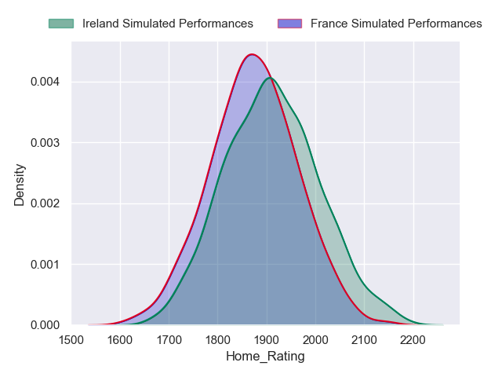

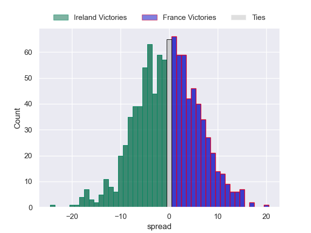

### Italy V England on 2024/02/03

Average Margin: England by 2.3

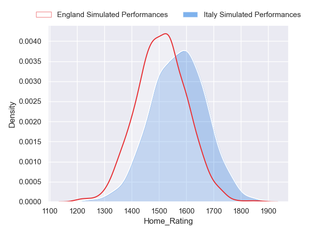

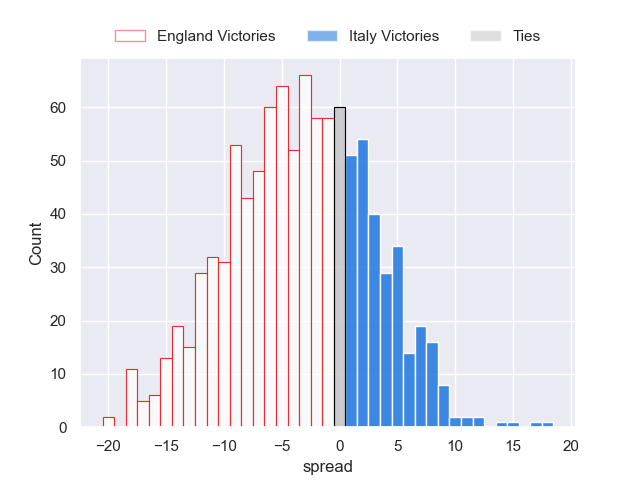

### Wales V Scotland on 2024/02/03

Average Margin: Wales by 1.8

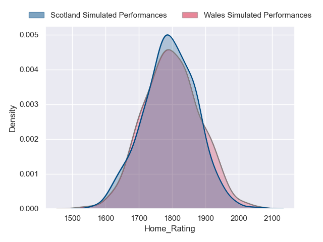

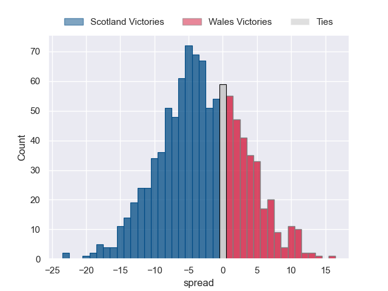

## Week 2

### Scotland V France on 2024/02/10

Average Margin: France by 2.0

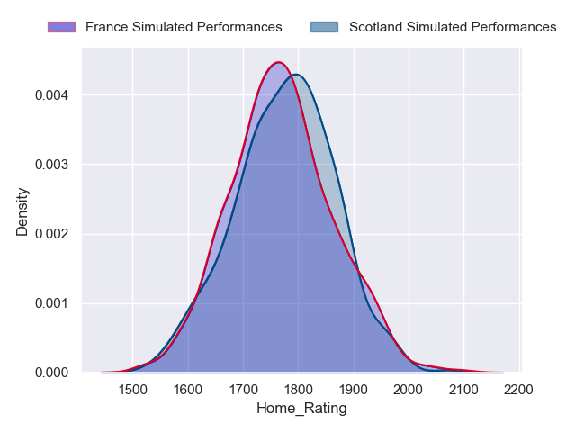

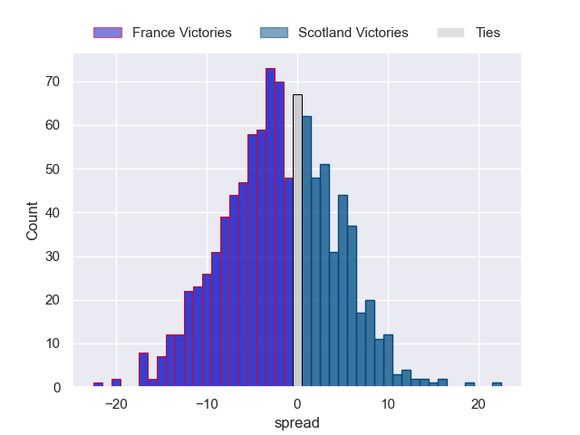

### England V Wales on 2024/02/10

Average Margin: England by 0.5

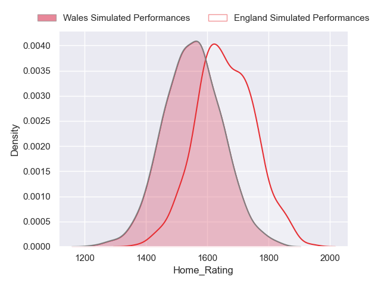
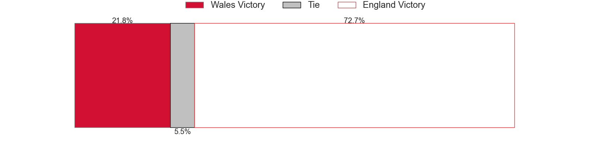
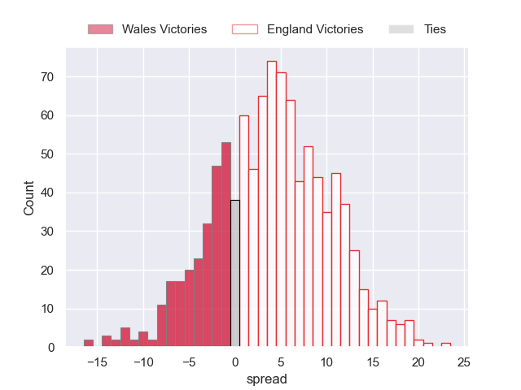

### Ireland V Italy on 2024/02/11

Average Margin: Ireland by 24.3

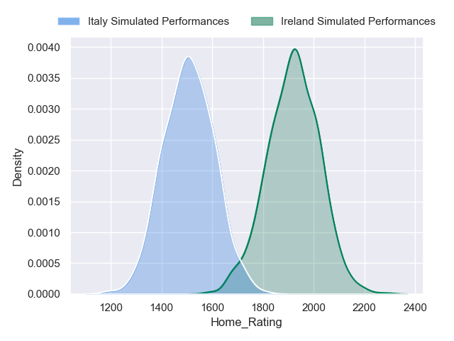
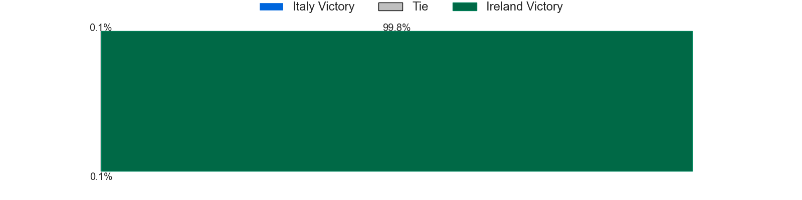
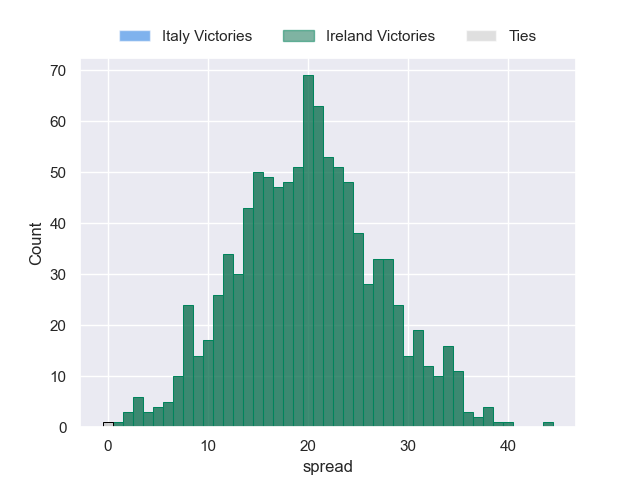

## Week 3

### Ireland V Wales on 2024/02/22

Average Margin: Ireland by 15.5

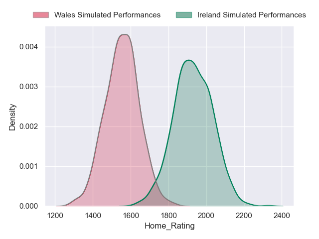
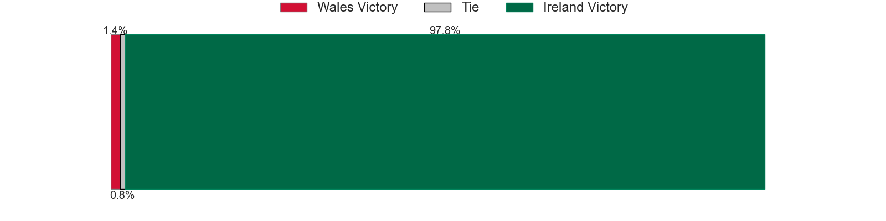
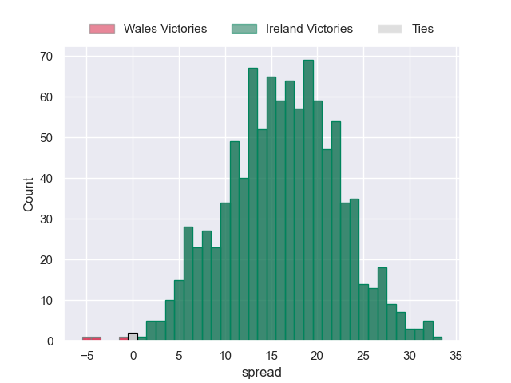

### Scotland V England on 2024/02/24

Average Margin: Scotland by 7.7

### France V Italy on 2024/02/25

Average Margin: France by 19.1

## Week 4

### Italy V Scotland on 2024/03/09

Average Margin: Scotland by 6.9

### England V Ireland on 2024/03/09

Average Margin: Ireland by 11.8

### Wales V France on 2024/03/10

Average Margin: France by 3.4

## Week 5

### Wales V Italy on 2024/03/16

Average Margin: Wales by 12.1

### Ireland V Scotland on 2024/03/16

Average Margin: Ireland by 14.3

### France V England on 2024/03/16

Average Margin: France by 12.9

