---  
title: "Six Nations Championship 2024 Status"  
date: 2024-02-20 6:00:00 -0500  
categories: model review projection  
layout: article  
aside:  
    toc: true  
---
# Current Team Rankings

# Standings

## Current Standings

| Club     |   Played |   Wins |   Point Differential |   Losing Bonus Points |   Try Bonus Points |   Competition Points |
|:---------|---------:|-------:|---------------------:|----------------------:|-------------------:|---------------------:|
| Ireland  |        2 |      2 |                   57 |                     0 |                  2 |                   10 |
| England  |        2 |      2 |                    5 |                     0 |                  0 |                    8 |
| Scotland |        2 |      1 |                   -3 |                     1 |                  0 |                    5 |
| France   |        2 |      1 |                  -17 |                     0 |                  0 |                    4 |
| Wales    |        2 |      0 |                   -3 |                     2 |                  1 |                    3 |
| Italy    |        2 |      0 |                  -39 |                     1 |                  0 |                    1 |

## Projected Remaining Table

| Club     |   Matches Remaining |   Wins |   Point Differential |   Losing Bonus Points |   Try Bonus Points |   Competition Points |
|:---------|--------------------:|-------:|---------------------:|----------------------:|-------------------:|---------------------:|
| Ireland  |                   3 |    2.9 |             41.913   |                   0.1 |                1.5 |                 13.3 |
| France   |                   3 |    2.6 |             28.5929  |                   0.3 |                1.3 |                 12.2 |
| Scotland |                   3 |    1.6 |             -3.41434 |                   0.4 |                0.9 |                  7.9 |
| Wales    |                   3 |    1.2 |            -11.313   |                   0.5 |                0.4 |                  5.9 |
| England  |                   3 |    0.3 |            -25.371   |                   1   |                0.3 |                  2.5 |
| Italy    |                   3 |    0.3 |            -30.4076  |                   0.8 |                0.2 |                  2   |

## Projected Total Table

| Club     |   Total Matches |   Wins |   Point Differential |   Losing Bonus Points |   Try Bonus Points |   Competition Points |
|:---------|----------------:|-------:|---------------------:|----------------------:|-------------------:|---------------------:|
| Ireland  |               5 |    4.9 |             98.913   |                   0.1 |                3.5 |                 23.3 |
| France   |               5 |    3.6 |             11.5929  |                   0.3 |                1.3 |                 16.2 |
| Scotland |               5 |    2.6 |             -6.41434 |                   1.4 |                0.9 |                 12.9 |
| England  |               5 |    2.3 |            -20.371   |                   1   |                0.3 |                 10.5 |
| Wales    |               5 |    1.2 |            -14.313   |                   2.5 |                1.4 |                  8.9 |
| Italy    |               5 |    0.3 |            -69.4076  |                   1.8 |                0.2 |                  3   |

# Completed Match Review

| Model | Percent Correct Predictions | Spread Error |
| ------ | ------ | ------ |
| Club Level | 66.7% | 7.8 |
| Player Level: Lineup | 83.3% | 14.2 |
| Player Level: Minutes | 83.3% | 13.6 |

# Future Predictions

## Week 3

### Ireland V Wales on 2024/02/24

Average Margin: Ireland by 17.2

Average Scoreline: 32-14

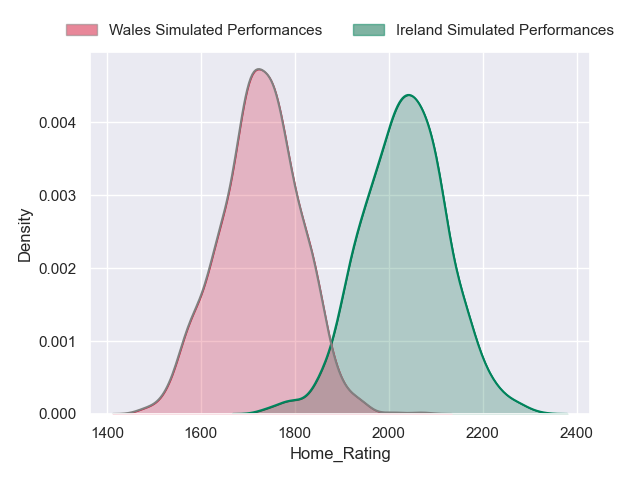

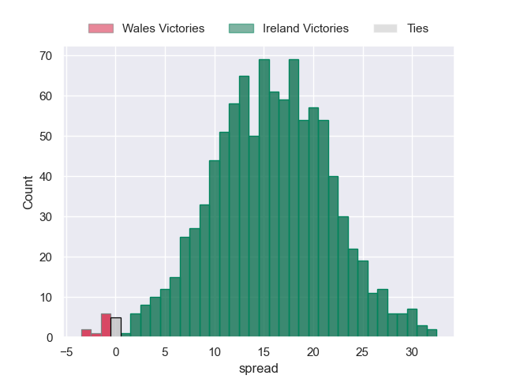

### Scotland V England on 2024/02/24

Average Margin: Scotland by 5.9

Average Scoreline: 27-21

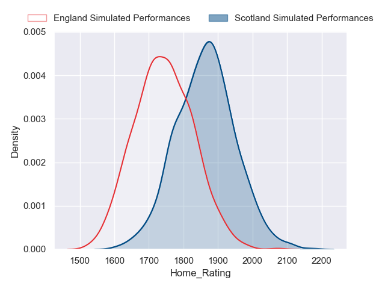

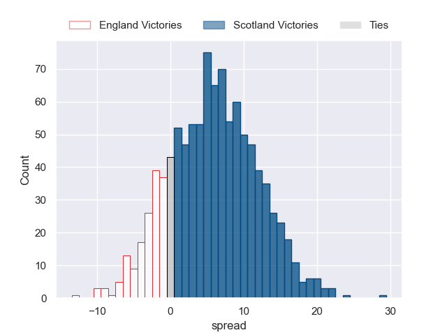

### France V Italy on 2024/02/25

Average Margin: France by 16.1

Average Scoreline: 38-22

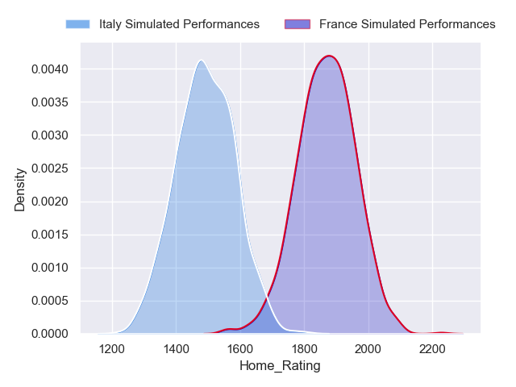
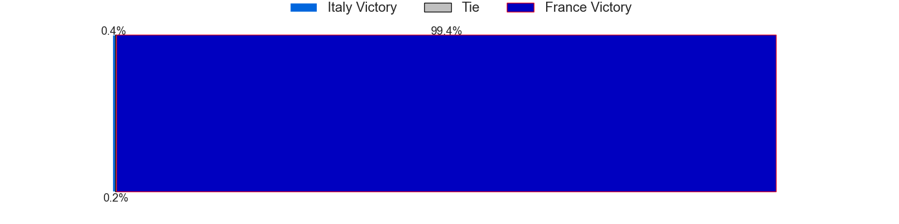
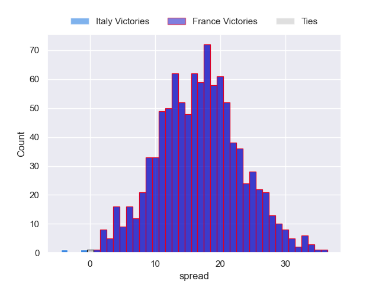

## Week 4

### Italy V Scotland on 2024/03/09

Average Margin: Scotland by 5.2

Average Scoreline: 24-19

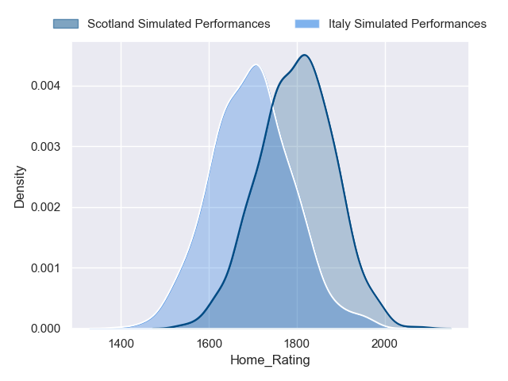

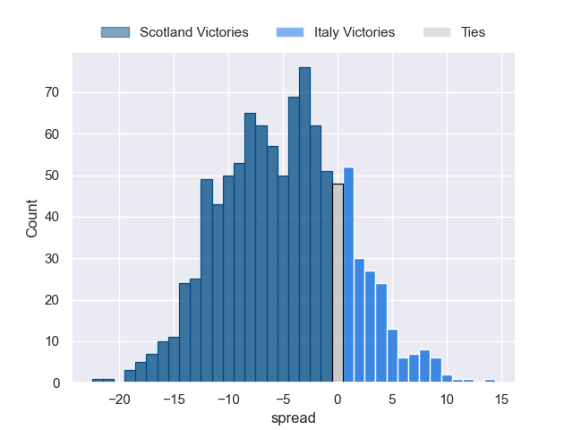

### England V Ireland on 2024/03/09

Average Margin: Ireland by 10.2

Average Scoreline: 27-17

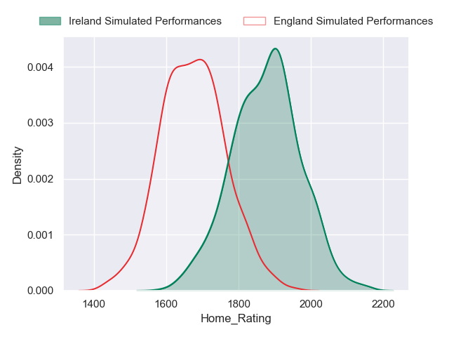
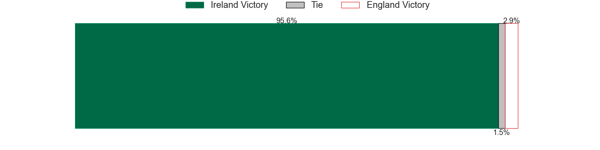
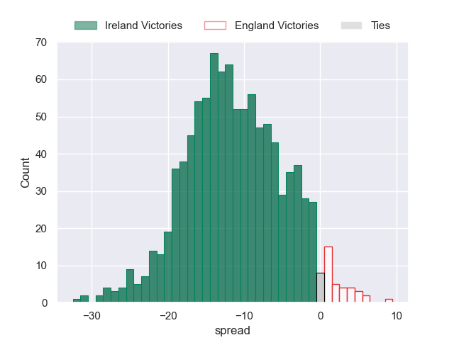

### Wales V France on 2024/03/10

Average Margin: France by 3.1

Average Scoreline: 25-22

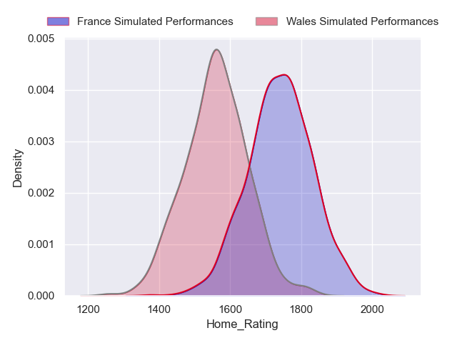
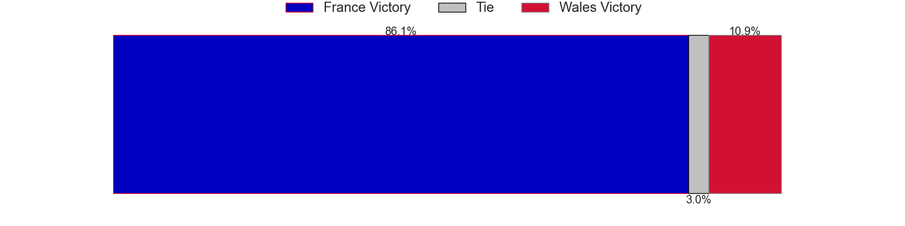
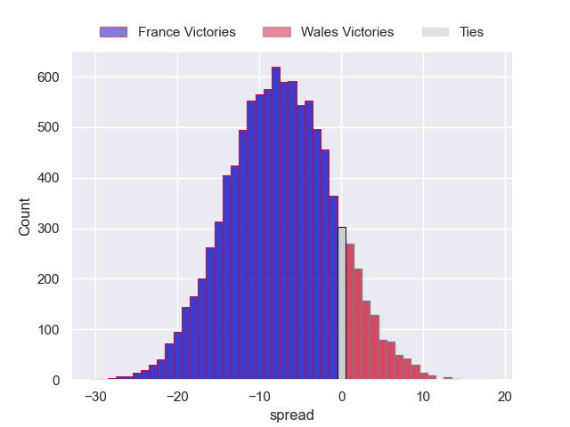

## Week 5

### Ireland V Scotland on 2024/03/16

Average Margin: Ireland by 14.5

Average Scoreline: 31-17

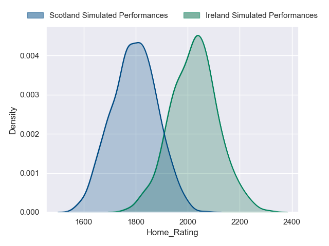
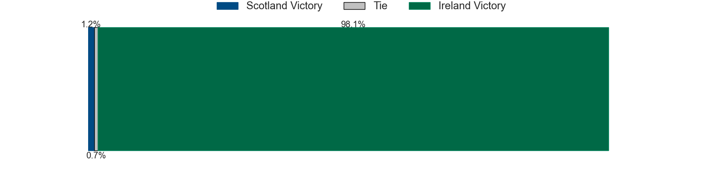
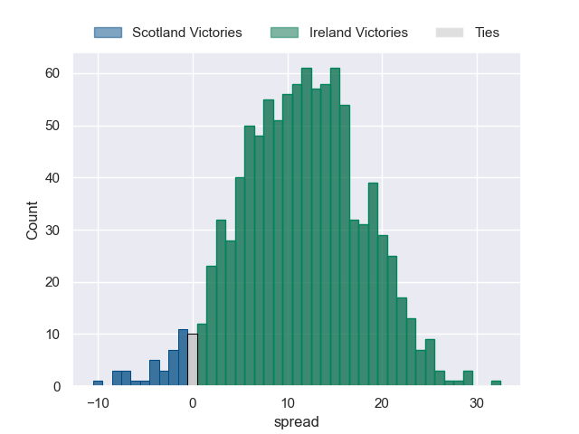

### Wales V Italy on 2024/03/16

Average Margin: Wales by 9.0

Average Scoreline: 25-16

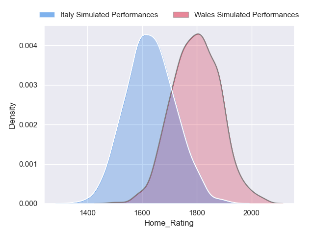

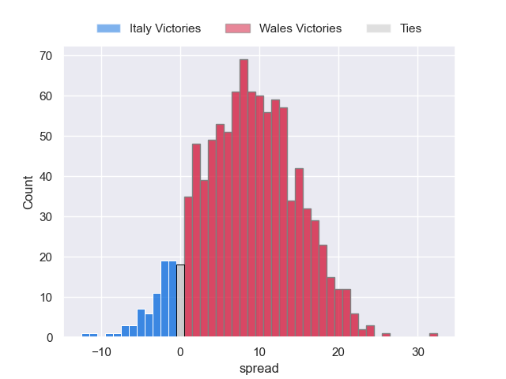

### France V England on 2024/03/16

Average Margin: France by 9.3

Average Scoreline: 24-15

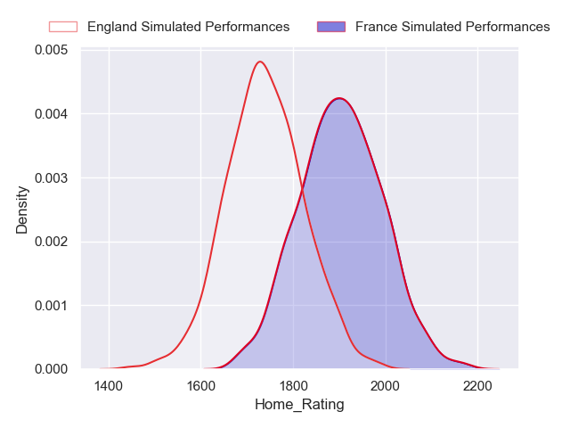
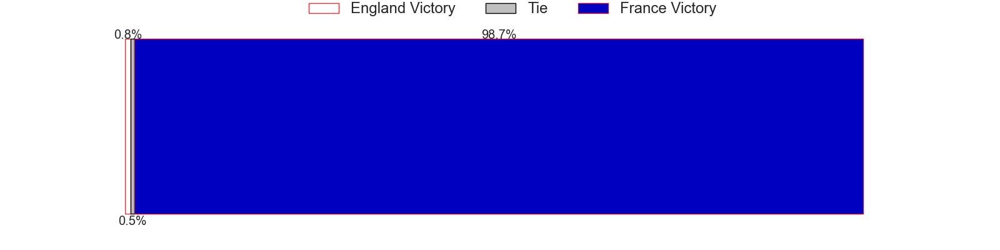
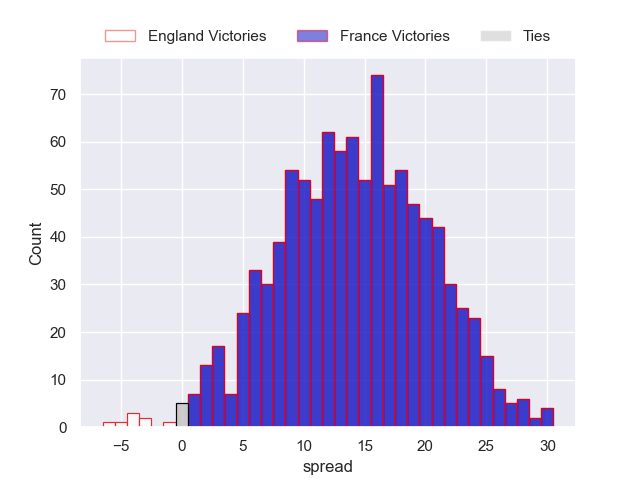

