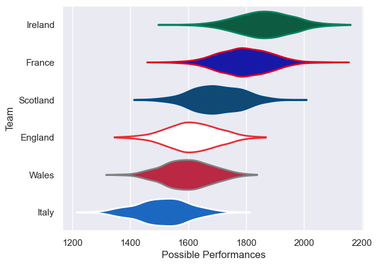

---  
title: "Six Nations Championship 2024 Status"  
date: 2024-08-27 6:00:00 -0500  
categories: model review projection  
layout: article  
aside:  
    toc: true  
---
# Current Team Rankings

# Standings

## Current Standings

| Club     |   Played |   Wins |   Point Differential |   Losing Bonus Points |   Try Bonus Points |   Competition Points |
|:---------|---------:|-------:|---------------------:|----------------------:|-------------------:|---------------------:|
| Ireland  |        5 |      4 |                   84 |                     1 |                  3 |                   20 |
| France   |        5 |      3 |                    6 |                     0 |                  1 |                   15 |
| England  |        5 |      3 |                   -5 |                     1 |                  1 |                   14 |
| Scotland |        5 |      2 |                    0 |                     3 |                  1 |                   12 |
| Italy    |        5 |      2 |                  -34 |                     1 |                  0 |                   11 |
| Wales    |        5 |      0 |                  -51 |                     3 |                  1 |                    4 |

## Projected Remaining Table

| Club     |   Matches Remaining |   Wins |   Point Differential |   Losing Bonus Points |   Try Bonus Points |   Competition Points |
|:---------|--------------------:|-------:|---------------------:|----------------------:|-------------------:|---------------------:|
| Ireland  |                   5 |    4.5 |             45.6284  |                   0.5 |                2.8 |                 21.3 |
| Scotland |                   5 |    2.9 |             13.857   |                   1.4 |                1.4 |                 14.5 |
| France   |                   5 |    2.8 |              6.38557 |                   1.2 |                1.1 |                 13.6 |
| England  |                   5 |    2.7 |             -3.31687 |                   1.3 |                1   |                 12.9 |
| Italy    |                   5 |    1.6 |            -15.3139  |                   1.7 |                0.7 |                  9   |
| Wales    |                   5 |    0.5 |            -47.2403  |                   1.4 |                0.6 |                  3.8 |

## Projected Total Table

| Club     |   Total Matches |   Wins |   Point Differential |   Losing Bonus Points |   Try Bonus Points |   Competition Points |
|:---------|----------------:|-------:|---------------------:|----------------------:|-------------------:|---------------------:|
| Ireland  |              10 |    8.5 |            129.628   |                   1.5 |                5.8 |                 41.3 |
| France   |              10 |    5.8 |             12.3856  |                   1.2 |                2.1 |                 28.6 |
| England  |              10 |    5.7 |             -8.31687 |                   2.3 |                2   |                 26.9 |
| Scotland |              10 |    4.9 |             13.857   |                   4.4 |                2.4 |                 26.5 |
| Italy    |              10 |    3.6 |            -49.3139  |                   2.7 |                0.7 |                 20   |
| Wales    |              10 |    0.5 |            -98.2403  |                   4.4 |                1.6 |                  7.8 |

# Completed Match Review

| Model | Percent Correct Predictions | Spread Error |
| ------ | ------ | ------ |
| Club Level | 46.7% | 9.5 |
| Player Level: Lineup | 66.7% | 10.7 |
| Player Level: Minutes | 66.7% | 10.5 |

# Future Predictions

## Week 6

### France V Wales on 2025/01/31

Average Margin: France by 12.6

Average Scoreline: 29-16

### Scotland V Italy on 2025/02/01

Average Margin: Scotland by 8.4

Average Scoreline: 32-24

### Ireland V England on 2025/02/01

Average Margin: Ireland by 12.7

Average Scoreline: 34-21

## Week 7

### Italy V Wales on 2025/02/08

Average Margin: Italy by 7.5

Average Scoreline: 31-23

### England V France on 2025/02/08

Average Margin: England by 0.7

Average Scoreline: 24-23

### Scotland V Ireland on 2025/02/09

Average Margin: Ireland by 3.3

Average Scoreline: 25-22

## Week 8

### England V Scotland on 2025/02/22

Average Margin: England by 0.5

Average Scoreline: 23-23

### Wales V Ireland on 2025/02/22

Average Margin: Ireland by 12.2

Average Scoreline: 29-16

### Italy V France on 2025/02/23

Average Margin: France by 1.4

Average Scoreline: 27-26

## Week 9

### Scotland V Wales on 2025/03/08

Average Margin: Scotland by 12.3

Average Scoreline: 32-19

### Ireland V France on 2025/03/08

Average Margin: Ireland by 10.0

Average Scoreline: 31-21

### England V Italy on 2025/03/09

Average Margin: England by 5.5

Average Scoreline: 27-22

## Week 10

### Wales V England on 2025/03/15

Average Margin: England by 2.7

Average Scoreline: 29-26

### Italy V Ireland on 2025/03/15

Average Margin: Ireland by 7.5

Average Scoreline: 31-24

### France V Scotland on 2025/03/15

Average Margin: France by 3.2

Average Scoreline: 24-21

