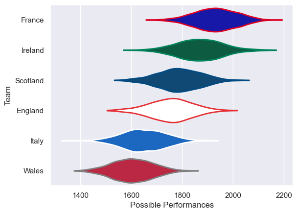
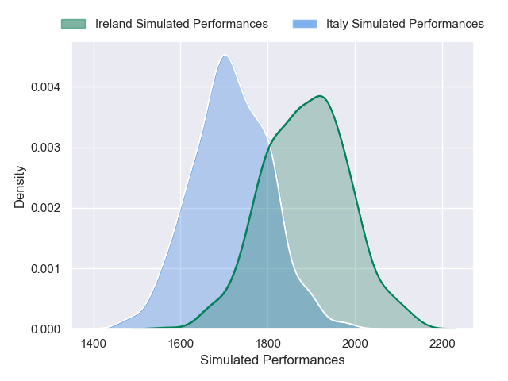
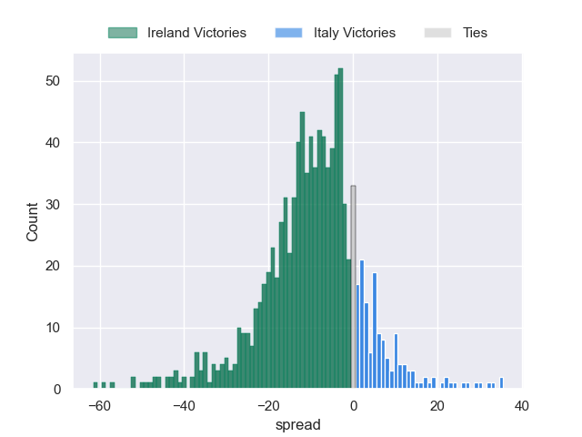
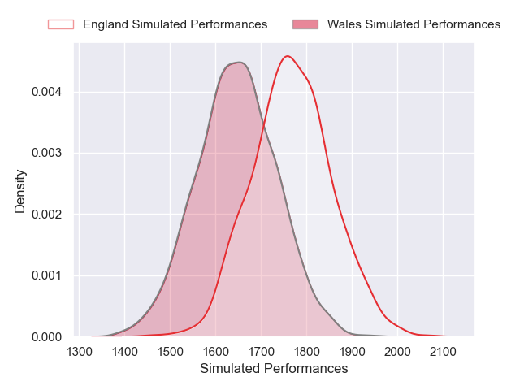
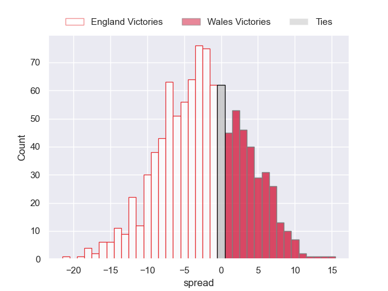
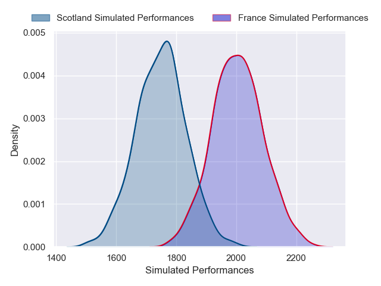
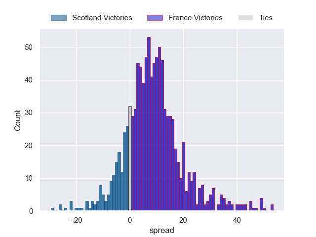

---  
title: "Six Nations Championship 2025 Status"  
date: 2025-03-14 6:00:00 -0500  
categories: model review projection  
layout: article  
aside:  
    toc: true  
---
# Current Team Rankings

# Standings

## Current Standings

| Club     |   Played |   Wins |   Point Differential |   Losing Bonus Points |   Try Bonus Points |   Competition Points |
|:---------|---------:|-------:|---------------------:|----------------------:|-------------------:|---------------------:|
| France   |        4 |      3 |                  106 |                     1 |                  3 |                   16 |
| England  |        4 |      3 |                   20 |                     1 |                  2 |                   15 |
| Ireland  |        4 |      3 |                   13 |                     0 |                  2 |                   14 |
| Scotland |        4 |      2 |                    3 |                     1 |                  2 |                   11 |
| Italy    |        4 |      1 |                  -77 |                     0 |                  0 |                    4 |
| Wales    |        4 |      0 |                  -65 |                     2 |                  1 |                    3 |

## Projected Remaining Table

| Club     |   Matches Remaining |   Wins |   Point Differential |   Losing Bonus Points |   Try Bonus Points |   Competition Points |
|:---------|--------------------:|-------:|---------------------:|----------------------:|-------------------:|---------------------:|
| Ireland  |                   1 |    0.9 |             11.0163  |                   0.1 |                0.7 |                  4.3 |
| France   |                   1 |    0.9 |             10.6949  |                   0.1 |                0.4 |                  3.9 |
| England  |                   1 |    0.8 |              7.18808 |                   0.1 |                0.5 |                  3.8 |
| Wales    |                   1 |    0.2 |             -7.18808 |                   0.3 |                0.1 |                  1.2 |
| Scotland |                   1 |    0.1 |            -10.6949  |                   0.2 |                0.2 |                  1   |
| Italy    |                   1 |    0.1 |            -11.0163  |                   0.3 |                0.1 |                  0.8 |

## Projected Total Table

| Club     |   Total Matches |   Wins |   Point Differential |   Losing Bonus Points |   Try Bonus Points |   Competition Points |
|:---------|----------------:|-------:|---------------------:|----------------------:|-------------------:|---------------------:|
| France   |               5 |    3.9 |            116.695   |                   1.1 |                3.4 |                 19.9 |
| England  |               5 |    3.8 |             27.1881  |                   1.1 |                2.5 |                 18.8 |
| Ireland  |               5 |    3.9 |             24.0163  |                   0.1 |                2.7 |                 18.3 |
| Scotland |               5 |    2.1 |             -7.69492 |                   1.2 |                2.2 |                 12   |
| Italy    |               5 |    1.1 |            -88.0163  |                   0.3 |                0.1 |                  4.8 |
| Wales    |               5 |    0.2 |            -72.1881  |                   2.3 |                1.1 |                  4.2 |

# Completed Match Review

| Model | Percent Correct Predictions | Spread Error |
| ------ | ------ | ------ |
| Club Level | 75.0% | 11.5 |
| Player Level: Lineup | 50.0% | 13.0 |
| Player Level: Minutes | 75.0% | 10.6 |

# Future Predictions

## Week 5

### Italy V Ireland on 2025/03/15

Average Margin: Ireland by 11.0

Average Scoreline: 32-21

### Wales V England on 2025/03/15

Average Margin: England by 7.2

Average Scoreline: 27-20

### France V Scotland on 2025/03/15

Average Margin: France by 10.7

Average Scoreline: 31-21

