---  
title: "Six Nations Championship 2025 Status"  
date: 2025-01-31 6:00:00 -0500  
categories: model review projection  
layout: article  
aside:  
    toc: true  
---
# Current Team Rankings

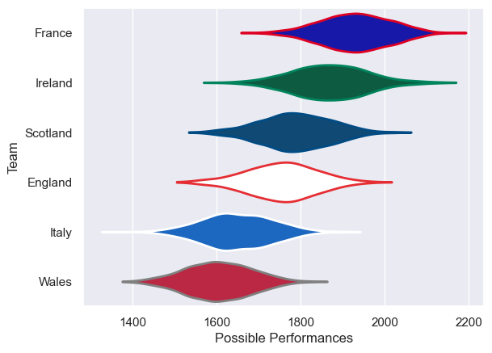
# Standings

## Projected Total Table

| Club     |   Total Matches |   Wins |   Point Differential |   Losing Bonus Points |   Try Bonus Points |   Competition Points |
|:---------|----------------:|-------:|---------------------:|----------------------:|-------------------:|---------------------:|
| Ireland  |               5 |    3.9 |             42.5489  |                   0.7 |                2.2 |                 18.4 |
| France   |               5 |    3.3 |             27.1165  |                   0.9 |                1.8 |                 15.9 |
| Scotland |               5 |    3.3 |             29.0835  |                   1   |                1.5 |                 15.5 |
| England  |               5 |    2.3 |             -6.91963 |                   1.1 |                1.3 |                 11.8 |
| Italy    |               5 |    1.4 |            -35.0379  |                   1.1 |                0.8 |                  7.4 |
| Wales    |               5 |    0.8 |            -56.7914  |                   1   |                0.5 |                  4.9 |

# Future Predictions

## Week 1

### France V Wales on 2025/01/31

Average Margin: France by 17.1

Average Scoreline: 33-16

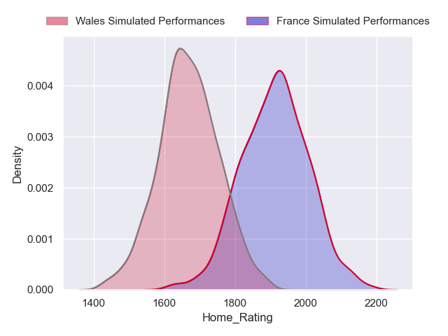

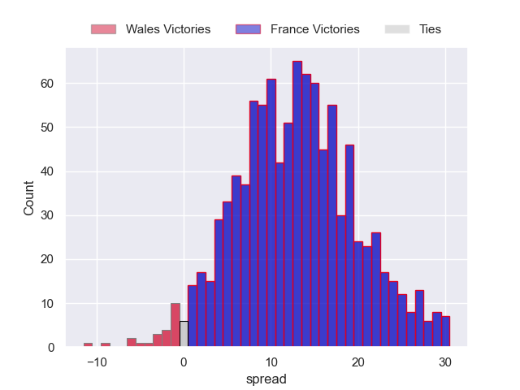

### Scotland V Italy on 2025/02/01

Average Margin: Scotland by 14.5

Average Scoreline: 35-20

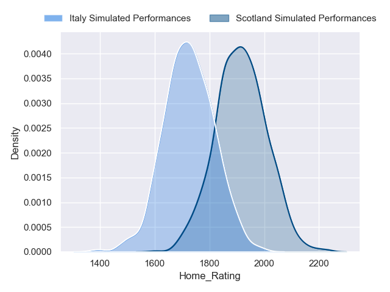

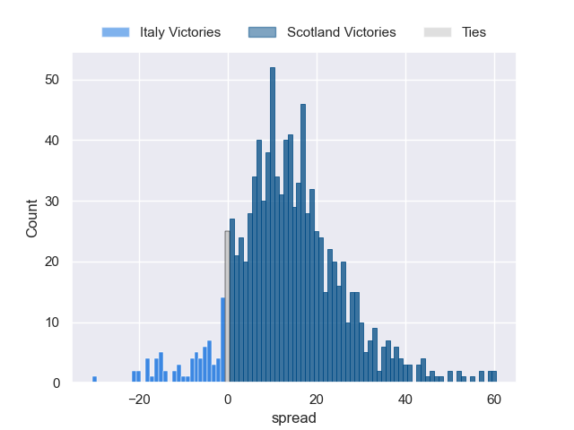

### Ireland V England on 2025/02/01

Average Margin: Ireland by 12.9

Average Scoreline: 25-12

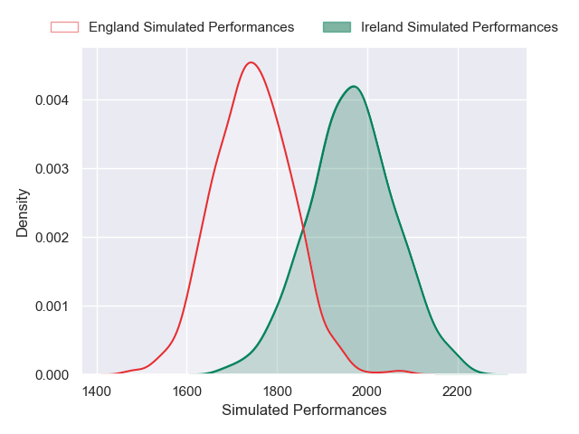

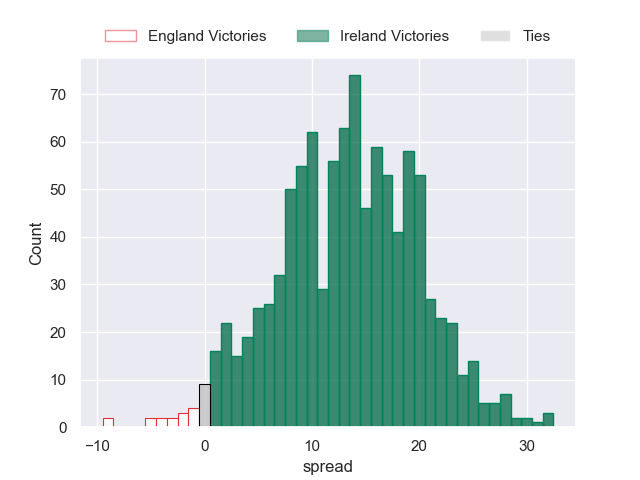

## Week 2

### Italy V Wales on 2025/02/08

Average Margin: Italy by 6.3

Average Scoreline: 28-22

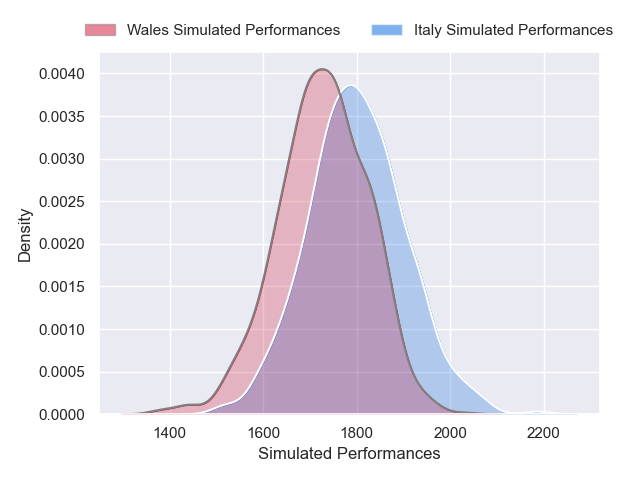

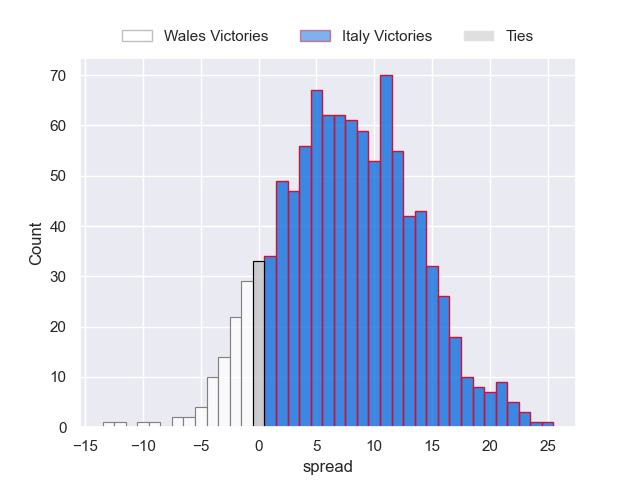

### England V France on 2025/02/08

Average Margin: France by 3.9

Average Scoreline: 22-18

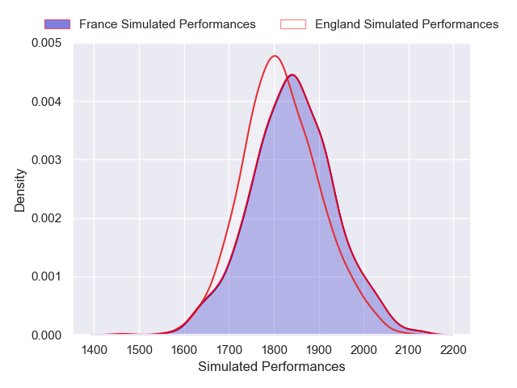

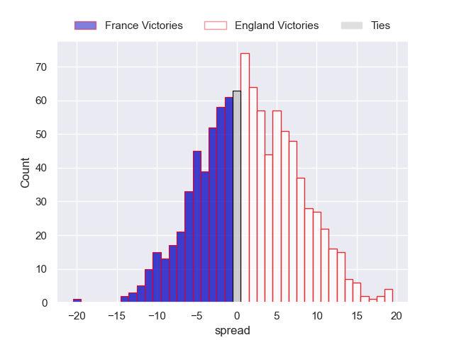

### Scotland V Ireland on 2025/02/09

Average Margin: Scotland by 0.7

Average Scoreline: 29-28

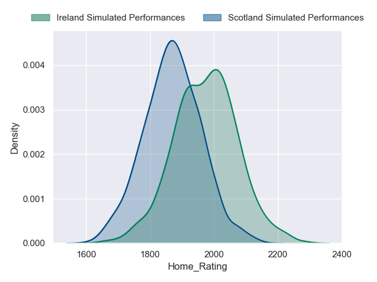

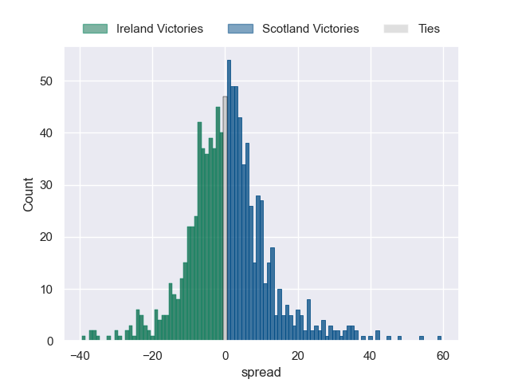

## Week 3

### England V Scotland on 2025/02/22

Average Margin: Scotland by 2.5

Average Scoreline: 24-22

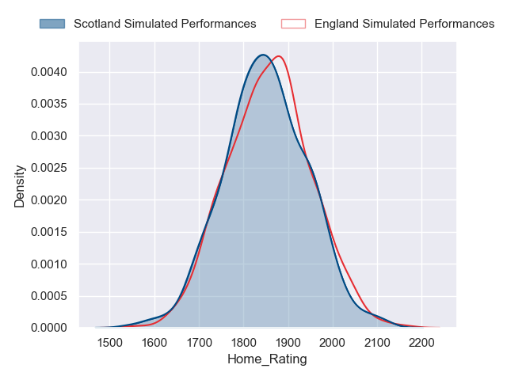

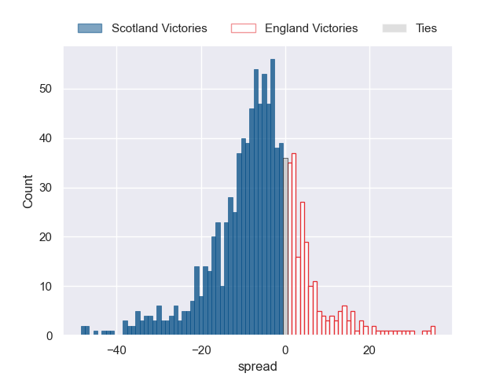

### Wales V Ireland on 2025/02/22

Average Margin: Ireland by 13.3

Average Scoreline: 39-26

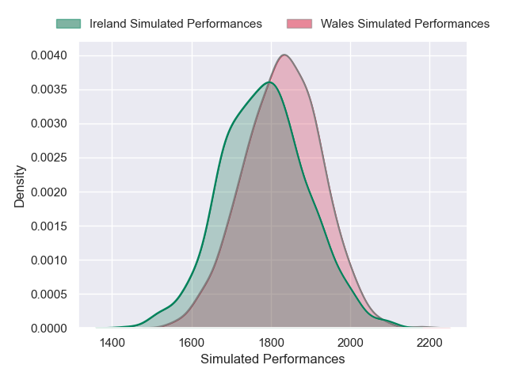

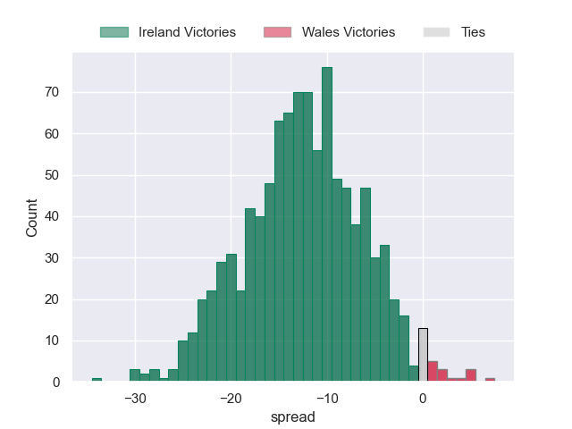

### Italy V France on 2025/02/23

Average Margin: France by 8.2

Average Scoreline: 33-25

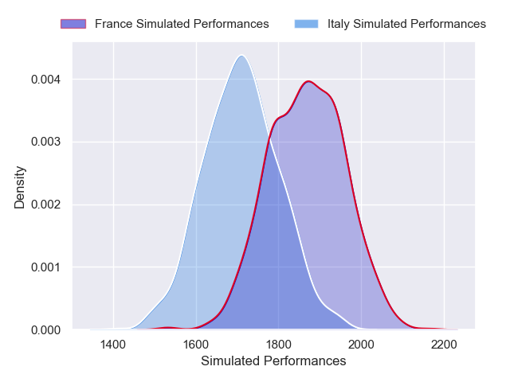

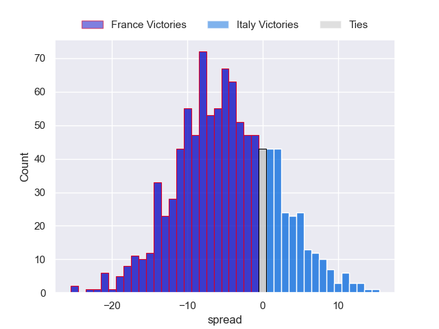

## Week 4

### Ireland V France on 2025/03/08

Average Margin: Ireland by 6.6

Average Scoreline: 24-18

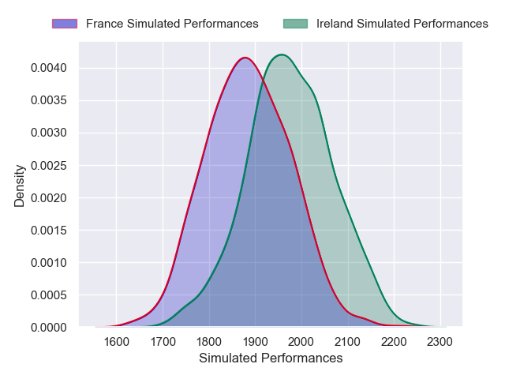

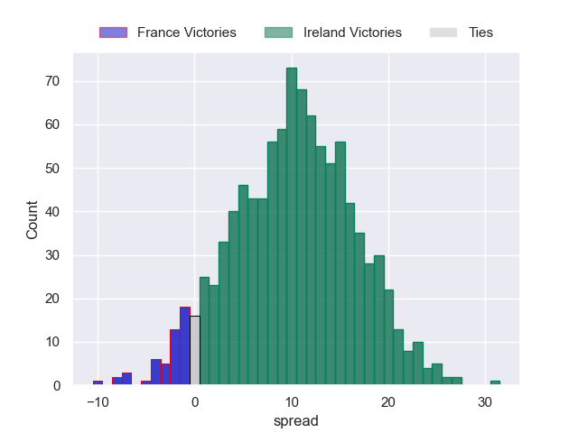

### Scotland V Wales on 2025/03/08

Average Margin: Scotland by 15.9

Average Scoreline: 30-15

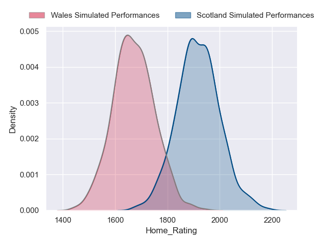

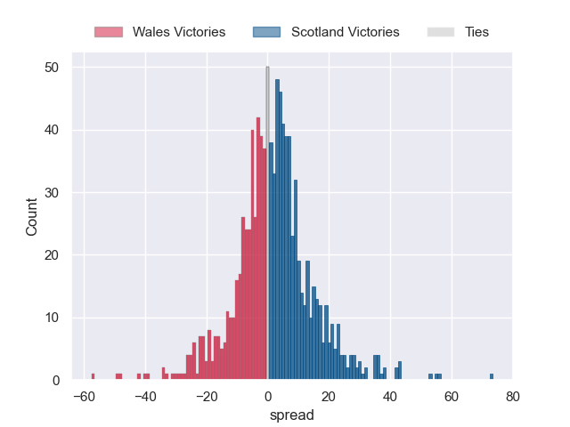

### England V Italy on 2025/03/09

Average Margin: England by 8.2

Average Scoreline: 27-18

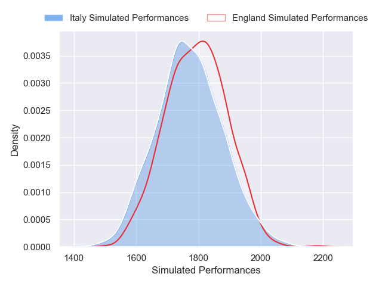
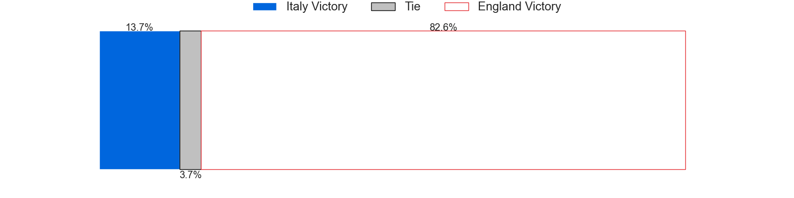
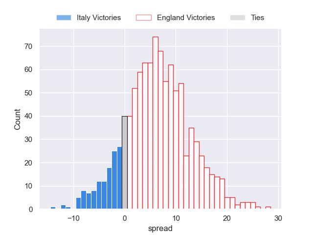

## Week 5

### Italy V Ireland on 2025/03/15

Average Margin: Ireland by 10.4

Average Scoreline: 38-27

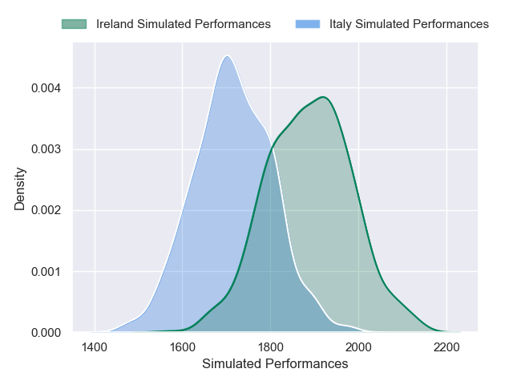

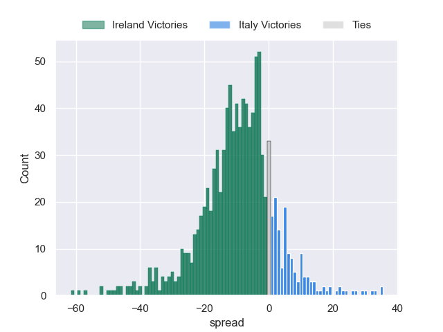

### France V Scotland on 2025/03/15

Average Margin: France by 4.5

Average Scoreline: 24-20

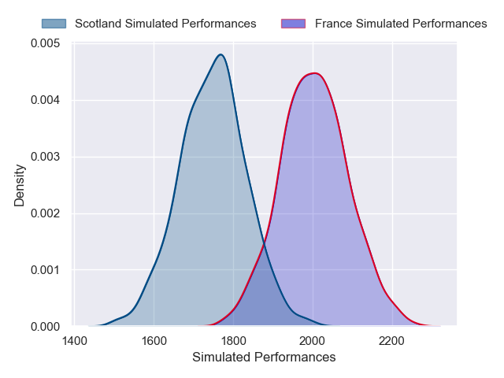

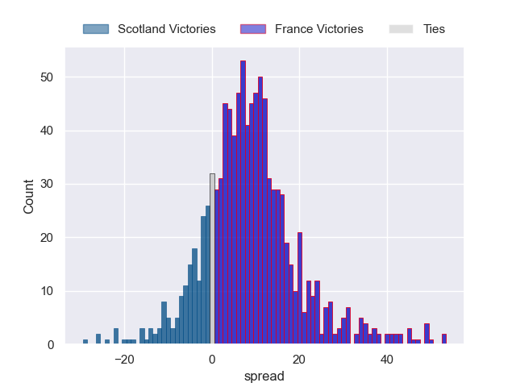

### Wales V England on 2025/03/15

Average Margin: England by 4.2

Average Scoreline: 28-24

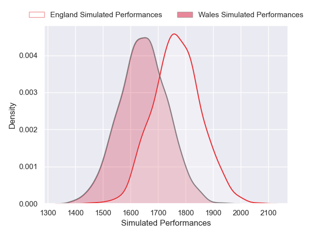

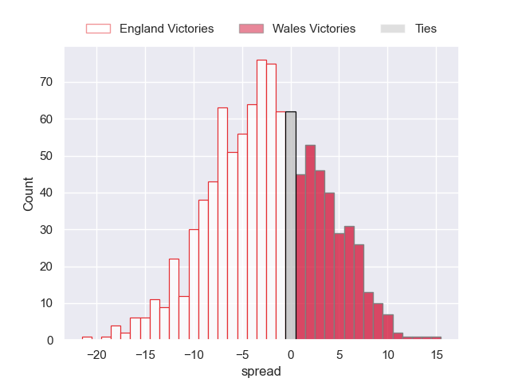

