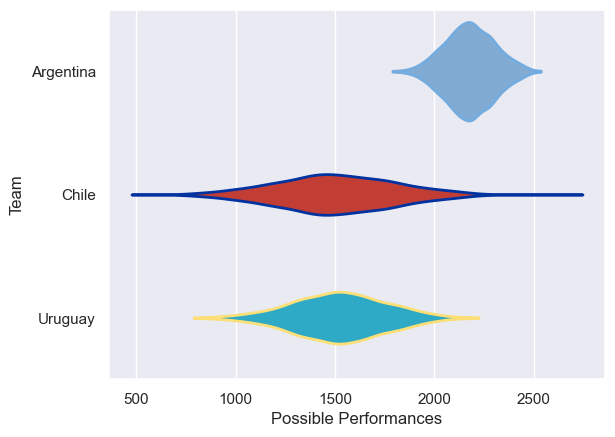

---  
title: "South American Championship 2010"  
date: 2025-07-29 6:00:00 -0500  
categories: model review projection  
layout: article  
aside:  
    toc: true  
---
# Current Team Rankings

# Standings

## Current Standings

| Club      |   Played |   Wins |   Point Differential |   Losing Bonus Points | Try Bonus Points   |   Competition Points |
|:----------|---------:|-------:|---------------------:|----------------------:|:-------------------|---------------------:|
| Argentina |        2 |      2 |                   77 |                     0 |                    |                    8 |
| Uruguay   |        1 |      0 |                  -38 |                     0 |                    |                    0 |
| Chile     |        1 |      0 |                  -39 |                     0 |                    |                    0 |

# Completed Match Review

| Model | Percent Correct Predictions | Spread Error |
| ------ | ------ | ------ |
| Club Level | 100.0% | 4.8 |
| Player Level: Lineup | nan% | nan |
| Player Level: Minutes | nan% | nan |

