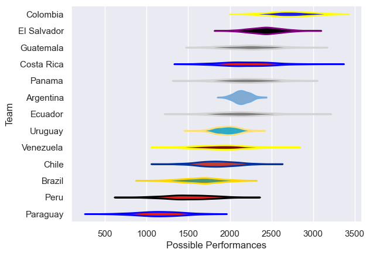

---  
title: "South American Championship 2016"  
date: 2025-07-29 6:00:00 -0500  
categories: model review projection  
layout: article  
aside:  
    toc: true  
---
# Current Team Rankings

# Standings

## Current Standings

| Club        |   Played |   Wins |   Point Differential |   Losing Bonus Points | Try Bonus Points   |   Competition Points |
|:------------|---------:|-------:|---------------------:|----------------------:|:-------------------|---------------------:|
| Guatemala   |        4 |      3 |                  132 |                     1 |                    |                   13 |
| Colombia    |        3 |      3 |                  122 |                     0 |                    |                   12 |
| Uruguay     |        4 |      3 |                   82 |                     0 |                    |                   12 |
| Argentina   |        2 |      2 |                   85 |                     0 |                    |                    8 |
| Costa Rica  |        3 |      2 |                   54 |                     0 |                    |                    8 |
| Venezuela   |        3 |      2 |                   42 |                     0 |                    |                    8 |
| Brazil      |        3 |      1 |                  -11 |                     0 |                    |                    6 |
| Chile       |        4 |      1 |                  -39 |                     0 |                    |                    6 |
| Peru        |        3 |      1 |                    3 |                     0 |                    |                    4 |
| Panama      |        3 |      1 |                  -83 |                     0 |                    |                    4 |
| Ecuador     |        4 |      1 |                 -166 |                     0 |                    |                    4 |
| El Salvador |        3 |      0 |                 -104 |                     0 |                    |                    0 |
| Paraguay    |        3 |      0 |                 -117 |                     0 |                    |                    0 |

# Completed Match Review

| Model | Percent Correct Predictions | Spread Error |
| ------ | ------ | ------ |
| Club Level | 52.4% | 37.5 |
| Player Level: Lineup | nan% | nan |
| Player Level: Minutes | nan% | nan |

