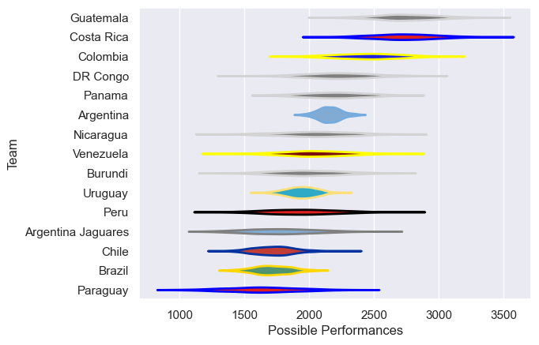

---  
title: "South American Championship 2017"  
date: 2025-07-29 6:00:00 -0500  
categories: model review projection  
layout: article  
aside:  
    toc: true  
---
# Current Team Rankings

# Standings

## Current Standings

| Club               |   Played |   Wins |   Point Differential |   Losing Bonus Points | Try Bonus Points   |   Competition Points |
|:-------------------|---------:|-------:|---------------------:|----------------------:|:-------------------|---------------------:|
| Uruguay            |        4 |      3 |                   51 |                     1 |                    |                   13 |
| Costa Rica         |        3 |      2 |                  137 |                     0 |                    |                   10 |
| Guatemala          |        3 |      2 |                   97 |                     0 |                    |                   10 |
| Colombia           |        2 |      2 |                   85 |                     0 |                    |                    8 |
| Chile              |        4 |      2 |                   32 |                     0 |                    |                    8 |
| Brazil             |        3 |      1 |                   32 |                     1 |                    |                    5 |
| Argentina          |        1 |      1 |                   16 |                     0 |                    |                    4 |
| Argentina Jaguares |        1 |      1 |                    5 |                     0 |                    |                    4 |
| Venezuela          |        2 |      1 |                  -26 |                     0 |                    |                    4 |
| Nicaragua          |        3 |      1 |                  -79 |                     0 |                    |                    4 |
| Peru               |        2 |      0 |                  -59 |                     0 |                    |                    0 |
| Paraguay           |        3 |      0 |                 -136 |                     0 |                    |                    0 |
| Panama             |        3 |      0 |                 -155 |                     0 |                    |                    0 |

## Projected Remaining Table

| Club     |   To Play |   Projected Wins |   Projected Differential |   Projected Losing Bonus Points | Projected Try Bonus Points   |   Projected Competition Points |
|:---------|----------:|-----------------:|-------------------------:|--------------------------------:|:-----------------------------|-------------------------------:|
| DR Congo |         1 |            0.564 |                    4.666 |                           0.161 |                              |                          2.483 |
| Burundi  |         1 |            0.403 |                   -4.666 |                           0.165 |                              |                          1.843 |

## Projected Total Table

| Club               |   Played |   Wins |   Point Differential |   Losing Bonus Points | Try Bonus Points   |   Competition Points |
|:-------------------|---------:|-------:|---------------------:|----------------------:|:-------------------|---------------------:|
| Uruguay            |        4 |  3     |               51     |                 1     |                    |               13     |
| Costa Rica         |        3 |  2     |              137     |                 0     |                    |               10     |
| Guatemala          |        3 |  2     |               97     |                 0     |                    |               10     |
| Colombia           |        2 |  2     |               85     |                 0     |                    |                8     |
| Chile              |        4 |  2     |               32     |                 0     |                    |                8     |
| Brazil             |        3 |  1     |               32     |                 1     |                    |                5     |
| Argentina          |        1 |  1     |               16     |                 0     |                    |                4     |
| Argentina Jaguares |        1 |  1     |                5     |                 0     |                    |                4     |
| Venezuela          |        2 |  1     |              -26     |                 0     |                    |                4     |
| Nicaragua          |        3 |  1     |              -79     |                 0     |                    |                4     |
| DR Congo           |        1 |  0.564 |                4.666 |                 0.161 |                    |                2.483 |
| Burundi            |        1 |  0.403 |               -4.666 |                 0.165 |                    |                1.843 |
| Peru               |        2 |  0     |              -59     |                 0     |                    |                0     |
| Paraguay           |        3 |  0     |             -136     |                 0     |                    |                0     |
| Panama             |        3 |  0     |             -155     |                 0     |                    |                0     |

# Completed Match Review

| Model | Percent Correct Predictions | Spread Error |
| ------ | ------ | ------ |
| Club Level | 72.2% | 20.0 |
| Player Level: Lineup | nan% | nan |
| Player Level: Minutes | nan% | nan |

# Future Predictions

## Week 5

### Burundi V DR Congo on 2017/10/01

Average Margin: DR Congo by 4.7

