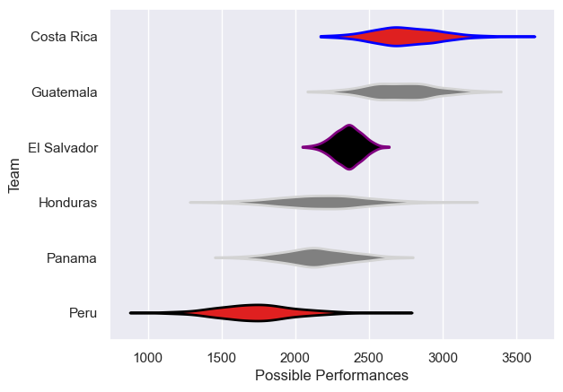

---  
title: "South American Championship 2018 Status"  
date: 2025-07-28 6:00:00 -0500  
categories: model review projection  
layout: article  
aside:  
    toc: true  
---
# Current Team Rankings

# Standings

## Current Standings

| Club        |   Played |   Wins |   Point Differential |   Losing Bonus Points | Try Bonus Points   |   Competition Points |
|:------------|---------:|-------:|---------------------:|----------------------:|:-------------------|---------------------:|
| Peru        |        2 |      2 |                   56 |                     0 |                    |                    8 |
| Panama      |        2 |      2 |                   37 |                     0 |                    |                    8 |
| El Salvador |        2 |      1 |                  -22 |                     0 |                    |                    4 |
| Guatemala   |        2 |      1 |                  -30 |                     0 |                    |                    4 |
| Honduras    |        2 |      0 |                  -15 |                     1 |                    |                    1 |
| Costa Rica  |        2 |      0 |                  -26 |                     1 |                    |                    1 |

# Completed Match Review

| Model | Percent Correct Predictions | Spread Error |
| ------ | ------ | ------ |
| Club Level | 33.3% | 39.2 |
| Player Level: Lineup | nan% | nan |
| Player Level: Minutes | nan% | nan |

