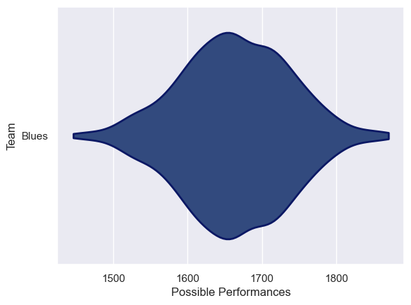
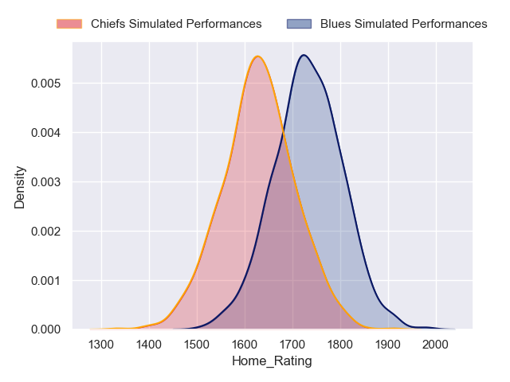
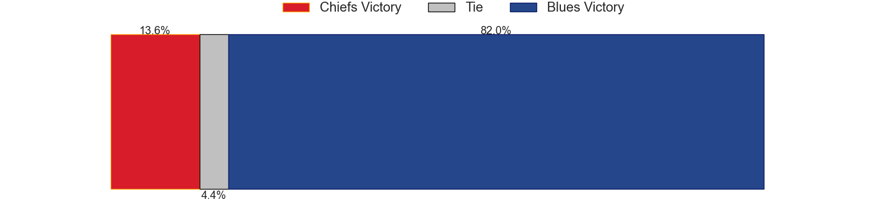
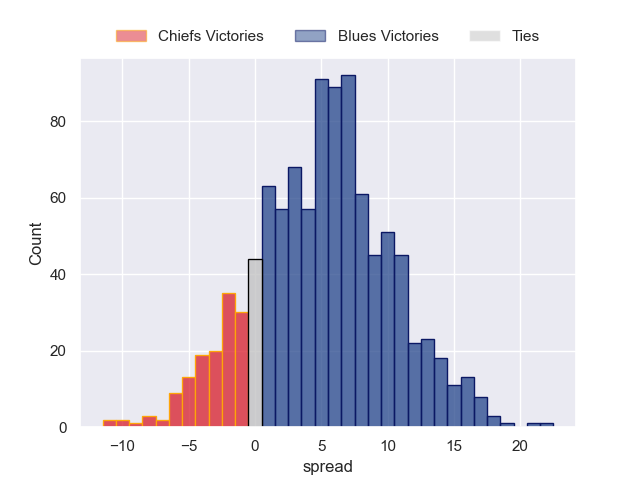

---  
title: "Super Rugby 2024 Status"  
date: 2024-06-21 6:00:00 -0500  
categories: model review projection  
layout: article  
aside:  
    toc: true  
---
# Current Team Rankings

# Standings

## Projected Total Table

| Club   |   Total Matches |   Wins |   Point Differential |   Losing Bonus Points |   Try Bonus Points |   Competition Points |
|:-------|----------------:|-------:|---------------------:|----------------------:|-------------------:|---------------------:|
| Blues  |               1 |    0.8 |               5.1753 |                   0.1 |                0.3 |                  3.8 |
| Chiefs |               1 |    0.2 |              -5.1753 |                   0.5 |                0.2 |                  1.3 |

# Future Predictions

## Week 1

### Blues V Chiefs on 2024/06/22

Average Margin: Blues by 5.2

Average Scoreline: 38-33

