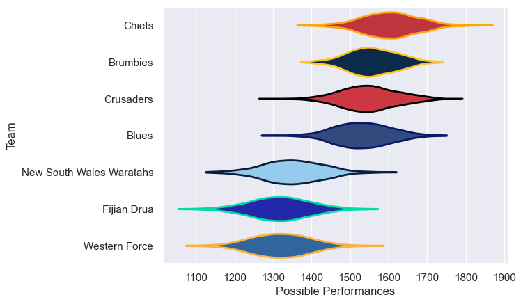

---  
title: "Super Rugby 2025 Status"  
date: 2025-06-16 6:00:00 -0500  
categories: model review projection  
layout: article  
aside:  
    toc: true  
---
# Current Team Rankings

# Standings

## Current Standings

| Club            |   Played |   Wins |   Point Differential |   Losing Bonus Points |   Try Bonus Points |   Competition Points |
|:----------------|---------:|-------:|---------------------:|----------------------:|-------------------:|---------------------:|
| Fijian Drua     |        1 |      1 |                    3 |                     0 |                  1 |                    5 |
| Queensland Reds |        1 |      0 |                   -3 |                     1 |                  1 |                    2 |

## Projected Remaining Table

| Club      |   Matches Remaining |   Wins |   Point Differential |   Losing Bonus Points |   Try Bonus Points |   Competition Points |
|:----------|--------------------:|-------:|---------------------:|----------------------:|-------------------:|---------------------:|
| Chiefs    |                   1 |    0.6 |              1.89851 |                   0.3 |                0.4 |                  3   |
| Crusaders |                   1 |    0.4 |             -1.89851 |                   0.3 |                0.2 |                  2.2 |

## Projected Total Table

| Club            |   Total Matches |   Wins |   Point Differential |   Losing Bonus Points |   Try Bonus Points |   Competition Points |
|:----------------|----------------:|-------:|---------------------:|----------------------:|-------------------:|---------------------:|
| Fijian Drua     |               1 |    1   |              3       |                   0   |                1   |                  5   |
| Chiefs          |               1 |    0.6 |              1.89851 |                   0.3 |                0.4 |                  3   |
| Crusaders       |               1 |    0.4 |             -1.89851 |                   0.3 |                0.2 |                  2.2 |
| Queensland Reds |               1 |    0   |             -3       |                   1   |                1   |                  2   |

# Completed Match Review

| Model | Percent Correct Predictions | Spread Error |
| ------ | ------ | ------ |
| Club Level | 0.0% | 3.7 |
| Player Level: Lineup | nan% | nan |
| Player Level: Minutes | nan% | nan |

# Future Predictions

## Week 2

### Crusaders V Chiefs on 2025/06/21

Average Margin: Chiefs by 1.9

Average Scoreline: 19-17

