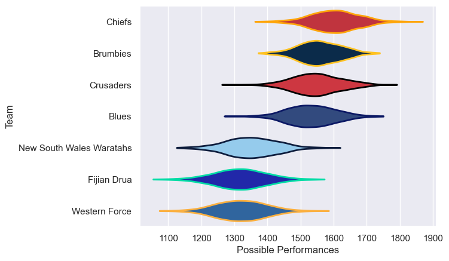
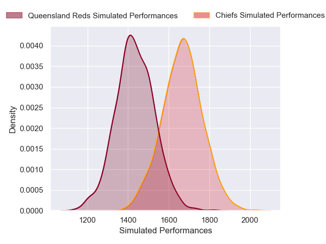
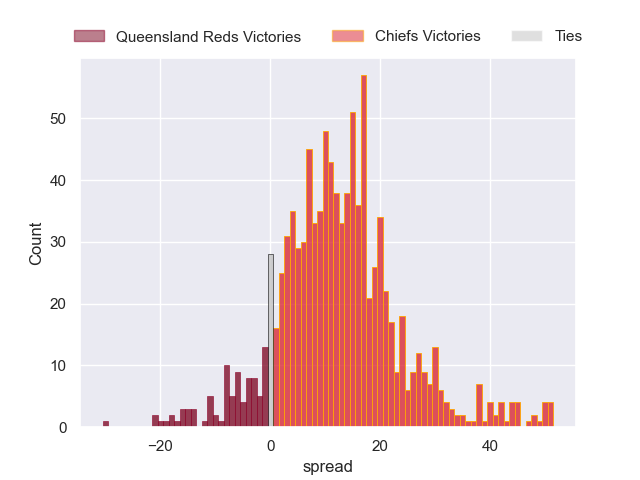

---  
title: "Super Rugby 2025 Status"  
date: 2025-04-04 6:00:00 -0500  
categories: model review projection  
layout: article  
aside:  
    toc: true  
---
# Current Team Rankings

# Standings

## Projected Total Table

| Club            |   Total Matches |   Wins |   Point Differential |   Losing Bonus Points |   Try Bonus Points |   Competition Points |
|:----------------|----------------:|-------:|---------------------:|----------------------:|-------------------:|---------------------:|
| Chiefs          |               1 |    0.8 |              8.64188 |                   0.1 |                0.4 |                  3.8 |
| Queensland Reds |               1 |    0.2 |             -8.64188 |                   0.3 |                0.2 |                  1.2 |

# Future Predictions

## Week 1

### Chiefs V Queensland Reds on 2025/04/04

Average Margin: Chiefs by 8.6

Average Scoreline: 38-29

