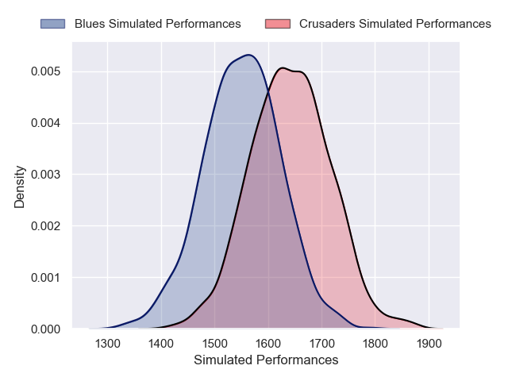
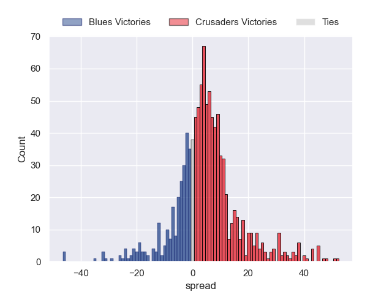
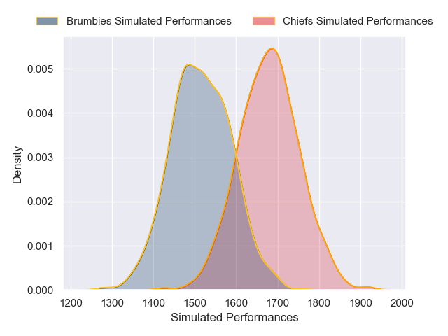
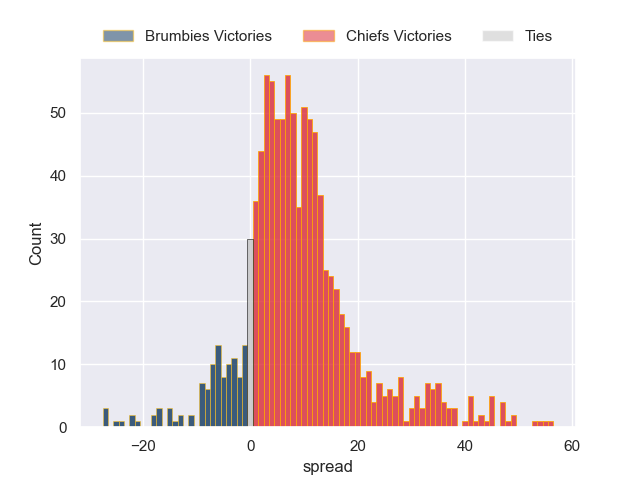

---  
title: "Super Rugby 2025 Status"  
date: 2025-06-13 6:00:00 -0500  
categories: model review projection  
layout: article  
aside:  
    toc: true  
---
# Current Team Rankings

# Standings

## Current Standings

| Club                     |   Played |   Wins |   Point Differential |   Losing Bonus Points |   Try Bonus Points |   Competition Points |
|:-------------------------|---------:|-------:|---------------------:|----------------------:|-------------------:|---------------------:|
| Fijian Drua              |        1 |      1 |                   31 |                     0 |                  1 |                    5 |
| Brumbies                 |        1 |      1 |                   23 |                     0 |                  1 |                    5 |
| New South Wales Waratahs |        1 |      0 |                  -23 |                     0 |                  0 |                    0 |
| Western Force            |        1 |      0 |                  -31 |                     0 |                  0 |                    0 |

## Projected Remaining Table

| Club      |   Matches Remaining |   Wins |   Point Differential |   Losing Bonus Points |   Try Bonus Points |   Competition Points |
|:----------|--------------------:|-------:|---------------------:|----------------------:|-------------------:|---------------------:|
| Chiefs    |                   1 |    0.8 |              6.03724 |                   0.1 |                0.3 |                  3.6 |
| Crusaders |                   1 |    0.7 |              4.72213 |                   0.2 |                0.3 |                  3.3 |
| Blues     |                   1 |    0.3 |             -4.72213 |                   0.4 |                0.2 |                  1.7 |
| Brumbies  |                   1 |    0.2 |             -6.03724 |                   0.4 |                0.2 |                  1.5 |

## Projected Total Table

| Club                     |   Total Matches |   Wins |   Point Differential |   Losing Bonus Points |   Try Bonus Points |   Competition Points |
|:-------------------------|----------------:|-------:|---------------------:|----------------------:|-------------------:|---------------------:|
| Brumbies                 |               2 |    1.2 |             16.9628  |                   0.4 |                1.2 |                  6.5 |
| Fijian Drua              |               1 |    1   |             31       |                   0   |                1   |                  5   |
| Chiefs                   |               1 |    0.8 |              6.03724 |                   0.1 |                0.3 |                  3.6 |
| Crusaders                |               1 |    0.7 |              4.72213 |                   0.2 |                0.3 |                  3.3 |
| Blues                    |               1 |    0.3 |             -4.72213 |                   0.4 |                0.2 |                  1.7 |
| New South Wales Waratahs |               1 |    0   |            -23       |                   0   |                0   |                  0   |
| Western Force            |               1 |    0   |            -31       |                   0   |                0   |                  0   |

# Completed Match Review

| Model | Percent Correct Predictions | Spread Error |
| ------ | ------ | ------ |
| Club Level | 100.0% | 20.8 |
| Player Level: Lineup | nan% | nan |
| Player Level: Minutes | nan% | nan |

# Future Predictions

## Week 2

### Crusaders V Blues on 2025/06/13

Average Margin: Crusaders by 4.7

Average Scoreline: 23-18

### Chiefs V Brumbies on 2025/06/14

Average Margin: Chiefs by 6.0

Average Scoreline: 26-20

