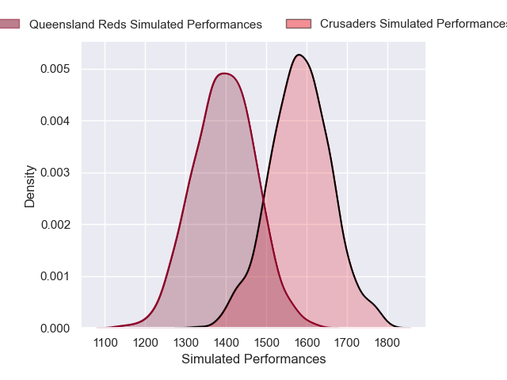
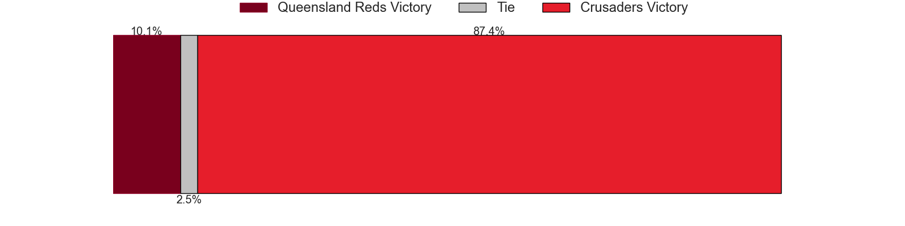
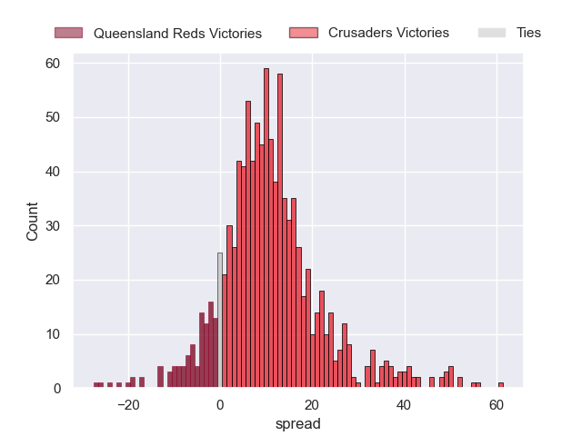
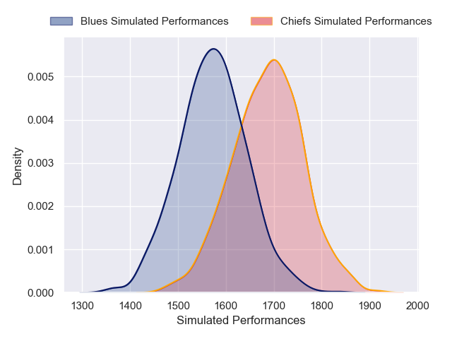
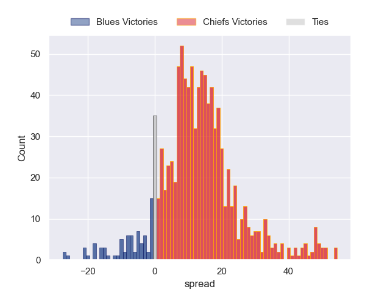
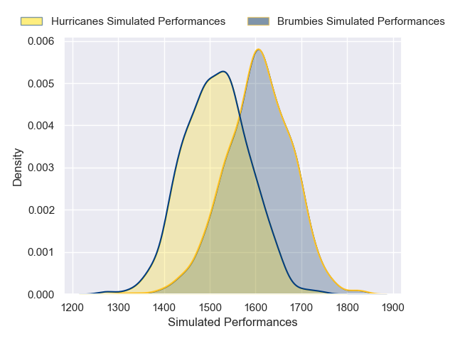
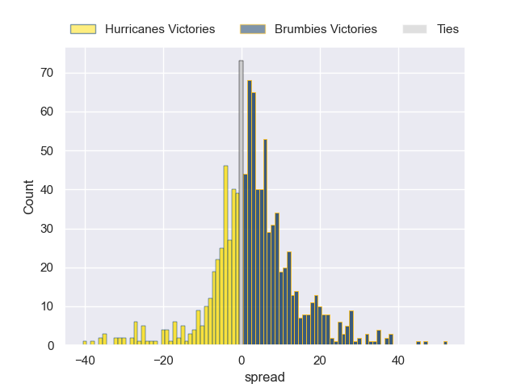

---  
title: "Super Rugby 2025 Status"  
date: 2025-06-05 6:00:00 -0500  
categories: model review projection  
layout: article  
aside:  
    toc: true  
---
# Current Team Rankings

# Standings

## Current Standings

| Club                     |   Played |   Wins |   Point Differential |   Losing Bonus Points |   Try Bonus Points |   Competition Points |
|:-------------------------|---------:|-------:|---------------------:|----------------------:|-------------------:|---------------------:|
| Brumbies                 |        1 |      1 |                   23 |                     0 |                  1 |                    5 |
| Queensland Reds          |        1 |      1 |                    4 |                     0 |                  1 |                    5 |
| Western Force            |        1 |      0 |                   -4 |                     1 |                  0 |                    1 |
| New South Wales Waratahs |        1 |      0 |                  -23 |                     0 |                  0 |                    0 |

## Projected Remaining Table

| Club            |   Matches Remaining |   Wins |   Point Differential |   Losing Bonus Points |   Try Bonus Points |   Competition Points |
|:----------------|--------------------:|-------:|---------------------:|----------------------:|-------------------:|---------------------:|
| Chiefs          |                   1 |    0.8 |              6.11789 |                   0.1 |                0.3 |                  3.6 |
| Brumbies        |                   1 |    0.8 |              4.88852 |                   0.1 |                0.3 |                  3.5 |
| Crusaders       |                   1 |    0.7 |              5.08075 |                   0.2 |                0.3 |                  3.4 |
| Queensland Reds |                   1 |    0.3 |             -5.08075 |                   0.3 |                0.2 |                  1.7 |
| Hurricanes      |                   1 |    0.2 |             -4.88852 |                   0.4 |                0.2 |                  1.6 |
| Blues           |                   1 |    0.2 |             -6.11789 |                   0.4 |                0.2 |                  1.4 |

## Projected Total Table

| Club                     |   Total Matches |   Wins |   Point Differential |   Losing Bonus Points |   Try Bonus Points |   Competition Points |
|:-------------------------|----------------:|-------:|---------------------:|----------------------:|-------------------:|---------------------:|
| Brumbies                 |               2 |    1.8 |             27.8885  |                   0.1 |                1.3 |                  8.5 |
| Queensland Reds          |               2 |    1.3 |             -1.08075 |                   0.3 |                1.2 |                  6.7 |
| Chiefs                   |               1 |    0.8 |              6.11789 |                   0.1 |                0.3 |                  3.6 |
| Crusaders                |               1 |    0.7 |              5.08075 |                   0.2 |                0.3 |                  3.4 |
| Hurricanes               |               1 |    0.2 |             -4.88852 |                   0.4 |                0.2 |                  1.6 |
| Blues                    |               1 |    0.2 |             -6.11789 |                   0.4 |                0.2 |                  1.4 |
| Western Force            |               1 |    0   |             -4       |                   1   |                0   |                  1   |
| New South Wales Waratahs |               1 |    0   |            -23       |                   0   |                0   |                  0   |

# Completed Match Review

| Model | Percent Correct Predictions | Spread Error |
| ------ | ------ | ------ |
| Club Level | 100.0% | 6.1 |
| Player Level: Lineup | nan% | nan |
| Player Level: Minutes | nan% | nan |

# Future Predictions

## Week 2

### Crusaders V Queensland Reds on 2025/06/06

Average Margin: Crusaders by 5.1

Average Scoreline: 31-26

### Chiefs V Blues on 2025/06/07

Average Margin: Chiefs by 6.1

Average Scoreline: 31-24

### Brumbies V Hurricanes on 2025/06/07

Average Margin: Brumbies by 4.9

Average Scoreline: 31-26

