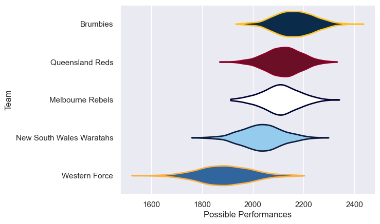

---  
title: "Super Rugby AU 2020 Status"  
date: 2025-07-28 6:00:00 -0500  
categories: model review projection  
layout: article  
aside:  
    toc: true  
---
# Current Team Rankings

# Standings

## Current Standings

| Club                     |   Played |   Wins |   Point Differential |   Losing Bonus Points |   Try Bonus Points |   Competition Points |
|:-------------------------|---------:|-------:|---------------------:|----------------------:|-------------------:|---------------------:|
| Brumbies                 |        9 |      7 |                   47 |                     0 |                  5 |                   33 |
| Queensland Reds          |       10 |      6 |                   72 |                     2 |                  3 |                   31 |
| Melbourne Rebels         |        9 |      4 |                    4 |                     1 |                  3 |                   22 |
| New South Wales Waratahs |        8 |      4 |                   15 |                     2 |                  2 |                   20 |
| Western Force            |        8 |      0 |                 -138 |                     3 |                  2 |                    5 |

# Completed Match Review

| Model | Percent Correct Predictions | Spread Error |
| ------ | ------ | ------ |
| Club Level | 63.6% | 13.8 |
| Player Level: Lineup | nan% | nan |
| Player Level: Minutes | nan% | nan |

