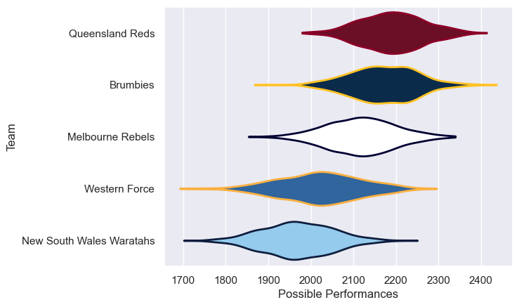

---  
title: "Super Rugby AU 2021"  
date: 2025-07-29 6:00:00 -0500  
categories: model review projection  
layout: article  
aside:  
    toc: true  
---
# Current Team Rankings

# Standings

## Current Standings

| Club                     |   Played |   Wins |   Point Differential |   Losing Bonus Points |   Try Bonus Points |   Competition Points |
|:-------------------------|---------:|-------:|---------------------:|----------------------:|-------------------:|---------------------:|
| Queensland Reds          |        9 |      8 |                  104 |                     1 |                  5 |                   38 |
| Brumbies                 |       10 |      7 |                  111 |                     3 |                  5 |                   36 |
| Western Force            |        9 |      4 |                  -57 |                     2 |                  1 |                   19 |
| Melbourne Rebels         |        8 |      3 |                   -4 |                     4 |                  1 |                   17 |
| New South Wales Waratahs |        8 |      0 |                 -154 |                     3 |                    |                    3 |

# Completed Match Review

| Model | Percent Correct Predictions | Spread Error |
| ------ | ------ | ------ |
| Club Level | 72.7% | 11.9 |
| Player Level: Lineup | nan% | nan |
| Player Level: Minutes | nan% | nan |

