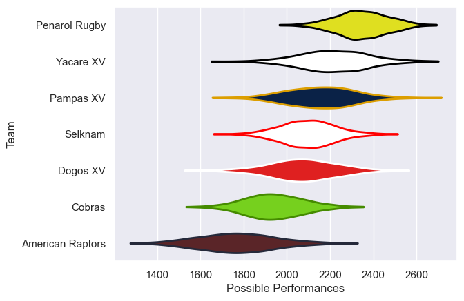

---  
title: "Super Rugby Americas 2023 Status"  
date: 2025-07-28 6:00:00 -0500  
categories: model review projection  
layout: article  
aside:  
    toc: true  
---
# Current Team Rankings

# Standings

## Current Standings

| Club             |   Played |   Wins |   Point Differential |   Losing Bonus Points |   Try Bonus Points |   Competition Points |
|:-----------------|---------:|-------:|---------------------:|----------------------:|-------------------:|---------------------:|
| Penarol Rugby    |       14 |     12 |                  200 |                     2 |                 10 |                   60 |
| Dogos XV         |       14 |     10 |                   70 |                     2 |                  9 |                   51 |
| Pampas XV        |       13 |      8 |                   91 |                     2 |                  3 |                   37 |
| Yacare XV        |       12 |      6 |                  -26 |                     2 |                  5 |                   31 |
| Selknam          |       11 |      4 |                    2 |                     3 |                  4 |                   23 |
| American Raptors |       12 |      2 |                 -176 |                     2 |                  6 |                   16 |
| Cobras           |       12 |      2 |                 -161 |                     2 |                  3 |                   13 |

## Projected Remaining Table

| Club      |   To Play |   Projected Wins |   Projected Differential |   Projected Losing Bonus Points | Projected Try Bonus Points   |   Projected Competition Points |
|:----------|----------:|-----------------:|-------------------------:|--------------------------------:|:-----------------------------|-------------------------------:|
| Selknam   |         1 |             0.55 |                     2.37 |                            0.13 |                              |                           2.39 |
| Yacare XV |         1 |             0.42 |                    -2.37 |                            0.18 |                              |                           1.92 |

## Projected Total Table

| Club             |   Played |   Wins |   Point Differential |   Losing Bonus Points |   Try Bonus Points |   Competition Points |
|:-----------------|---------:|-------:|---------------------:|----------------------:|-------------------:|---------------------:|
| Penarol Rugby    |       14 |  12    |               200    |                  2    |                 10 |                60    |
| Dogos XV         |       14 |  10    |                70    |                  2    |                  9 |                51    |
| Pampas XV        |       13 |   8    |                91    |                  2    |                  3 |                37    |
| Yacare XV        |       13 |   6.42 |               -28.37 |                  2.18 |                  5 |                32.92 |
| Selknam          |       12 |   4.55 |                 4.37 |                  3.13 |                  4 |                25.39 |
| American Raptors |       12 |   2    |              -176    |                  2    |                  6 |                16    |
| Cobras           |       12 |   2    |              -161    |                  2    |                  3 |                13    |

# Completed Match Review

| Model | Percent Correct Predictions | Spread Error |
| ------ | ------ | ------ |
| Club Level | 68.9% | 12.4 |
| Player Level: Lineup | nan% | nan |
| Player Level: Minutes | nan% | nan |

# Future Predictions

## Week 15

### Yacare XV V Selknam on 2023/04/01

Average Margin: Selknam by 0.9

