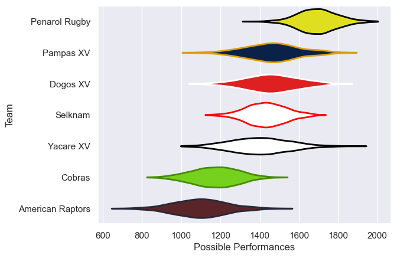

---  
title: "Super Rugby Americas 2023 Status"  
date: 2023-05-19 6:00:00 -0500  
categories: model review projection  
layout: article  
aside:  
    toc: true  
---
# Current Team Rankings

# Standings

## Current Standings

| Club             |   Played |   Wins |   Point Differential |   Losing Bonus Points |   Try Bonus Points |   Competition Points |
|:-----------------|---------:|-------:|---------------------:|----------------------:|-------------------:|---------------------:|
| Penarol Rugby    |        9 |      8 |                  141 |                     1 |                  7 |                   40 |
| Dogos XV         |       10 |      8 |                   73 |                     1 |                  7 |                   40 |
| Pampas XV        |       10 |      6 |                   95 |                     2 |                nan |                   29 |
| Selknam          |        9 |      4 |                   26 |                     2 |                nan |                   22 |
| Yacare XV        |        8 |      4 |                  -29 |                     1 |                  3 |                   20 |
| Cobras           |       10 |      2 |                 -134 |                     1 |                  2 |                   11 |
| American Raptors |       10 |      1 |                 -172 |                     2 |                  4 |                   10 |

## Projected Remaining Table

| Club             |   Matches Remaining |   Wins |   Point Differential |   Losing Bonus Points |   Try Bonus Points |   Competition Points |
|:-----------------|--------------------:|-------:|---------------------:|----------------------:|-------------------:|---------------------:|
| Penarol Rugby    |                   2 |    1.9 |                 31   |                   0   |                1.9 |                  9.8 |
| Dogos XV         |                   1 |    1   |                 20.2 |                   0   |                1   |                  4.9 |
| Pampas XV        |                   2 |    0.8 |                 -8.5 |                   0.3 |                0.7 |                  4.2 |
| Cobras           |                   1 |    0.8 |                  6.7 |                   0.1 |                0.8 |                  4.1 |
| Selknam          |                   2 |    0.7 |                -11.3 |                   0.3 |                0.7 |                  3.8 |
| Yacare XV        |                   2 |    0.6 |                -10.8 |                   0.5 |                0.5 |                  3.3 |
| American Raptors |                   2 |    0.2 |                -27.1 |                   0.4 |                0.3 |                  1.5 |

## Projected Total Table

| Club             |   Total Matches |   Wins |   Point Differential |   Losing Bonus Points |   Try Bonus Points |   Competition Points |
|:-----------------|----------------:|-------:|---------------------:|----------------------:|-------------------:|---------------------:|
| Penarol Rugby    |              11 |    9.9 |                172   |                   1   |                8.9 |                 49.8 |
| Dogos XV         |              11 |    9   |                 93.2 |                   1   |                8   |                 44.9 |
| Pampas XV        |              12 |    6.8 |                 86.5 |                   2.3 |                0.7 |                 33.2 |
| Selknam          |              11 |    4.7 |                 14.7 |                   2.3 |                0.7 |                 25.8 |
| Yacare XV        |              10 |    4.6 |                -39.8 |                   1.5 |                3.5 |                 23.3 |
| Cobras           |              11 |    2.8 |               -127.3 |                   1.1 |                2.8 |                 15.1 |
| American Raptors |              12 |    1.2 |               -199.1 |                   2.4 |                4.3 |                 11.5 |

# Completed Match Review

| Model | Percent Correct Predictions | Spread Error |
| ------ | ------ | ------ |
| Club Level | 72.7% | 10.7 |
| Player Level: Lineup | 60.6% | 13.8 |
| Player Level: Minutes | 51.5% | 14.9 |

# Future Predictions

## Week 11

### Penarol Rugby V Pampas XV on 2023/05/19

Average Margin: Penarol Rugby by 15.2

### Selknam V Yacare XV on 2023/05/20

Average Margin: Selknam by 4.6

### Dogos XV V American Raptors on 2023/05/21

Average Margin: Dogos XV by 20.6

## Week 12

### Pampas XV V Yacare XV on 2023/05/26

Average Margin: Pampas XV by 6.5

### Penarol Rugby V Selknam on 2023/05/26

Average Margin: Penarol Rugby by 16.2

### Cobras V American Raptors on 2023/05/27

Average Margin: Cobras by 6.9

