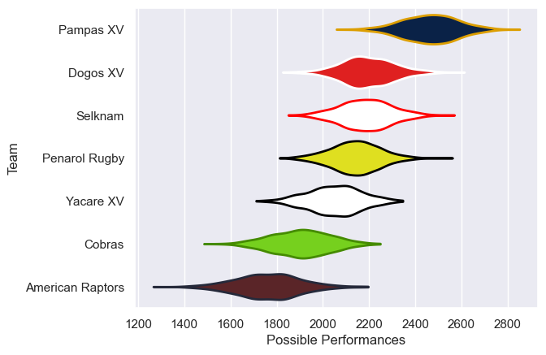

---  
title: "Super Rugby Americas 2024"  
date: 2025-07-29 6:00:00 -0500  
categories: model review projection  
layout: article  
aside:  
    toc: true  
---
# Current Team Rankings

# Standings

## Current Standings

| Club             |   Played |   Wins |   Point Differential |   Losing Bonus Points |   Try Bonus Points |   Competition Points |
|:-----------------|---------:|-------:|---------------------:|----------------------:|-------------------:|---------------------:|
| Pampas XV        |       14 |     12 |                  303 |                     1 |                  2 |                   51 |
| Dogos XV         |       14 |     10 |                  166 |                     1 |                  3 |                   48 |
| Yacare XV        |       13 |      6 |                   32 |                     3 |                  2 |                   29 |
| Selknam          |       12 |      5 |                  -33 |                     1 |                  1 |                   24 |
| Penarol Rugby    |       13 |      5 |                  -48 |                     2 |                    |                   24 |
| American Raptors |       12 |      3 |                 -221 |                     2 |                  1 |                   15 |
| Cobras           |       12 |      2 |                 -199 |                     1 |                    |                    9 |

# Completed Match Review

| Model | Percent Correct Predictions | Spread Error |
| ------ | ------ | ------ |
| Club Level | 64.4% | 15.8 |
| Player Level: Lineup | nan% | nan |
| Player Level: Minutes | nan% | nan |

