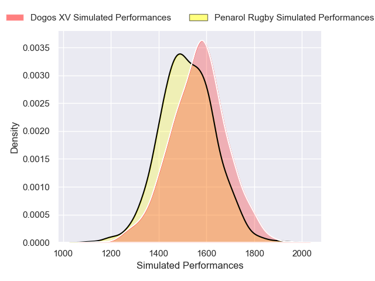
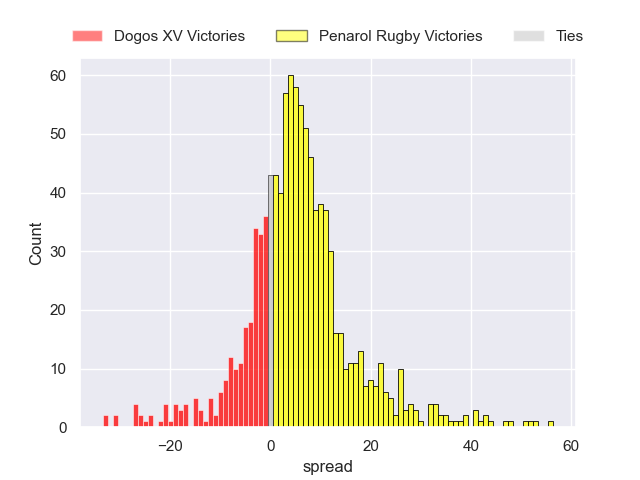
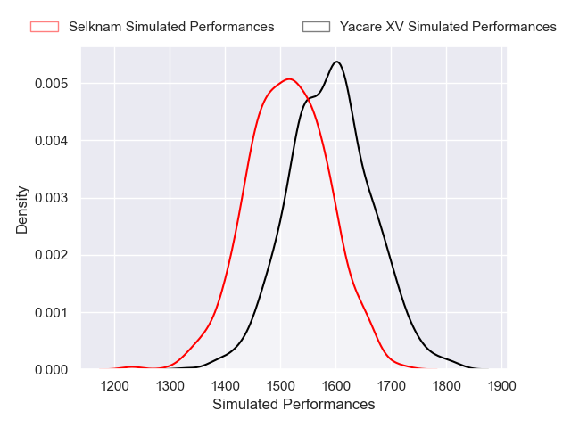
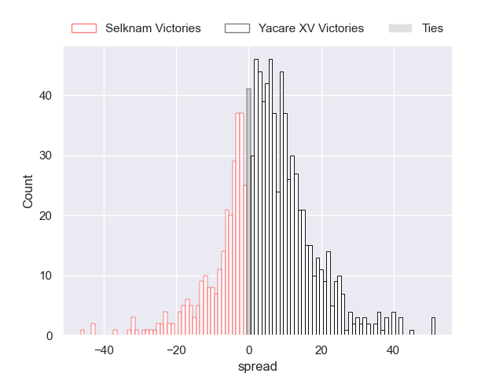

---  
title: "Super Rugby Americas 2024 Status"  
date: 2025-01-13 6:00:00 -0500  
categories: model review projection  
layout: article  
aside:  
    toc: true  
---
# Current Team Rankings

# Standings

## Current Standings

| Club             |   Played |   Wins |   Point Differential |   Losing Bonus Points |   Try Bonus Points |   Competition Points |
|:-----------------|---------:|-------:|---------------------:|----------------------:|-------------------:|---------------------:|
| Dogos XV         |        4 |      4 |                  133 |                     0 |                  3 |                   19 |
| Pampas XV        |        4 |      3 |                   45 |                     0 |                  2 |                   14 |
| Cobras           |        3 |      2 |                  -14 |                     0 |                  0 |                    8 |
| Selknam          |        1 |      1 |                   24 |                     0 |                  1 |                    5 |
| American Raptors |        4 |      1 |                 -128 |                     0 |                  1 |                    5 |
| Yacare XV        |        4 |      0 |                  -52 |                     1 |                  2 |                    3 |
| Penarol Rugby    |        2 |      0 |                   -8 |                     2 |                  0 |                    2 |

## Projected Remaining Table

| Club          |   Matches Remaining |   Wins |   Point Differential |   Losing Bonus Points |   Try Bonus Points |   Competition Points |
|:--------------|--------------------:|-------:|---------------------:|----------------------:|-------------------:|---------------------:|
| Pampas XV     |                  12 |    6.7 |             17.3324  |                   3.1 |                4.3 |                 34.2 |
| Penarol Rugby |                  12 |    6.1 |              4.2124  |                   3.4 |                4.1 |                 32.1 |
| Yacare XV     |                  12 |    6.1 |              4.07362 |                   3.3 |                3.9 |                 31.8 |
| Cobras        |                  12 |    6   |              0.15155 |                   3.4 |                3.8 |                 31.1 |
| Tarucas       |                  12 |    5.8 |             -6.81763 |                   3.4 |                3.8 |                 30.5 |
| Selknam       |                  12 |    5.7 |             -7.26866 |                   3.5 |                3.8 |                 30.1 |
| Dogos XV      |                  12 |    5.5 |            -11.6837  |                   3.5 |                4.1 |                 29.8 |

## Projected Total Table

| Club             |   Total Matches |   Wins |   Point Differential |   Losing Bonus Points |   Try Bonus Points |   Competition Points |
|:-----------------|----------------:|-------:|---------------------:|----------------------:|-------------------:|---------------------:|
| Dogos XV         |              16 |    9.5 |            121.316   |                   3.5 |                7.1 |                 48.8 |
| Pampas XV        |              16 |    9.7 |             62.3324  |                   3.1 |                6.3 |                 48.2 |
| Cobras           |              15 |    8   |            -13.8484  |                   3.4 |                3.8 |                 39.1 |
| Selknam          |              13 |    6.7 |             16.7313  |                   3.5 |                4.8 |                 35.1 |
| Yacare XV        |              16 |    6.1 |            -47.9264  |                   4.3 |                5.9 |                 34.8 |
| Penarol Rugby    |              14 |    6.1 |             -3.7876  |                   5.4 |                4.1 |                 34.1 |
| Tarucas          |              12 |    5.8 |             -6.81763 |                   3.4 |                3.8 |                 30.5 |
| American Raptors |               4 |    1   |           -128       |                   0   |                1   |                  5   |

# Completed Match Review

| Model | Percent Correct Predictions | Spread Error |
| ------ | ------ | ------ |
| Club Level | 45.5% | 20.6 |
| Player Level: Lineup | 63.6% | 17.9 |
| Player Level: Minutes | 63.6% | 18.3 |

# Future Predictions

## Week 5

### Penarol Rugby V Dogos XV on 2025/02/14

Average Margin: Penarol Rugby by 5.1

Average Scoreline: 27-22

### Yacare XV V Selknam on 2025/02/15

Average Margin: Yacare XV by 4.6

Average Scoreline: 28-24

## Week 6

### Penarol Rugby V Yacare XV on 2025/02/21

Average Margin: Penarol Rugby by 3.8

Average Scoreline: 27-23

### Cobras V Selknam on 2025/02/22

Average Margin: Cobras by 5.0

Average Scoreline: 29-24

### Dogos XV V Pampas XV on 2025/02/22

Average Margin: Dogos XV by 1.4

Average Scoreline: 28-27

## Week 7

### Pampas XV V Penarol Rugby on 2025/02/28

Average Margin: Pampas XV by 4.6

Average Scoreline: 30-26

### Yacare XV V Tarucas on 2025/03/01

Average Margin: Yacare XV by 5.1

Average Scoreline: 29-24

### Selknam V Dogos XV on 2025/03/01

Average Margin: Selknam by 4.6

Average Scoreline: 28-23

## Week 8

### Penarol Rugby V Selknam on 2025/03/07

Average Margin: Penarol Rugby by 5.1

Average Scoreline: 26-21

### Dogos XV V Cobras on 2025/03/08

Average Margin: Dogos XV by 3.2

Average Scoreline: 27-24

## Week 9

### Pampas XV V Yacare XV on 2025/03/14

Average Margin: Pampas XV by 5.3

Average Scoreline: 29-23

### Cobras V Penarol Rugby on 2025/03/16

Average Margin: Cobras by 3.6

Average Scoreline: 25-22

### Selknam V Tarucas on 2025/03/16

Average Margin: Selknam by 3.6

Average Scoreline: 27-23

## Week 10

### Dogos XV V Tarucas on 2025/03/28

Average Margin: Dogos XV by 3.5

Average Scoreline: 26-23

### Selknam V Pampas XV on 2025/03/29

Average Margin: Selknam by 2.6

Average Scoreline: 28-26

### Cobras V Yacare XV on 2025/03/29

Average Margin: Cobras by 3.3

Average Scoreline: 27-24

## Week 11

### Pampas XV V Cobras on 2025/04/04

Average Margin: Pampas XV by 4.9

Average Scoreline: 31-26

### Yacare XV V Dogos XV on 2025/04/05

Average Margin: Yacare XV by 4.6

Average Scoreline: 29-25

## Week 12

### Pampas XV V Dogos XV on 2025/04/11

Average Margin: Pampas XV by 5.6

Average Scoreline: 29-24

### Yacare XV V Penarol Rugby on 2025/04/12

Average Margin: Yacare XV by 4.1

Average Scoreline: 23-19

### Selknam V Cobras on 2025/04/12

Average Margin: Selknam by 3.1

Average Scoreline: 23-19

## Week 13

### Pampas XV V Tarucas on 2025/04/25

Average Margin: Pampas XV by 5.5

Average Scoreline: 26-21

### Cobras V Dogos XV on 2025/04/26

Average Margin: Cobras by 4.3

Average Scoreline: 28-24

### Selknam V Penarol Rugby on 2025/04/27

Average Margin: Selknam by 2.8

Average Scoreline: 22-19

## Week 14

### Penarol Rugby V Tarucas on 2025/05/02

Average Margin: Penarol Rugby by 4.5

Average Scoreline: 27-23

### Cobras V Pampas XV on 2025/05/03

Average Margin: Cobras by 3.0

Average Scoreline: 31-28

## Week 15

### Dogos XV V Yacare XV on 2025/05/05

Average Margin: Dogos XV by 2.9

Average Scoreline: 27-24

### Yacare XV V Pampas XV on 2025/05/10

Average Margin: Yacare XV by 2.8

Average Scoreline: 29-26

## Week 16

### Penarol Rugby V Cobras on 2025/05/12

Average Margin: Penarol Rugby by 4.4

Average Scoreline: 26-22

### Yacare XV V Cobras on 2025/05/17

Average Margin: Yacare XV by 4.2

Average Scoreline: 24-20

## Week 17

### Pampas XV V Selknam on 2025/05/19

Average Margin: Pampas XV by 6.0

Average Scoreline: 31-25

### Dogos XV V Penarol Rugby on 2025/05/23

Average Margin: Dogos XV by 3.1

Average Scoreline: 27-24

### Selknam V Yacare XV on 2025/05/24

Average Margin: Selknam by 3.1

Average Scoreline: 22-19

### Cobras V Tarucas on 2025/05/25

Average Margin: Cobras by 4.6

Average Scoreline: 28-23

## Week 18

### Penarol Rugby V Pampas XV on 2025/05/30

Average Margin: Penarol Rugby by 2.6

Average Scoreline: 28-25

### Dogos XV V Selknam on 2025/05/30

Average Margin: Dogos XV by 3.2

Average Scoreline: 27-24

