---  
title: "Super Rugby Americas 2024 Status"  
date: 2024-02-20 6:00:00 -0500  
categories: model review projection  
layout: article  
aside:  
    toc: true  
---
# Current Team Rankings

# Standings

## Current Standings

| Club             |   Played |   Wins |   Point Differential |   Losing Bonus Points |   Try Bonus Points |   Competition Points |
|:-----------------|---------:|-------:|---------------------:|----------------------:|-------------------:|---------------------:|
| Dogos XV         |        1 |      1 |                   48 |                     0 |                  1 |                    5 |
| American Raptors |        1 |      0 |                  -48 |                     0 |                  0 |                    0 |

## Projected Remaining Table

| Club             |   Matches Remaining |   Wins |   Point Differential |   Losing Bonus Points |   Try Bonus Points |   Competition Points |
|:-----------------|--------------------:|-------:|---------------------:|----------------------:|-------------------:|---------------------:|
| Penarol Rugby    |                  11 |    8.9 |            111.772   |                   1.4 |                6.8 |                 43.7 |
| Yacare XV        |                  11 |    9   |            119.423   |                   1.3 |                6   |                 43.3 |
| Selknam          |                  12 |    5.8 |             -6.39498 |                   2.6 |                5.5 |                 31.1 |
| Pampas XV        |                  11 |    6   |             17.605   |                   2.3 |                4.1 |                 30.5 |
| Dogos XV         |                  11 |    5.4 |             -1.93952 |                   2.4 |                5.2 |                 29.4 |
| Cobras           |                  11 |    2.3 |           -106.402   |                   2.2 |                4.1 |                 15.3 |
| American Raptors |                  11 |    1.7 |           -134.064   |                   2   |                3.9 |                 12.6 |

## Projected Total Table

| Club             |   Total Matches |   Wins |   Point Differential |   Losing Bonus Points |   Try Bonus Points |   Competition Points |
|:-----------------|----------------:|-------:|---------------------:|----------------------:|-------------------:|---------------------:|
| Penarol Rugby    |              11 |    8.9 |            111.772   |                   1.4 |                6.8 |                 43.7 |
| Yacare XV        |              11 |    9   |            119.423   |                   1.3 |                6   |                 43.3 |
| Dogos XV         |              12 |    6.4 |             46.0605  |                   2.4 |                6.2 |                 34.4 |
| Selknam          |              12 |    5.8 |             -6.39498 |                   2.6 |                5.5 |                 31.1 |
| Pampas XV        |              11 |    6   |             17.605   |                   2.3 |                4.1 |                 30.5 |
| Cobras           |              11 |    2.3 |           -106.402   |                   2.2 |                4.1 |                 15.3 |
| American Raptors |              12 |    1.7 |           -182.064   |                   2   |                3.9 |                 12.6 |

# Completed Match Review

| Model | Percent Correct Predictions | Spread Error |
| ------ | ------ | ------ |
| Club Level | 100.0% | 35.4 |
| Player Level: Lineup | 100.0% | 32.8 |
| Player Level: Minutes | 100.0% | 34.4 |

# Future Predictions

## Week 2

### Pampas XV V American Raptors on 2024/02/24

Average Margin: Pampas XV by 14.9

Average Scoreline: 33-18

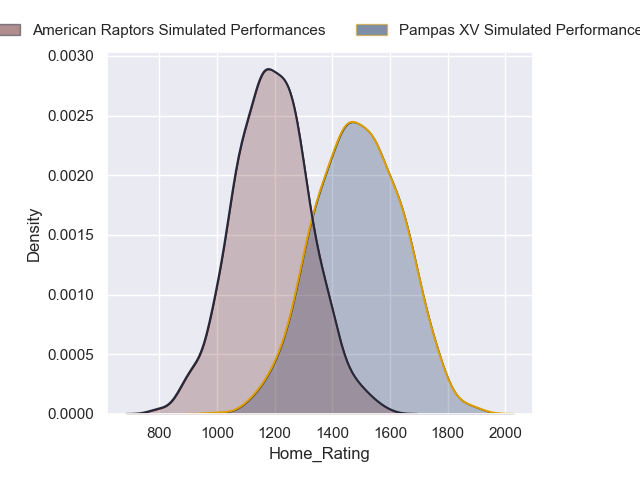
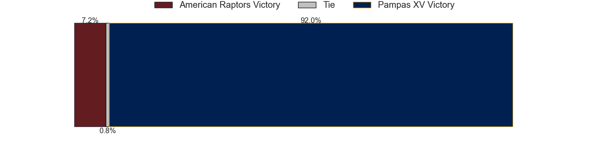
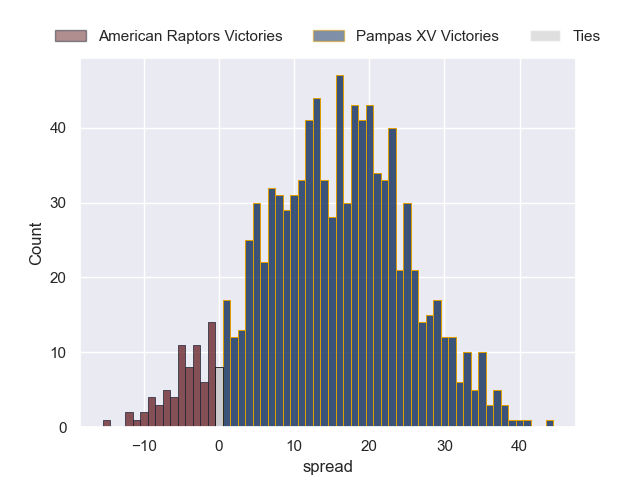

### Yacare XV V Selknam on 2024/02/24

Average Margin: Yacare XV by 13.5

Average Scoreline: 29-15

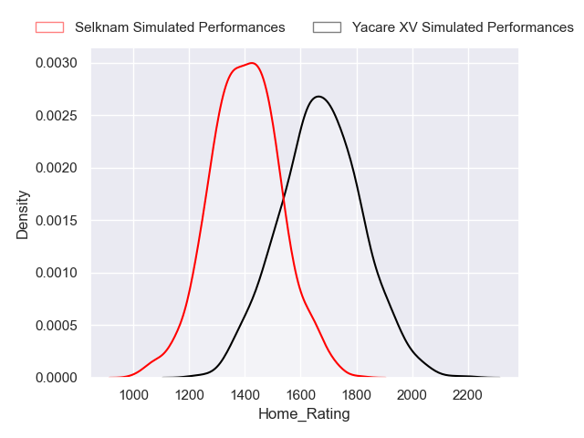
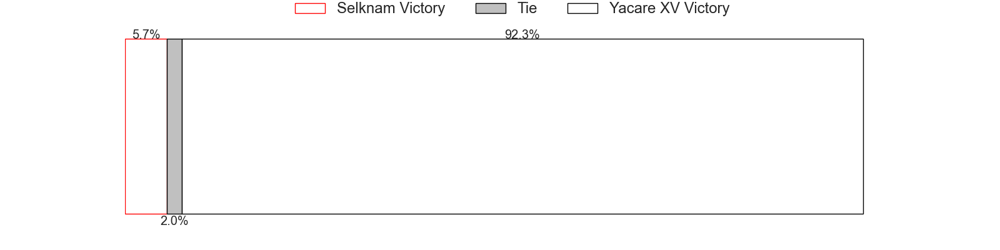
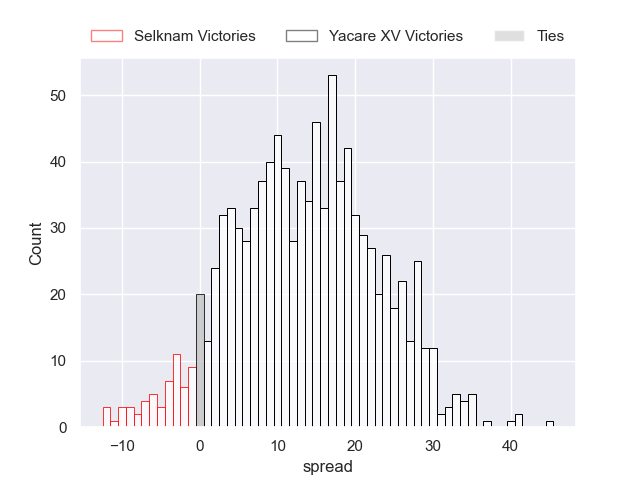

### Cobras V Dogos XV on 2024/02/24

Average Margin: Dogos XV by 6.5

Average Scoreline: 29-23

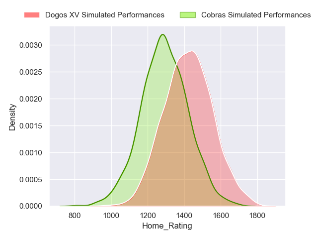

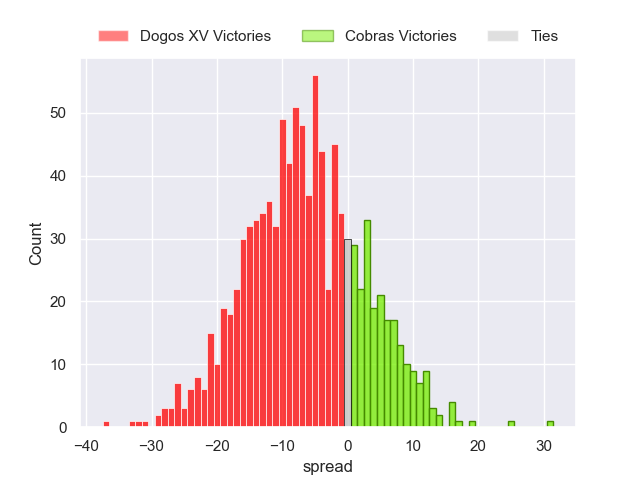

## Week 3

### Penarol Rugby V American Raptors on 2024/03/01

Average Margin: Penarol Rugby by 23.5

Average Scoreline: 40-16

### Cobras V Selknam on 2024/03/02

Average Margin: Selknam by 4.9

Average Scoreline: 21-16

### Dogos XV V Yacare XV on 2024/03/02

Average Margin: Yacare XV by 5.8

Average Scoreline: 32-26

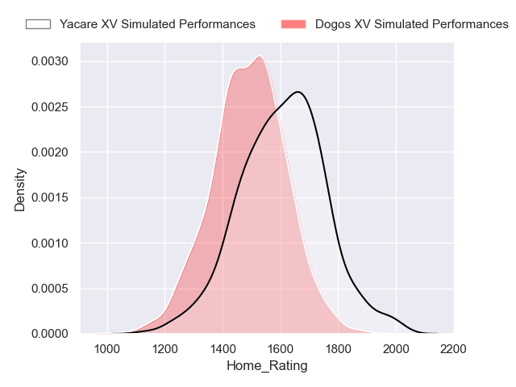
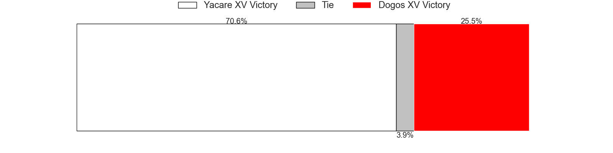
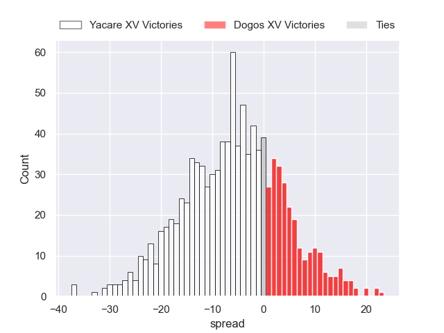

## Week 4

### Pampas XV V Dogos XV on 2024/03/08

Average Margin: Pampas XV by 2.6

Average Scoreline: 24-22

### Selknam V Penarol Rugby on 2024/03/09

Average Margin: Penarol Rugby by 6.3

Average Scoreline: 24-18

### Yacare XV V Cobras on 2024/03/09

Average Margin: Yacare XV by 22.2

Average Scoreline: 32-10

## Week 5

### Penarol Rugby V Yacare XV on 2024/03/15

Average Margin: Penarol Rugby by 2.8

Average Scoreline: 29-26

### Selknam V Pampas XV on 2024/03/16

Average Margin: Selknam by 2.7

Average Scoreline: 28-26

### American Raptors V Cobras on 2024/03/17

Average Margin: American Raptors by 0.9

Average Scoreline: 34-33

## Week 6

### Pampas XV V Penarol Rugby on 2024/03/22

Average Margin: Penarol Rugby by 5.5

Average Scoreline: 22-16

### Dogos XV V Selknam on 2024/03/23

Average Margin: Dogos XV by 4.5

Average Scoreline: 22-18

### American Raptors V Yacare XV on 2024/03/24

Average Margin: Yacare XV by 17.0

Average Scoreline: 32-15

## Week 7

### Penarol Rugby V Dogos XV on 2024/04/05

Average Margin: Penarol Rugby by 11.4

Average Scoreline: 32-20

### Cobras V Pampas XV on 2024/04/06

Average Margin: Pampas XV by 5.8

Average Scoreline: 28-22

### American Raptors V Selknam on 2024/04/07

Average Margin: Selknam by 6.8

Average Scoreline: 23-16

## Week 8

### Pampas XV V Yacare XV on 2024/04/12

Average Margin: Yacare XV by 5.6

Average Scoreline: 28-23

### Penarol Rugby V Cobras on 2024/04/12

Average Margin: Penarol Rugby by 21.0

Average Scoreline: 32-11

### American Raptors V Dogos XV on 2024/04/14

Average Margin: Dogos XV by 8.2

Average Scoreline: 30-22

## Week 9

### Selknam V Yacare XV on 2024/04/20

Average Margin: Yacare XV by 6.6

Average Scoreline: 28-22

### Dogos XV V Cobras on 2024/04/21

Average Margin: Dogos XV by 12.9

Average Scoreline: 34-21

### American Raptors V Pampas XV on 2024/04/21

Average Margin: Pampas XV by 7.6

Average Scoreline: 25-18

## Week 10

### Yacare XV V Dogos XV on 2024/04/27

Average Margin: Yacare XV by 11.5

Average Scoreline: 31-19

### Selknam V Cobras on 2024/04/27

Average Margin: Selknam by 11.9

Average Scoreline: 30-18

### American Raptors V Penarol Rugby on 2024/04/28

Average Margin: Penarol Rugby by 16.3

Average Scoreline: 33-17

## Week 11

### Penarol Rugby V Selknam on 2024/05/03

Average Margin: Penarol Rugby by 12.4

Average Scoreline: 30-18

### Dogos XV V Pampas XV on 2024/05/04

Average Margin: Dogos XV by 3.8

Average Scoreline: 29-26

### Cobras V Yacare XV on 2024/05/04

Average Margin: Yacare XV by 13.8

Average Scoreline: 28-14

## Week 12

### Pampas XV V Selknam on 2024/05/10

Average Margin: Pampas XV by 4.1

Average Scoreline: 27-23

### Yacare XV V Penarol Rugby on 2024/05/11

Average Margin: Yacare XV by 3.7

Average Scoreline: 28-25

### Cobras V American Raptors on 2024/05/11

Average Margin: Cobras by 5.2

Average Scoreline: 39-33

## Week 13

### Penarol Rugby V Pampas XV on 2024/05/17

Average Margin: Penarol Rugby by 11.7

Average Scoreline: 30-18

### Selknam V Dogos XV on 2024/05/18

Average Margin: Selknam by 1.9

Average Scoreline: 25-24

### Yacare XV V American Raptors on 2024/05/18

Average Margin: Yacare XV by 22.4

Average Scoreline: 40-18

## Week 14

### Pampas XV V Cobras on 2024/05/24

Average Margin: Pampas XV by 11.9

Average Scoreline: 30-19

### Dogos XV V Penarol Rugby on 2024/05/24

Average Margin: Penarol Rugby by 4.5

Average Scoreline: 25-20

### Selknam V American Raptors on 2024/05/25

Average Margin: Selknam by 12.9

Average Scoreline: 35-22

