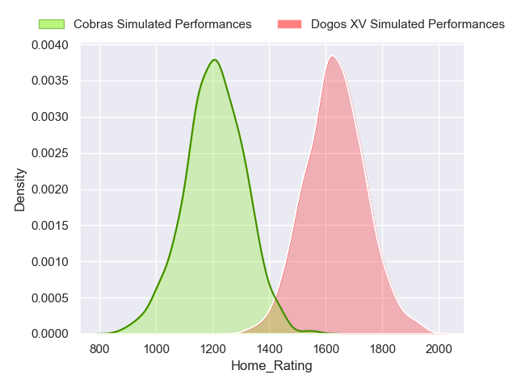
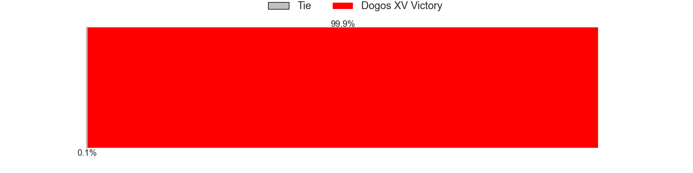
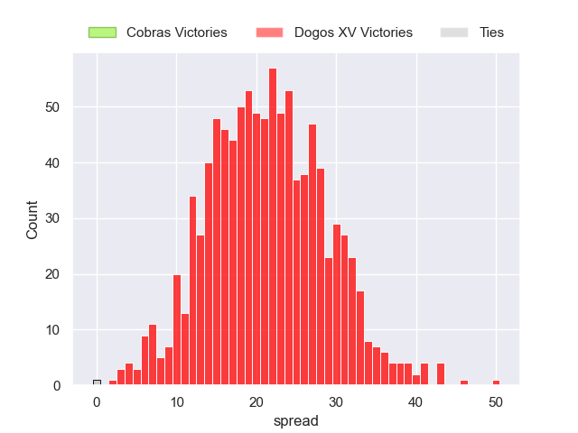

---  
title: "Super Rugby Americas 2024 Status"  
date: 2024-04-15 6:00:00 -0500  
categories: model review projection  
layout: article  
aside:  
    toc: true  
---
# Current Team Rankings

# Standings

## Current Standings

| Club             |   Played |   Wins |   Point Differential |   Losing Bonus Points |   Try Bonus Points |   Competition Points |
|:-----------------|---------:|-------:|---------------------:|----------------------:|-------------------:|---------------------:|
| Dogos XV         |        2 |      2 |                   97 |                     0 |                  2 |                   10 |
| Pampas XV        |        2 |      2 |                   26 |                     0 |                  1 |                    9 |
| Cobras           |        2 |      2 |                    8 |                     0 |                  0 |                    8 |
| American Raptors |        3 |      1 |                  -95 |                     0 |                  1 |                    5 |
| Yacare XV        |        3 |      0 |                  -28 |                     1 |                  2 |                    3 |
| Penarol Rugby    |        2 |      0 |                   -8 |                     2 |                  0 |                    2 |

## Projected Remaining Table

| Club             |   Matches Remaining |   Wins |   Point Differential |   Losing Bonus Points |   Try Bonus Points |   Competition Points |
|:-----------------|--------------------:|-------:|---------------------:|----------------------:|-------------------:|---------------------:|
| Pampas XV        |                   5 |    4.3 |             62.5486  |                   0.5 |                2.9 |                 20.5 |
| Yacare XV        |                   5 |    4.2 |             47.9947  |                   0.6 |                2.4 |                 19.6 |
| Dogos XV         |                   5 |    3.7 |             38.1674  |                   0.9 |                2.4 |                 18.1 |
| Selknam          |                   6 |    2.9 |              2.17292 |                   1.4 |                2.3 |                 15.3 |
| Penarol Rugby    |                   5 |    1.6 |            -23.1695  |                   1.2 |                1.8 |                  9.5 |
| Cobras           |                   5 |    0.8 |            -65.1783  |                   0.6 |                1.6 |                  5.5 |
| American Raptors |                   5 |    0.5 |            -62.5359  |                   0.9 |                2   |                  5.1 |

## Projected Total Table

| Club             |   Total Matches |   Wins |   Point Differential |   Losing Bonus Points |   Try Bonus Points |   Competition Points |
|:-----------------|----------------:|-------:|---------------------:|----------------------:|-------------------:|---------------------:|
| Pampas XV        |               7 |    6.3 |             88.5486  |                   0.5 |                3.9 |                 29.5 |
| Dogos XV         |               7 |    5.7 |            135.167   |                   0.9 |                4.4 |                 28.1 |
| Yacare XV        |               8 |    4.2 |             19.9947  |                   1.6 |                4.4 |                 22.6 |
| Selknam          |               6 |    2.9 |              2.17292 |                   1.4 |                2.3 |                 15.3 |
| Cobras           |               7 |    2.8 |            -57.1783  |                   0.6 |                1.6 |                 13.5 |
| Penarol Rugby    |               7 |    1.6 |            -31.1695  |                   3.2 |                1.8 |                 11.5 |
| American Raptors |               8 |    1.5 |           -157.536   |                   0.9 |                3   |                 10.1 |

# Completed Match Review

| Model | Percent Correct Predictions | Spread Error |
| ------ | ------ | ------ |
| Club Level | 42.9% | 24.7 |
| Player Level: Lineup | 42.9% | 18.8 |
| Player Level: Minutes | 42.9% | 19.1 |

# Future Predictions

## Week 4

### Selknam V Yacare XV on 2024/04/20

Average Margin: Yacare XV by 3.0

Average Scoreline: 32-29

### American Raptors V Pampas XV on 2024/04/21

Average Margin: Pampas XV by 18.3

Average Scoreline: 39-21

## Week 5

### Dogos XV V Cobras on 2024/04/22

Average Margin: Dogos XV by 21.3

Average Scoreline: 39-18

### Selknam V Cobras on 2024/04/27

Average Margin: Selknam by 12.8

Average Scoreline: 31-19

### Yacare XV V Dogos XV on 2024/04/27

Average Margin: Yacare XV by 1.5

Average Scoreline: 21-20

### American Raptors V Penarol Rugby on 2024/04/28

Average Margin: Penarol Rugby by 6.1

Average Scoreline: 41-35

## Week 6

### Penarol Rugby V Selknam on 2024/05/03

Average Margin: Penarol Rugby by 2.3

Average Scoreline: 26-24

### Dogos XV V Pampas XV on 2024/05/04

Average Margin: Dogos XV by 0.9

Average Scoreline: 30-29

### Cobras V Yacare XV on 2024/05/04

Average Margin: Yacare XV by 12.6

Average Scoreline: 35-22

## Week 7

### Pampas XV V Selknam on 2024/05/10

Average Margin: Pampas XV by 14.1

Average Scoreline: 34-20

### Yacare XV V Penarol Rugby on 2024/05/11

Average Margin: Yacare XV by 10.6

Average Scoreline: 31-20

### Cobras V American Raptors on 2024/05/11

Average Margin: Cobras by 4.4

Average Scoreline: 31-27

## Week 8

### Penarol Rugby V Pampas XV on 2024/05/17

Average Margin: Pampas XV by 8.2

Average Scoreline: 30-21

### Yacare XV V American Raptors on 2024/05/18

Average Margin: Yacare XV by 20.3

Average Scoreline: 46-25

### Selknam V Dogos XV on 2024/05/18

Average Margin: Dogos XV by 4.8

Average Scoreline: 27-22

## Week 9

### Pampas XV V Cobras on 2024/05/24

Average Margin: Pampas XV by 22.9

Average Scoreline: 39-16

### Dogos XV V Penarol Rugby on 2024/05/24

Average Margin: Dogos XV by 12.7

Average Scoreline: 34-22

### Selknam V American Raptors on 2024/05/25

Average Margin: Selknam by 13.5

Average Scoreline: 34-20

