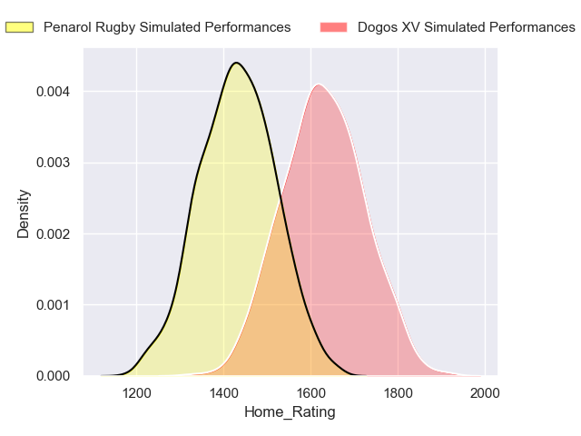
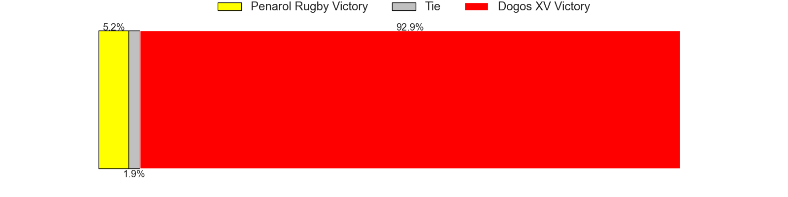
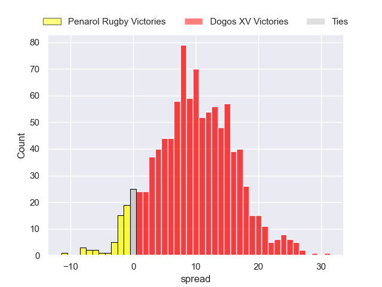
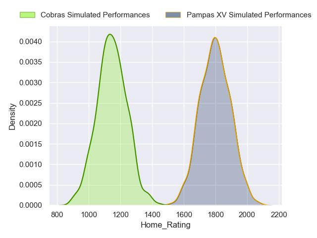
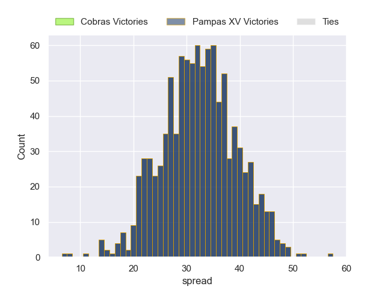

---  
title: "Super Rugby Americas 2024 Status"  
date: 2024-05-24 6:00:00 -0500  
categories: model review projection  
layout: article  
aside:  
    toc: true  
---
# Current Team Rankings

# Standings

## Current Standings

| Club             |   Played |   Wins |   Point Differential |   Losing Bonus Points |   Try Bonus Points |   Competition Points |
|:-----------------|---------:|-------:|---------------------:|----------------------:|-------------------:|---------------------:|
| Dogos XV         |        3 |      3 |                  119 |                     0 |                  3 |                   15 |
| Pampas XV        |        3 |      3 |                   59 |                     0 |                  2 |                   14 |
| Cobras           |        3 |      2 |                  -14 |                     0 |                  0 |                    8 |
| Selknam          |        1 |      1 |                   24 |                     0 |                  1 |                    5 |
| American Raptors |        4 |      1 |                 -128 |                     0 |                  1 |                    5 |
| Yacare XV        |        4 |      0 |                  -52 |                     1 |                  2 |                    3 |
| Penarol Rugby    |        2 |      0 |                   -8 |                     2 |                  0 |                    2 |

## Projected Remaining Table

| Club             |   Matches Remaining |   Wins |   Point Differential |   Losing Bonus Points |   Try Bonus Points |   Competition Points |
|:-----------------|--------------------:|-------:|---------------------:|----------------------:|-------------------:|---------------------:|
| Pampas XV        |                   1 |    1   |             32.7076  |                   0   |                0.9 |                  4.9 |
| Selknam          |                   1 |    1   |             14.9754  |                   0   |                0.8 |                  4.8 |
| Dogos XV         |                   1 |    0.9 |              9.81165 |                   0.1 |                0.5 |                  4.3 |
| Penarol Rugby    |                   1 |    0.1 |             -9.81165 |                   0.3 |                0.2 |                  0.7 |
| American Raptors |                   1 |    0   |            -14.9754  |                   0.1 |                0.2 |                  0.4 |
| Cobras           |                   1 |    0   |            -32.7076  |                   0   |                0.2 |                  0.2 |

## Projected Total Table

| Club             |   Total Matches |   Wins |   Point Differential |   Losing Bonus Points |   Try Bonus Points |   Competition Points |
|:-----------------|----------------:|-------:|---------------------:|----------------------:|-------------------:|---------------------:|
| Dogos XV         |               4 |    3.9 |             128.812  |                   0.1 |                3.5 |                 19.3 |
| Pampas XV        |               4 |    4   |              91.7076 |                   0   |                2.9 |                 18.9 |
| Selknam          |               2 |    2   |              38.9754 |                   0   |                1.8 |                  9.8 |
| Cobras           |               4 |    2   |             -46.7076 |                   0   |                0.2 |                  8.2 |
| American Raptors |               5 |    1   |            -142.975  |                   0.1 |                1.2 |                  5.4 |
| Yacare XV        |               4 |    0   |             -52      |                   1   |                2   |                  3   |
| Penarol Rugby    |               3 |    0.1 |             -17.8116 |                   2.3 |                0.2 |                  2.7 |

# Completed Match Review

| Model | Percent Correct Predictions | Spread Error |
| ------ | ------ | ------ |
| Club Level | 50.0% | 19.8 |
| Player Level: Lineup | 60.0% | 18.8 |
| Player Level: Minutes | 60.0% | 19.1 |

# Future Predictions

## Week 5

### Dogos XV V Penarol Rugby on 2024/05/25

Average Margin: Dogos XV by 9.8

Average Scoreline: 34-24

### Pampas XV V Cobras on 2024/05/25

Average Margin: Pampas XV by 32.7

Average Scoreline: 53-20

### Selknam V American Raptors on 2024/05/25

Average Margin: Selknam by 15.0

Average Scoreline: 32-17

