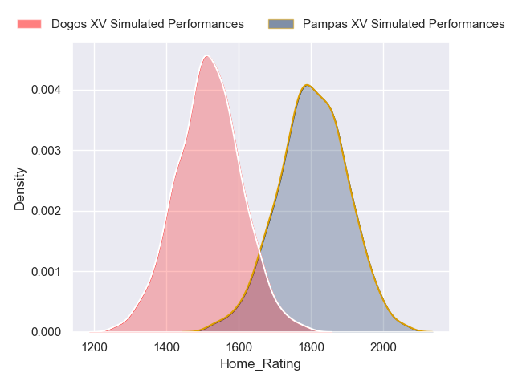
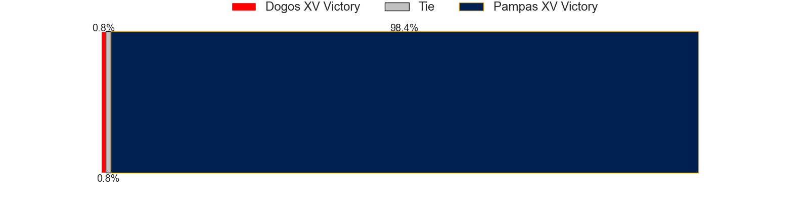
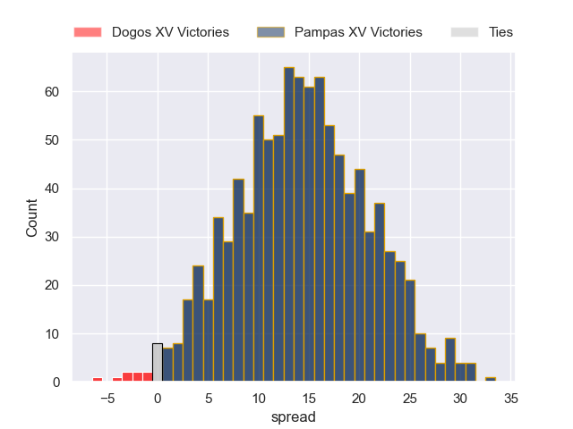

---  
title: "Super Rugby Americas 2024 Status"  
date: 2024-06-10 6:00:00 -0500  
categories: model review projection  
layout: article  
aside:  
    toc: true  
---
# Current Team Rankings

# Standings

## Current Standings

| Club             |   Played |   Wins |   Point Differential |   Losing Bonus Points |   Try Bonus Points |   Competition Points |
|:-----------------|---------:|-------:|---------------------:|----------------------:|-------------------:|---------------------:|
| Dogos XV         |        3 |      3 |                  119 |                     0 |                  3 |                   15 |
| Pampas XV        |        3 |      3 |                   59 |                     0 |                  2 |                   14 |
| Cobras           |        3 |      2 |                  -14 |                     0 |                  0 |                    8 |
| Selknam          |        1 |      1 |                   24 |                     0 |                  1 |                    5 |
| American Raptors |        4 |      1 |                 -128 |                     0 |                  1 |                    5 |
| Yacare XV        |        4 |      0 |                  -52 |                     1 |                  2 |                    3 |
| Penarol Rugby    |        2 |      0 |                   -8 |                     2 |                  0 |                    2 |

## Projected Remaining Table

| Club      |   Matches Remaining |   Wins |   Point Differential |   Losing Bonus Points |   Try Bonus Points |   Competition Points |
|:----------|--------------------:|-------:|---------------------:|----------------------:|-------------------:|---------------------:|
| Pampas XV |                   1 |      1 |              14.3317 |                   0   |                0.6 |                  4.6 |
| Dogos XV  |                   1 |      0 |             -14.3317 |                   0.1 |                0.1 |                  0.3 |

## Projected Total Table

| Club             |   Total Matches |   Wins |   Point Differential |   Losing Bonus Points |   Try Bonus Points |   Competition Points |
|:-----------------|----------------:|-------:|---------------------:|----------------------:|-------------------:|---------------------:|
| Pampas XV        |               4 |      4 |              73.3317 |                   0   |                2.6 |                 18.6 |
| Dogos XV         |               4 |      3 |             104.668  |                   0.1 |                3.1 |                 15.3 |
| Cobras           |               3 |      2 |             -14      |                   0   |                0   |                  8   |
| Selknam          |               1 |      1 |              24      |                   0   |                1   |                  5   |
| American Raptors |               4 |      1 |            -128      |                   0   |                1   |                  5   |
| Yacare XV        |               4 |      0 |             -52      |                   1   |                2   |                  3   |
| Penarol Rugby    |               2 |      0 |              -8      |                   2   |                0   |                  2   |

# Completed Match Review

| Model | Percent Correct Predictions | Spread Error |
| ------ | ------ | ------ |
| Club Level | 50.0% | 19.8 |
| Player Level: Lineup | 60.0% | 18.9 |
| Player Level: Minutes | 60.0% | 19.1 |

# Future Predictions

## Week 5

### Pampas XV V Dogos XV on 2024/06/15

Average Margin: Pampas XV by 14.3

Average Scoreline: 32-17

