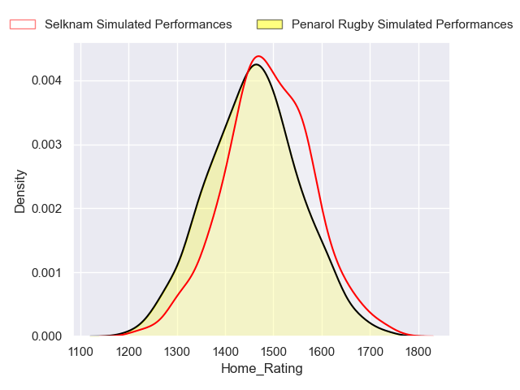
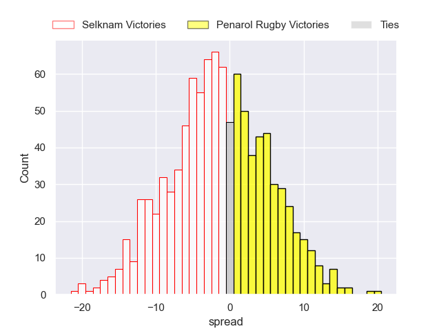
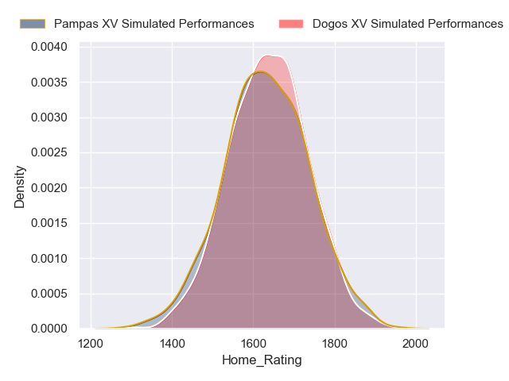
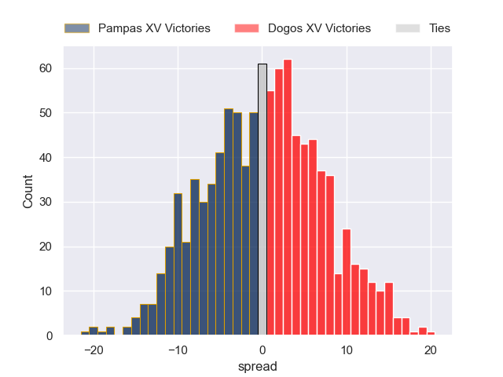

---  
title: "Super Rugby Americas 2024 Status"  
date: 2024-04-29 6:00:00 -0500  
categories: model review projection  
layout: article  
aside:  
    toc: true  
---
# Current Team Rankings

# Standings

## Current Standings

| Club             |   Played |   Wins |   Point Differential |   Losing Bonus Points |   Try Bonus Points |   Competition Points |
|:-----------------|---------:|-------:|---------------------:|----------------------:|-------------------:|---------------------:|
| Dogos XV         |        3 |      3 |                  119 |                     0 |                  3 |                   15 |
| Pampas XV        |        3 |      3 |                   59 |                     0 |                  2 |                   14 |
| Cobras           |        3 |      2 |                  -14 |                     0 |                  0 |                    8 |
| Selknam          |        1 |      1 |                   24 |                     0 |                  1 |                    5 |
| American Raptors |        4 |      1 |                 -128 |                     0 |                  1 |                    5 |
| Yacare XV        |        4 |      0 |                  -52 |                     1 |                  2 |                    3 |
| Penarol Rugby    |        2 |      0 |                   -8 |                     2 |                  0 |                    2 |

## Projected Remaining Table

| Club             |   Matches Remaining |   Wins |   Point Differential |   Losing Bonus Points |   Try Bonus Points |   Competition Points |
|:-----------------|--------------------:|-------:|---------------------:|----------------------:|-------------------:|---------------------:|
| Pampas XV        |                   4 |    3.3 |             44.3798  |                   0.5 |                2   |                 15.7 |
| Yacare XV        |                   3 |    2.8 |             35.9724  |                   0.2 |                2.1 |                 13.4 |
| Selknam          |                   4 |    2   |              9.84297 |                   0.9 |                1.5 |                 10.6 |
| Dogos XV         |                   3 |    2.1 |             14.466   |                   0.6 |                1.2 |                 10.3 |
| Cobras           |                   3 |    0.9 |            -29.3604  |                   0.5 |                0.9 |                  4.8 |
| Penarol Rugby    |                   4 |    0.7 |            -30.0247  |                   1.2 |                0.8 |                  4.8 |
| American Raptors |                   3 |    0.2 |            -45.276   |                   0.4 |                1   |                  2.4 |

## Projected Total Table

| Club             |   Total Matches |   Wins |   Point Differential |   Losing Bonus Points |   Try Bonus Points |   Competition Points |
|:-----------------|----------------:|-------:|---------------------:|----------------------:|-------------------:|---------------------:|
| Pampas XV        |               7 |    6.3 |             103.38   |                   0.5 |                4   |                 29.7 |
| Dogos XV         |               6 |    5.1 |             133.466  |                   0.6 |                4.2 |                 25.3 |
| Yacare XV        |               7 |    2.8 |             -16.0276 |                   1.2 |                4.1 |                 16.4 |
| Selknam          |               5 |    3   |              33.843  |                   0.9 |                2.5 |                 15.6 |
| Cobras           |               6 |    2.9 |             -43.3604 |                   0.5 |                0.9 |                 12.8 |
| American Raptors |               7 |    1.2 |            -173.276  |                   0.4 |                2   |                  7.4 |
| Penarol Rugby    |               6 |    0.7 |             -38.0247 |                   3.2 |                0.8 |                  6.8 |

# Completed Match Review

| Model | Percent Correct Predictions | Spread Error |
| ------ | ------ | ------ |
| Club Level | 50.0% | 21.8 |
| Player Level: Lineup | 60.0% | 18.7 |
| Player Level: Minutes | 60.0% | 19.0 |

# Future Predictions

## Week 5

### Penarol Rugby V Selknam on 2024/05/04

Average Margin: Selknam by 1.4

Average Scoreline: 25-24

### Cobras V Yacare XV on 2024/05/04

Average Margin: Yacare XV by 9.7

Average Scoreline: 32-23

### Dogos XV V Pampas XV on 2024/05/05

Average Margin: Dogos XV by 0.3

Average Scoreline: 25-24

## Week 6

### Pampas XV V Selknam on 2024/05/10

Average Margin: Pampas XV by 10.7

Average Scoreline: 28-17

### Cobras V American Raptors on 2024/05/11

Average Margin: Cobras by 5.7

Average Scoreline: 29-23

### Yacare XV V Penarol Rugby on 2024/05/11

Average Margin: Yacare XV by 7.2

Average Scoreline: 29-21

## Week 7

### Penarol Rugby V Pampas XV on 2024/05/17

Average Margin: Pampas XV by 8.6

Average Scoreline: 31-22

### Yacare XV V American Raptors on 2024/05/18

Average Margin: Yacare XV by 19.1

Average Scoreline: 41-22

### Selknam V Dogos XV on 2024/05/18

Average Margin: Dogos XV by 1.4

Average Scoreline: 25-24

## Week 8

### Pampas XV V Cobras on 2024/05/24

Average Margin: Pampas XV by 25.4

Average Scoreline: 38-13

### Dogos XV V Penarol Rugby on 2024/05/24

Average Margin: Dogos XV by 12.7

Average Scoreline: 34-21

### Selknam V American Raptors on 2024/05/25

Average Margin: Selknam by 20.5

Average Scoreline: 37-16

