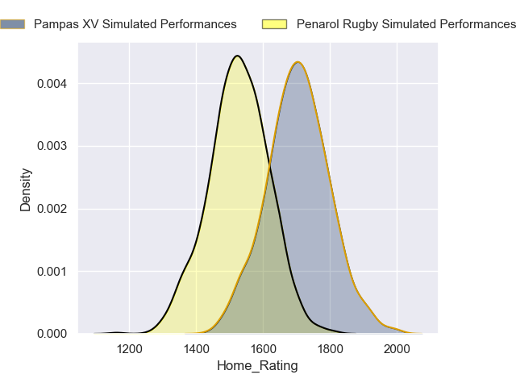
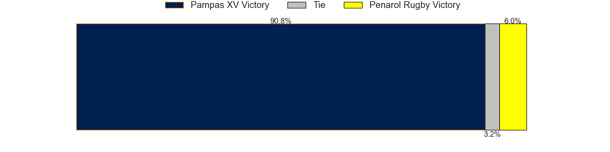
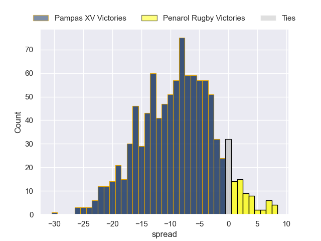
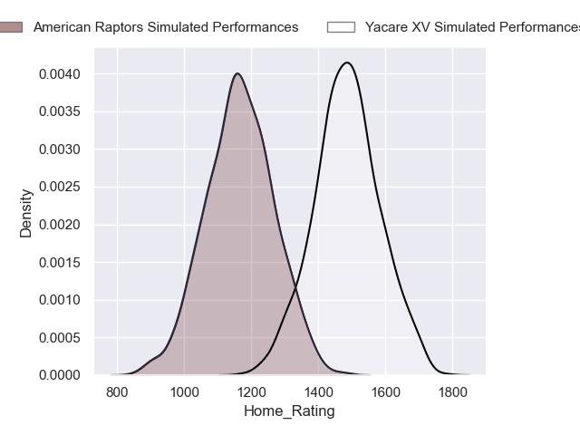
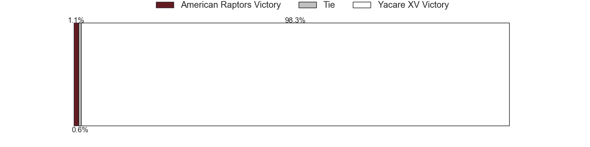
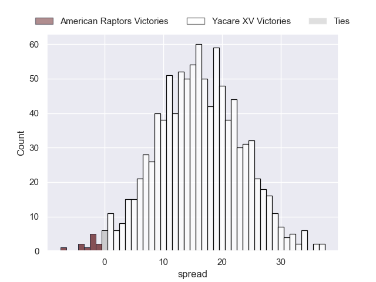

---  
title: "Super Rugby Americas 2024 Status"  
date: 2024-05-13 6:00:00 -0500  
categories: model review projection  
layout: article  
aside:  
    toc: true  
---
# Current Team Rankings

# Standings

## Current Standings

| Club             |   Played |   Wins |   Point Differential |   Losing Bonus Points |   Try Bonus Points |   Competition Points |
|:-----------------|---------:|-------:|---------------------:|----------------------:|-------------------:|---------------------:|
| Dogos XV         |        3 |      3 |                  119 |                     0 |                  3 |                   15 |
| Pampas XV        |        3 |      3 |                   59 |                     0 |                  2 |                   14 |
| Cobras           |        3 |      2 |                  -14 |                     0 |                  0 |                    8 |
| Selknam          |        1 |      1 |                   24 |                     0 |                  1 |                    5 |
| American Raptors |        4 |      1 |                 -128 |                     0 |                  1 |                    5 |
| Yacare XV        |        4 |      0 |                  -52 |                     1 |                  2 |                    3 |
| Penarol Rugby    |        2 |      0 |                   -8 |                     2 |                  0 |                    2 |

## Projected Remaining Table

| Club             |   Matches Remaining |   Wins |   Point Differential |   Losing Bonus Points |   Try Bonus Points |   Competition Points |
|:-----------------|--------------------:|-------:|---------------------:|----------------------:|-------------------:|---------------------:|
| Pampas XV        |                   2 |    1.9 |             39.7902  |                   0.1 |                1.4 |                  9.2 |
| Dogos XV         |                   2 |    1.5 |              9.22187 |                   0.4 |                0.8 |                  7.1 |
| Selknam          |                   2 |    1.4 |             14.2316  |                   0.4 |                1.1 |                  7   |
| Yacare XV        |                   1 |    1   |             16.0003  |                   0   |                0.9 |                  4.9 |
| Penarol Rugby    |                   2 |    0.2 |            -16.2853  |                   0.7 |                0.3 |                  1.8 |
| American Raptors |                   2 |    0   |            -32.0446  |                   0.2 |                0.6 |                  0.8 |
| Cobras           |                   1 |    0   |            -30.9139  |                   0   |                0.2 |                  0.2 |

## Projected Total Table

| Club             |   Total Matches |   Wins |   Point Differential |   Losing Bonus Points |   Try Bonus Points |   Competition Points |
|:-----------------|----------------:|-------:|---------------------:|----------------------:|-------------------:|---------------------:|
| Pampas XV        |               5 |    4.9 |              98.7902 |                   0.1 |                3.4 |                 23.2 |
| Dogos XV         |               5 |    4.5 |             128.222  |                   0.4 |                3.8 |                 22.1 |
| Selknam          |               3 |    2.4 |              38.2316 |                   0.4 |                2.1 |                 12   |
| Cobras           |               4 |    2   |             -44.9139 |                   0   |                0.2 |                  8.2 |
| Yacare XV        |               5 |    1   |             -35.9997 |                   1   |                2.9 |                  7.9 |
| American Raptors |               6 |    1   |            -160.045  |                   0.2 |                1.6 |                  5.8 |
| Penarol Rugby    |               4 |    0.2 |             -24.2853 |                   2.7 |                0.3 |                  3.8 |

# Completed Match Review

| Model | Percent Correct Predictions | Spread Error |
| ------ | ------ | ------ |
| Club Level | 50.0% | 19.8 |
| Player Level: Lineup | 60.0% | 18.8 |
| Player Level: Minutes | 60.0% | 19.1 |

# Future Predictions

## Week 5

### Selknam V Dogos XV on 2024/05/18

Average Margin: Dogos XV by 1.8

Average Scoreline: 22-20

### Penarol Rugby V Pampas XV on 2024/05/18

Average Margin: Pampas XV by 8.9

Average Scoreline: 29-20

### Yacare XV V American Raptors on 2024/05/19

Average Margin: Yacare XV by 16.0

Average Scoreline: 36-20

## Week 6

### Dogos XV V Penarol Rugby on 2024/05/24

Average Margin: Dogos XV by 7.4

Average Scoreline: 28-21

### Pampas XV V Cobras on 2024/05/24

Average Margin: Pampas XV by 30.9

Average Scoreline: 51-20

### Selknam V American Raptors on 2024/05/25

Average Margin: Selknam by 16.0

Average Scoreline: 41-25

