---  
title: "Super Rugby Americas 2024 Status"  
date: 2024-02-27 6:00:00 -0500  
categories: model review projection  
layout: article  
aside:  
    toc: true  
---
# Current Team Rankings

# Standings

## Current Standings

| Club             |   Played |   Wins |   Point Differential |   Losing Bonus Points |   Try Bonus Points |   Competition Points |
|:-----------------|---------:|-------:|---------------------:|----------------------:|-------------------:|---------------------:|
| Dogos XV         |        1 |      1 |                   48 |                     0 |                  1 |                    5 |
| American Raptors |        1 |      0 |                  -48 |                     0 |                  0 |                    0 |

## Projected Remaining Table

| Club             |   Matches Remaining |   Wins |   Point Differential |   Losing Bonus Points |   Try Bonus Points |   Competition Points |
|:-----------------|--------------------:|-------:|---------------------:|----------------------:|-------------------:|---------------------:|
| Penarol Rugby    |                  11 |    8.7 |            109.91    |                   1.5 |                6.8 |                 43.2 |
| Yacare XV        |                  10 |    8   |            112.745   |                   1.3 |                5.8 |                 39.2 |
| Selknam          |                  11 |    5.5 |              5.2887  |                   2.2 |                5.3 |                 29.5 |
| Pampas XV        |                  10 |    5.8 |             25.9629  |                   2.1 |                3.3 |                 28.5 |
| Dogos XV         |                  10 |    5.1 |              8.44877 |                   2.3 |                4.4 |                 27.1 |
| Cobras           |                  10 |    1.5 |           -127.958   |                   1.6 |                3.4 |                 11.1 |
| American Raptors |                  10 |    1.3 |           -134.398   |                   1.6 |                3.2 |                 10.2 |

## Projected Total Table

| Club             |   Total Matches |   Wins |   Point Differential |   Losing Bonus Points |   Try Bonus Points |   Competition Points |
|:-----------------|----------------:|-------:|---------------------:|----------------------:|-------------------:|---------------------:|
| Penarol Rugby    |              11 |    8.7 |             109.91   |                   1.5 |                6.8 |                 43.2 |
| Yacare XV        |              10 |    8   |             112.745  |                   1.3 |                5.8 |                 39.2 |
| Dogos XV         |              11 |    6.1 |              56.4488 |                   2.3 |                5.4 |                 32.1 |
| Selknam          |              11 |    5.5 |               5.2887 |                   2.2 |                5.3 |                 29.5 |
| Pampas XV        |              10 |    5.8 |              25.9629 |                   2.1 |                3.3 |                 28.5 |
| Cobras           |              10 |    1.5 |            -127.958  |                   1.6 |                3.4 |                 11.1 |
| American Raptors |              11 |    1.3 |            -182.398  |                   1.6 |                3.2 |                 10.2 |

# Completed Match Review

| Model | Percent Correct Predictions | Spread Error |
| ------ | ------ | ------ |
| Club Level | 100.0% | 35.4 |
| Player Level: Lineup | 100.0% | 32.8 |
| Player Level: Minutes | 100.0% | 34.4 |

# Future Predictions

## Week 2

### Penarol Rugby V American Raptors on 2024/03/01

Average Margin: Penarol Rugby by 25.1

Average Scoreline: 37-12

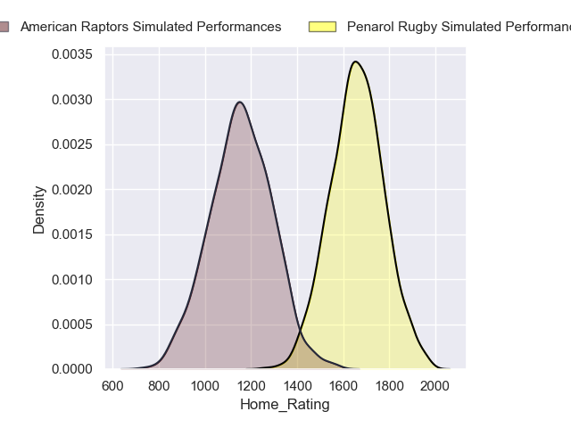
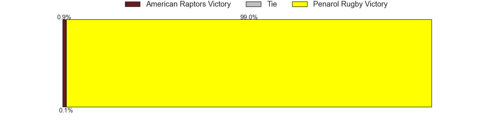
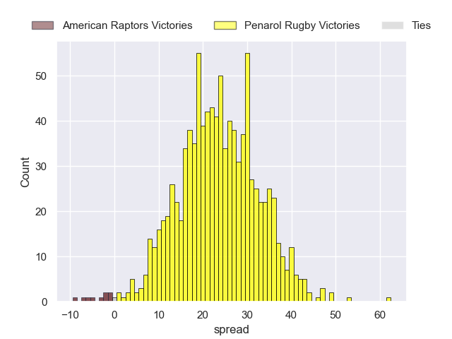

### Cobras V Selknam on 2024/03/02

Average Margin: Selknam by 7.5

Average Scoreline: 29-21

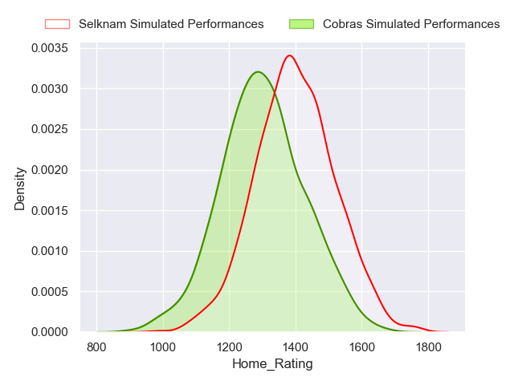
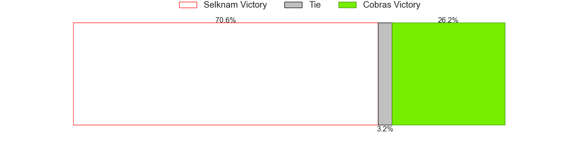
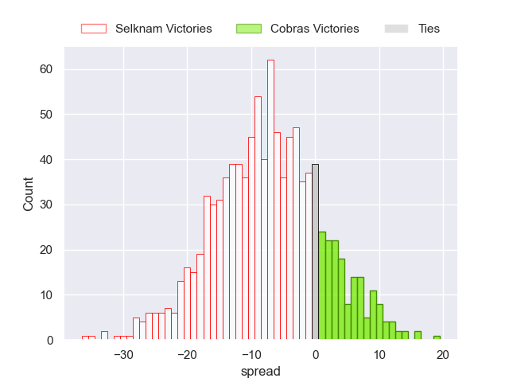

### Dogos XV V Yacare XV on 2024/03/03

Average Margin: Yacare XV by 4.3

Average Scoreline: 27-23

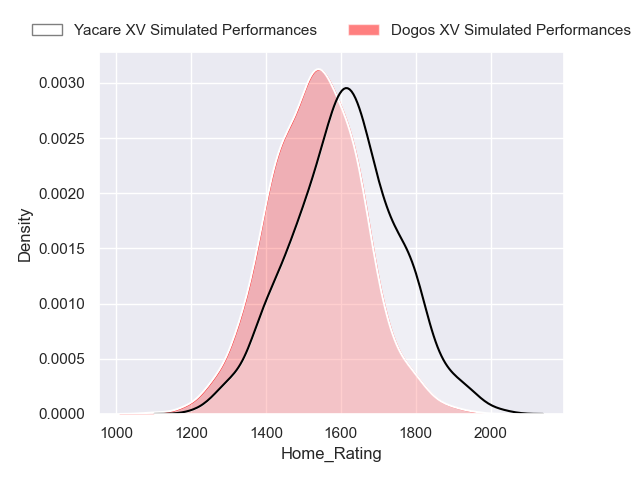
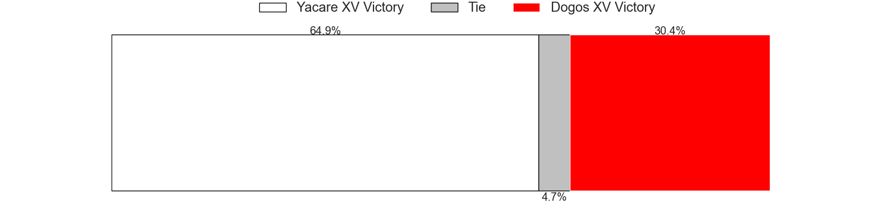
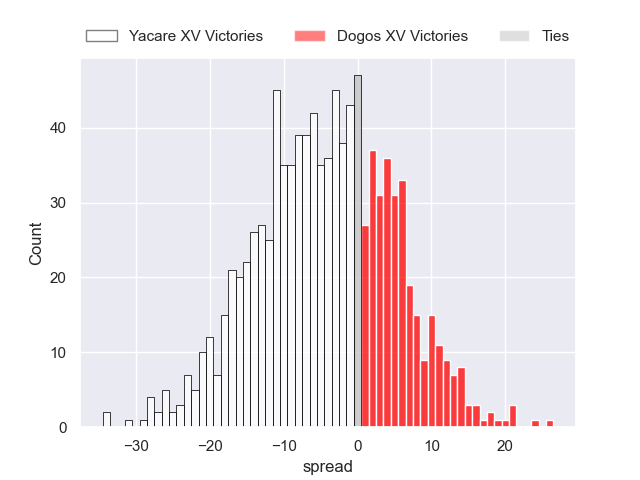

## Week 3

### Pampas XV V Dogos XV on 2024/03/08

Average Margin: Pampas XV by 3.1

Average Scoreline: 30-27

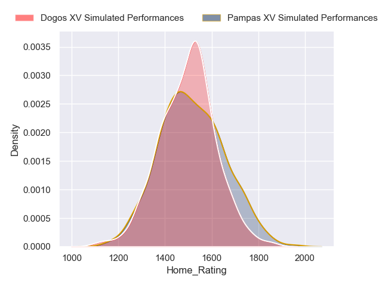

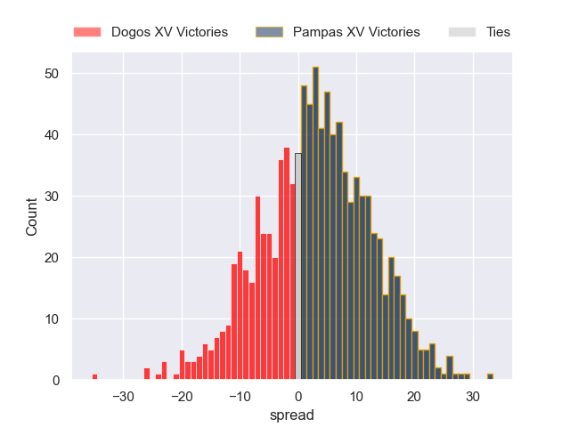

### Selknam V Penarol Rugby on 2024/03/09

Average Margin: Penarol Rugby by 6.4

Average Scoreline: 31-24

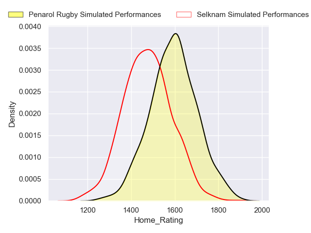
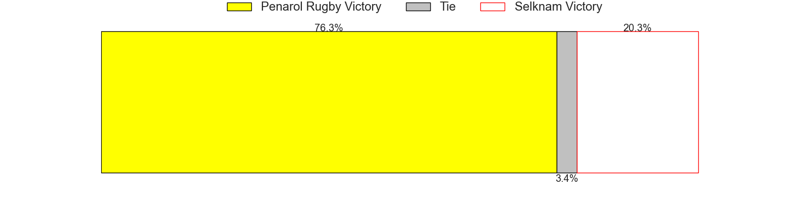
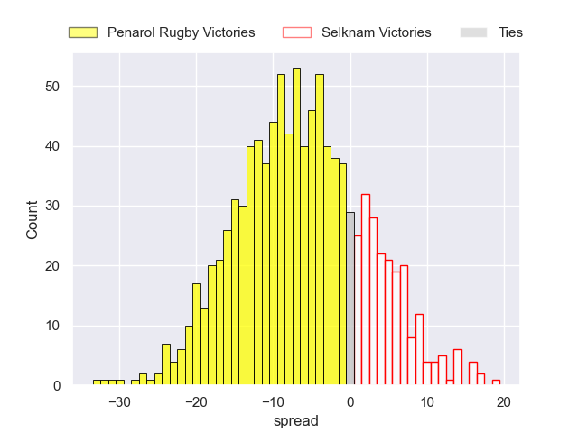

### Yacare XV V Cobras on 2024/03/09

Average Margin: Yacare XV by 24.9

Average Scoreline: 32-7

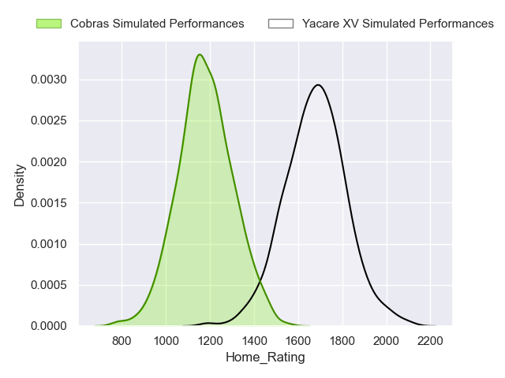
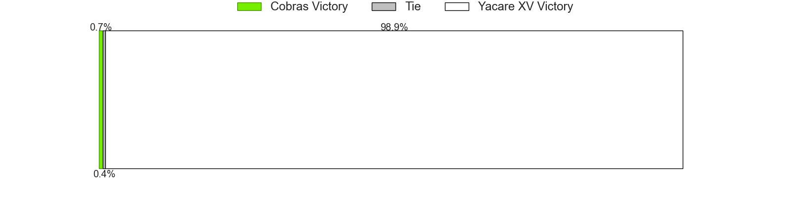
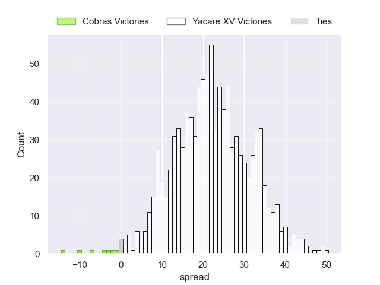

## Week 4

### Penarol Rugby V Yacare XV on 2024/03/15

Average Margin: Penarol Rugby by 2.5

Average Scoreline: 29-26

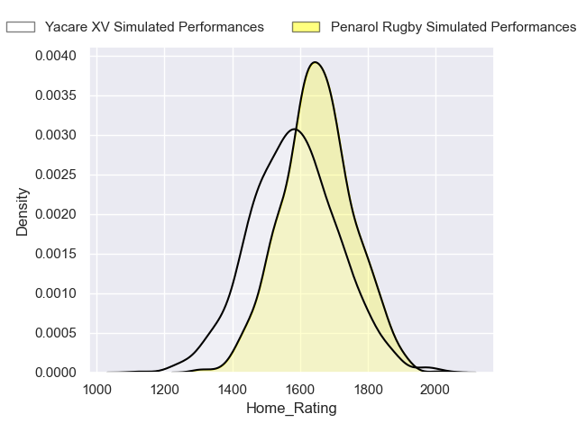
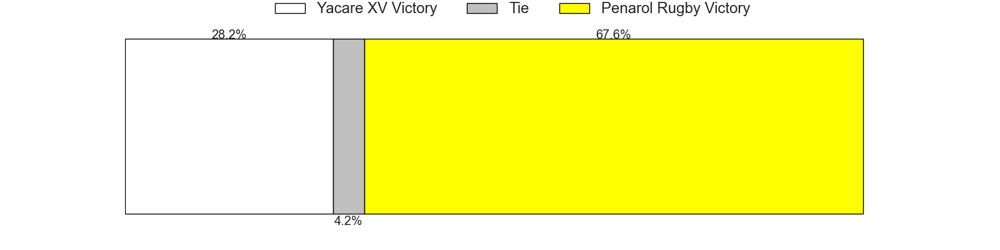
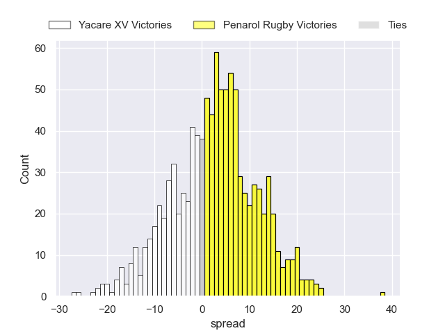

### Selknam V Pampas XV on 2024/03/16

Average Margin: Selknam by 0.1

Average Scoreline: 29-29

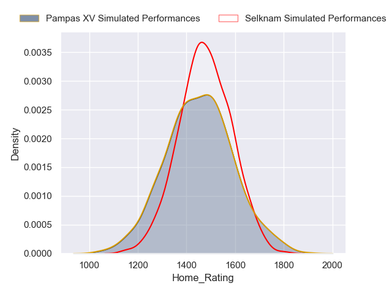

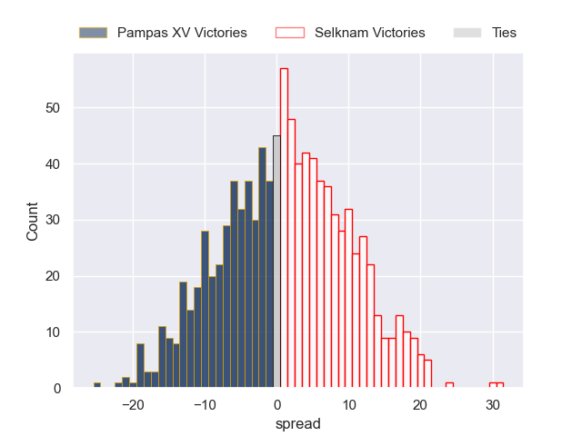

### American Raptors V Cobras on 2024/03/17

Average Margin: American Raptors by 2.2

Average Scoreline: 35-33

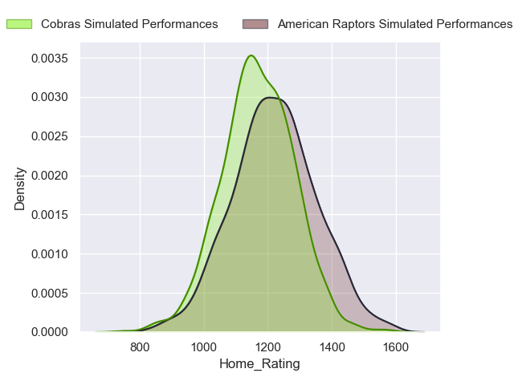

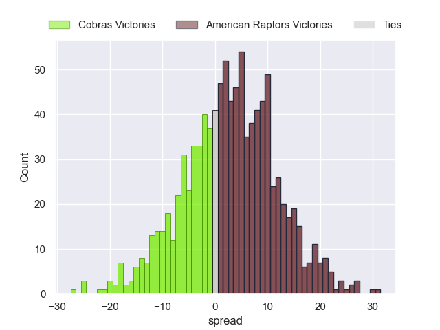

## Week 5

### Pampas XV V Penarol Rugby on 2024/03/22

Average Margin: Penarol Rugby by 3.6

Average Scoreline: 27-24

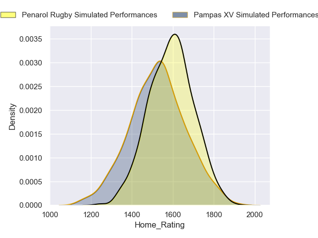

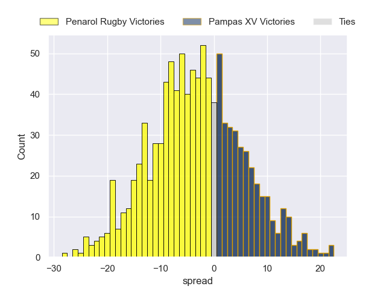

### Dogos XV V Selknam on 2024/03/23

Average Margin: Dogos XV by 6.8

Average Scoreline: 29-22

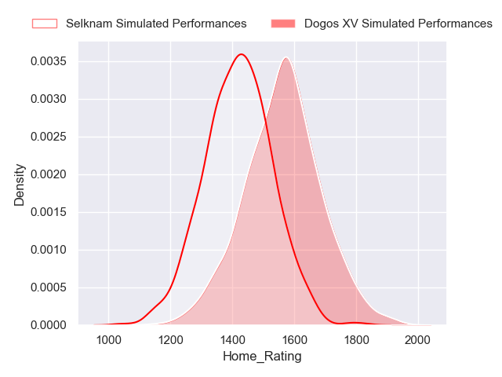
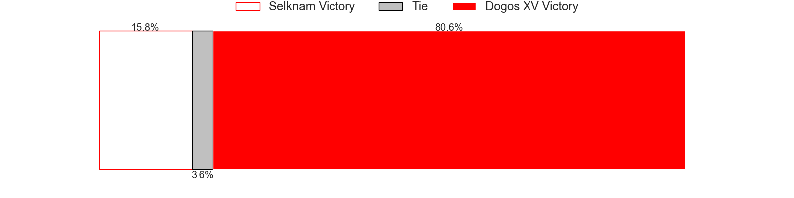
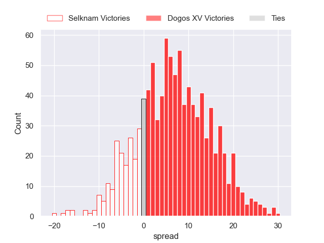

### American Raptors V Yacare XV on 2024/03/24

Average Margin: Yacare XV by 18.8

Average Scoreline: 43-24

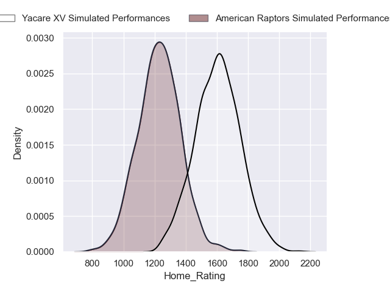
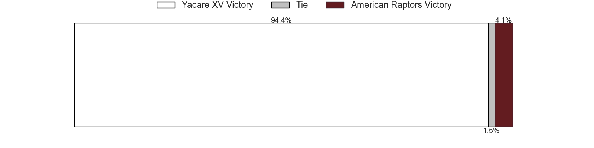
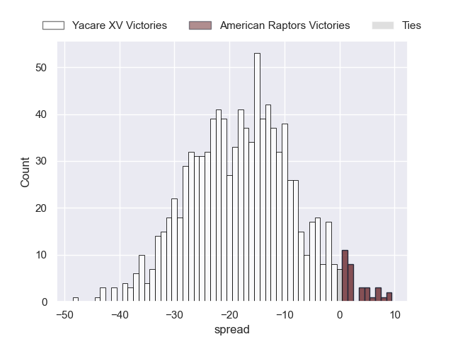

## Week 6

### Penarol Rugby V Dogos XV on 2024/04/05

Average Margin: Penarol Rugby by 9.5

Average Scoreline: 28-18

### Cobras V Pampas XV on 2024/04/06

Average Margin: Pampas XV by 10.3

Average Scoreline: 30-20

### American Raptors V Selknam on 2024/04/07

Average Margin: Selknam by 8.3

Average Scoreline: 31-23

## Week 7

### Pampas XV V Yacare XV on 2024/04/12

Average Margin: Yacare XV by 4.1

Average Scoreline: 26-21

### Penarol Rugby V Cobras on 2024/04/12

Average Margin: Penarol Rugby by 23.1

Average Scoreline: 36-13

### American Raptors V Dogos XV on 2024/04/14

Average Margin: Dogos XV by 11.2

Average Scoreline: 35-24

## Week 8

### Selknam V Yacare XV on 2024/04/20

Average Margin: Yacare XV by 7.0

Average Scoreline: 31-24

### American Raptors V Pampas XV on 2024/04/21

Average Margin: Pampas XV by 11.4

Average Scoreline: 32-20

### Dogos XV V Cobras on 2024/04/21

Average Margin: Dogos XV by 17.0

Average Scoreline: 42-25

## Week 9

### Selknam V Cobras on 2024/04/27

Average Margin: Selknam by 14.2

Average Scoreline: 35-21

### Yacare XV V Dogos XV on 2024/04/27

Average Margin: Yacare XV by 10.2

Average Scoreline: 27-17

### American Raptors V Penarol Rugby on 2024/04/28

Average Margin: Penarol Rugby by 17.8

Average Scoreline: 40-23

## Week 10

### Penarol Rugby V Selknam on 2024/05/03

Average Margin: Penarol Rugby by 12.8

Average Scoreline: 28-15

### Cobras V Yacare XV on 2024/05/04

Average Margin: Yacare XV by 17.1

Average Scoreline: 38-21

### Dogos XV V Pampas XV on 2024/05/04

Average Margin: Dogos XV by 3.8

Average Scoreline: 27-23

## Week 11

### Pampas XV V Selknam on 2024/05/10

Average Margin: Pampas XV by 6.6

Average Scoreline: 24-17

### Cobras V American Raptors on 2024/05/11

Average Margin: Cobras by 4.4

Average Scoreline: 33-29

### Yacare XV V Penarol Rugby on 2024/05/11

Average Margin: Yacare XV by 3.9

Average Scoreline: 25-22

## Week 12

### Penarol Rugby V Pampas XV on 2024/05/17

Average Margin: Penarol Rugby by 9.8

Average Scoreline: 25-16

### Yacare XV V American Raptors on 2024/05/18

Average Margin: Yacare XV by 24.9

Average Scoreline: 40-15

### Selknam V Dogos XV on 2024/05/18

Average Margin: Selknam by 0.1

Average Scoreline: 25-25

## Week 13

### Pampas XV V Cobras on 2024/05/24

Average Margin: Pampas XV by 16.0

Average Scoreline: 34-18

### Dogos XV V Penarol Rugby on 2024/05/24

Average Margin: Penarol Rugby by 3.1

Average Scoreline: 30-27

### Selknam V American Raptors on 2024/05/25

Average Margin: Selknam by 14.7

Average Scoreline: 34-19

