---  
title: "Super Rugby Americas 2024 Status"  
date: 2024-05-10 6:00:00 -0500  
categories: model review projection  
layout: article  
aside:  
    toc: true  
---
# Current Team Rankings

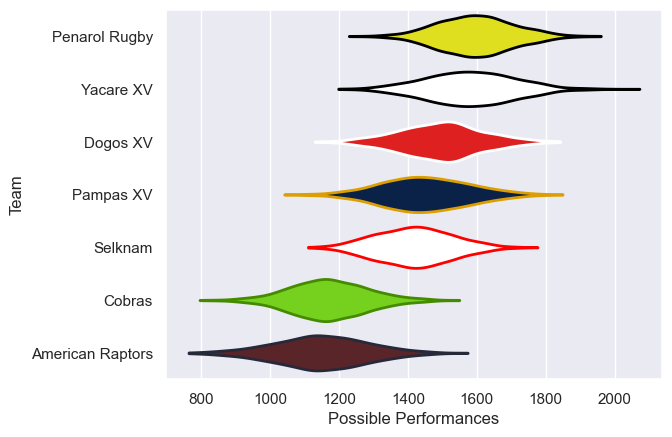
# Standings

## Current Standings

| Club             |   Played |   Wins |   Point Differential |   Losing Bonus Points |   Try Bonus Points |   Competition Points |
|:-----------------|---------:|-------:|---------------------:|----------------------:|-------------------:|---------------------:|
| Dogos XV         |        3 |      3 |                  119 |                     0 |                  3 |                   15 |
| Pampas XV        |        3 |      3 |                   59 |                     0 |                  2 |                   14 |
| Cobras           |        3 |      2 |                  -14 |                     0 |                  0 |                    8 |
| Selknam          |        1 |      1 |                   24 |                     0 |                  1 |                    5 |
| American Raptors |        4 |      1 |                 -128 |                     0 |                  1 |                    5 |
| Yacare XV        |        4 |      0 |                  -52 |                     1 |                  2 |                    3 |
| Penarol Rugby    |        2 |      0 |                   -8 |                     2 |                  0 |                    2 |

## Projected Remaining Table

| Club             |   Matches Remaining |   Wins |   Point Differential |   Losing Bonus Points |   Try Bonus Points |   Competition Points |
|:-----------------|--------------------:|-------:|---------------------:|----------------------:|-------------------:|---------------------:|
| Pampas XV        |                   3 |    2.9 |             54.5062  |                   0.1 |                2   |                 13.7 |
| Yacare XV        |                   2 |    1.8 |             26.3041  |                   0.2 |                1.2 |                  8.6 |
| Selknam          |                   3 |    1.4 |              1.49313 |                   0.5 |                1.2 |                  7.4 |
| Dogos XV         |                   2 |    1.5 |             10.7806  |                   0.4 |                0.8 |                  7.1 |
| Cobras           |                   2 |    0.8 |            -23.6736  |                   0.2 |                1   |                  4.2 |
| Penarol Rugby    |                   3 |    0.3 |            -26.0501  |                   0.9 |                0.7 |                  3   |
| American Raptors |                   3 |    0.2 |            -43.3603  |                   0.5 |                0.9 |                  2.3 |

## Projected Total Table

| Club             |   Total Matches |   Wins |   Point Differential |   Losing Bonus Points |   Try Bonus Points |   Competition Points |
|:-----------------|----------------:|-------:|---------------------:|----------------------:|-------------------:|---------------------:|
| Pampas XV        |               6 |    5.9 |             113.506  |                   0.1 |                4   |                 27.7 |
| Dogos XV         |               5 |    4.5 |             129.781  |                   0.4 |                3.8 |                 22.1 |
| Selknam          |               4 |    2.4 |              25.4931 |                   0.5 |                2.2 |                 12.4 |
| Cobras           |               5 |    2.8 |             -37.6736 |                   0.2 |                1   |                 12.2 |
| Yacare XV        |               6 |    1.8 |             -25.6959 |                   1.2 |                3.2 |                 11.6 |
| American Raptors |               7 |    1.2 |            -171.36   |                   0.5 |                1.9 |                  7.3 |
| Penarol Rugby    |               5 |    0.3 |             -34.0501 |                   2.9 |                0.7 |                  5   |

# Completed Match Review

| Model | Percent Correct Predictions | Spread Error |
| ------ | ------ | ------ |
| Club Level | 50.0% | 19.8 |
| Player Level: Lineup | 60.0% | 18.8 |
| Player Level: Minutes | 60.0% | 19.1 |

# Future Predictions

## Week 5

### Cobras V American Raptors on 2024/05/11

Average Margin: Cobras by 5.2

Average Scoreline: 35-30

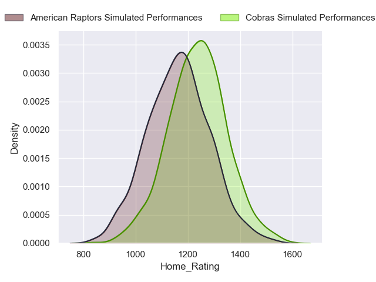

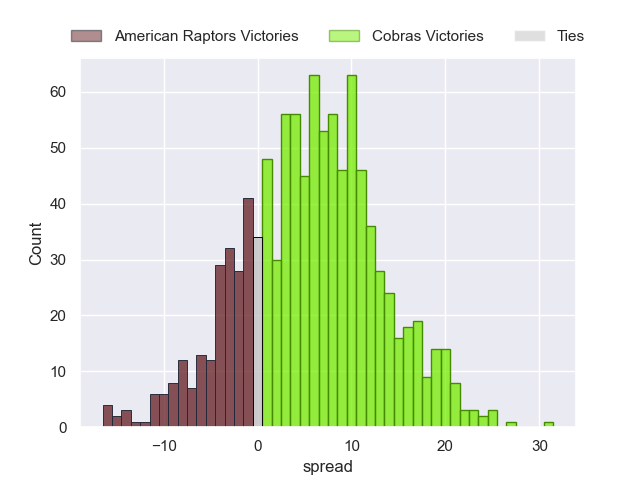

### Yacare XV V Penarol Rugby on 2024/05/11

Average Margin: Yacare XV by 6.5

Average Scoreline: 28-21

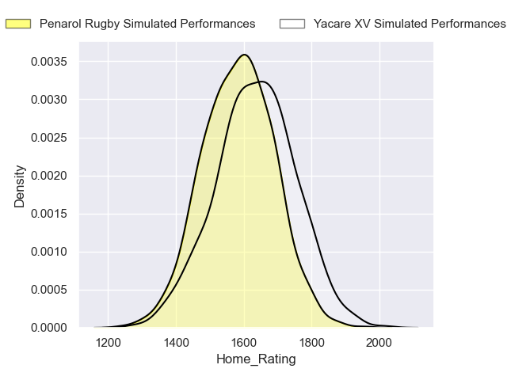
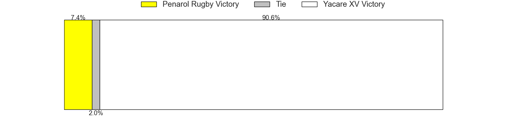
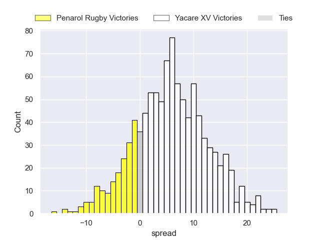

### Pampas XV V Selknam on 2024/05/11

Average Margin: Pampas XV by 15.5

Average Scoreline: 38-22

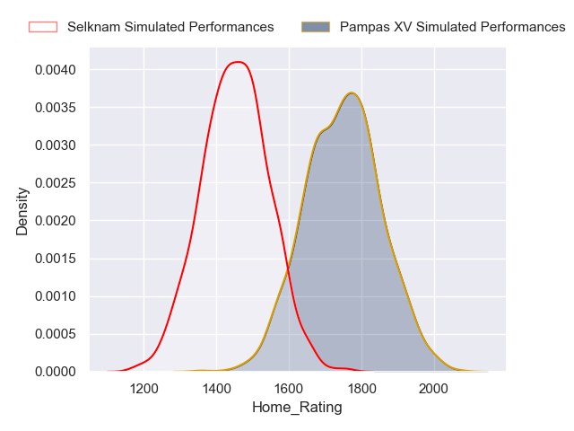

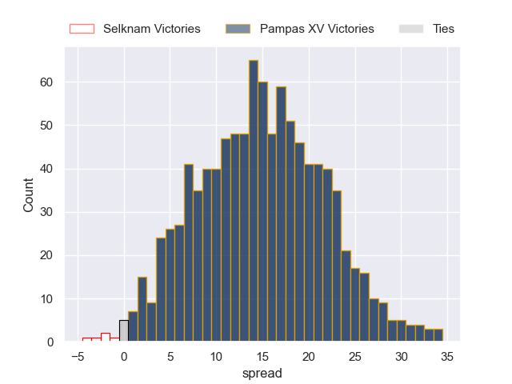

## Week 6

### Penarol Rugby V Pampas XV on 2024/05/17

Average Margin: Pampas XV by 10.1

Average Scoreline: 28-18

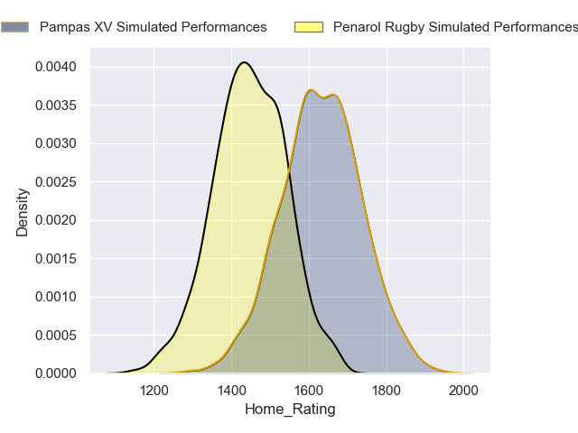
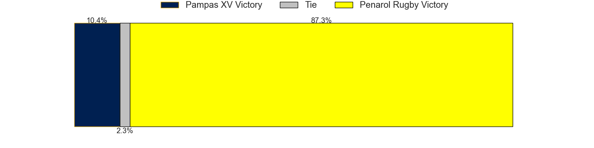
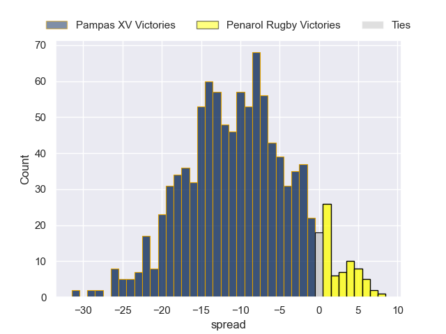

### Selknam V Dogos XV on 2024/05/18

Average Margin: Dogos XV by 1.3

Average Scoreline: 24-23

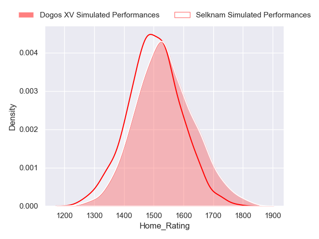

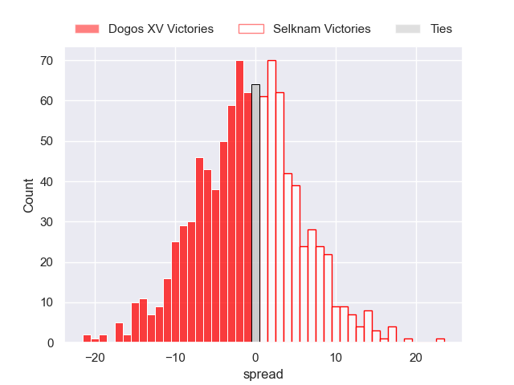

### Yacare XV V American Raptors on 2024/05/18

Average Margin: Yacare XV by 19.8

Average Scoreline: 45-25

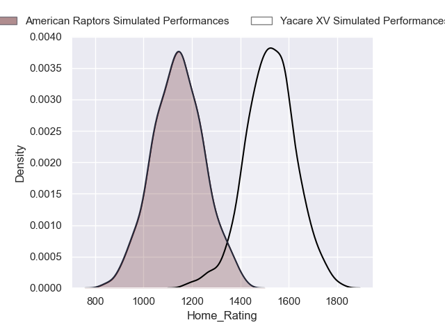
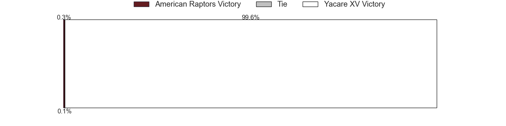
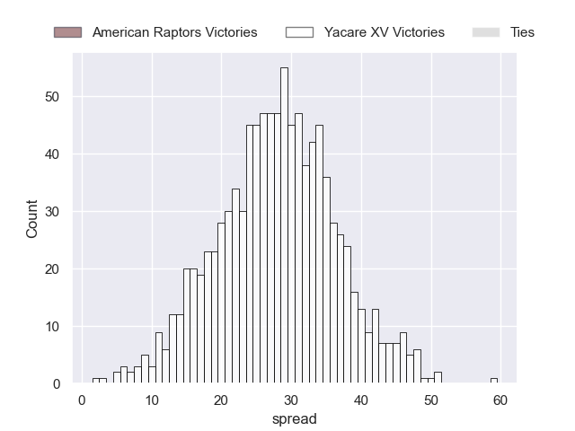

## Week 7

### Dogos XV V Penarol Rugby on 2024/05/24

Average Margin: Dogos XV by 9.4

Average Scoreline: 29-19

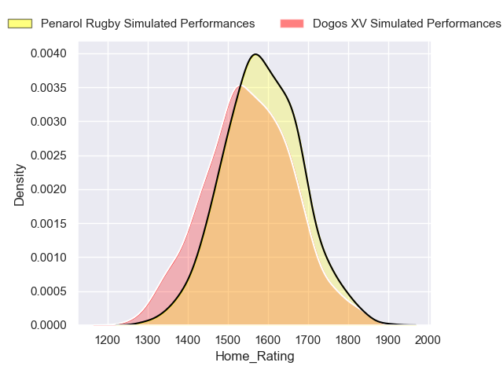

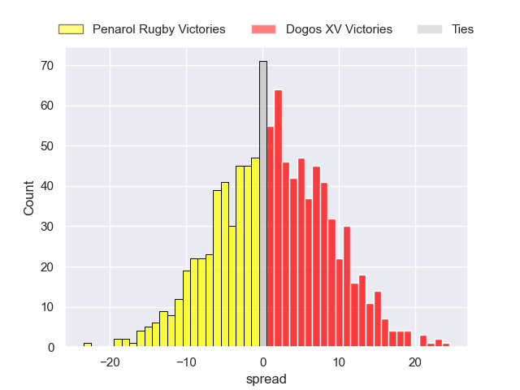

### Pampas XV V Cobras on 2024/05/24

Average Margin: Pampas XV by 28.9

Average Scoreline: 50-21

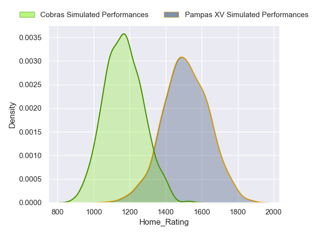

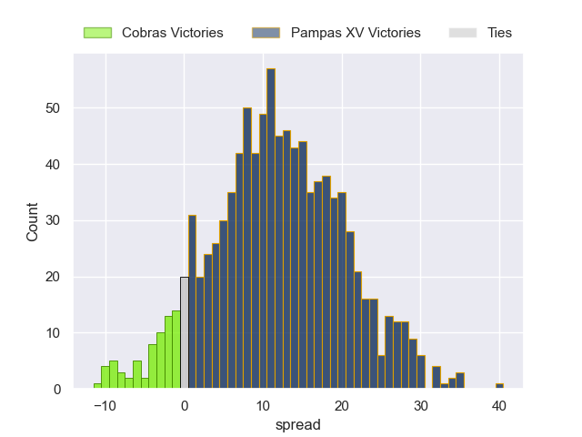

### Selknam V American Raptors on 2024/05/25

Average Margin: Selknam by 18.3

Average Scoreline: 40-22

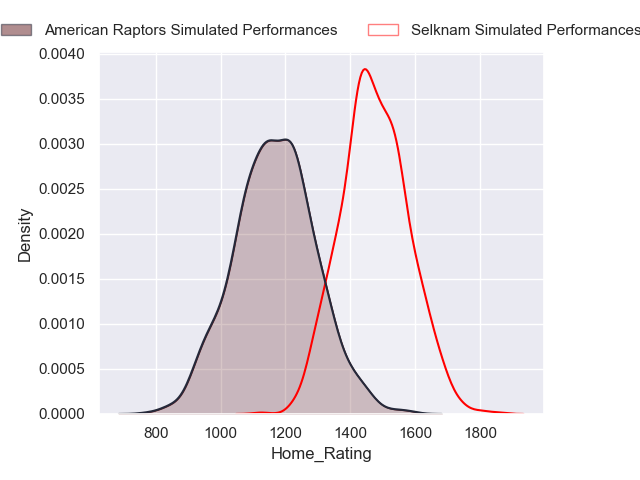
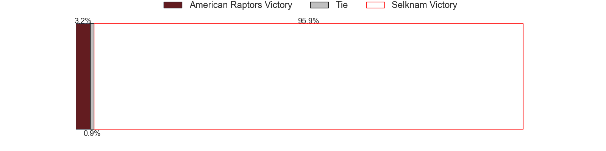
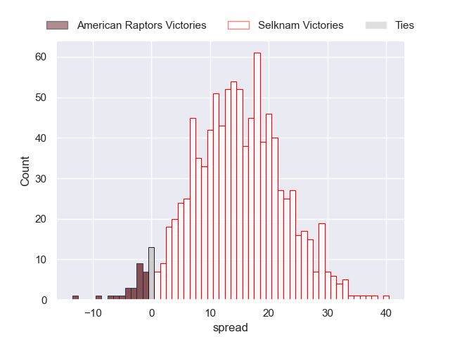

