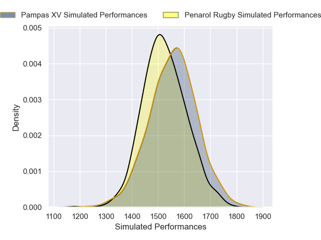
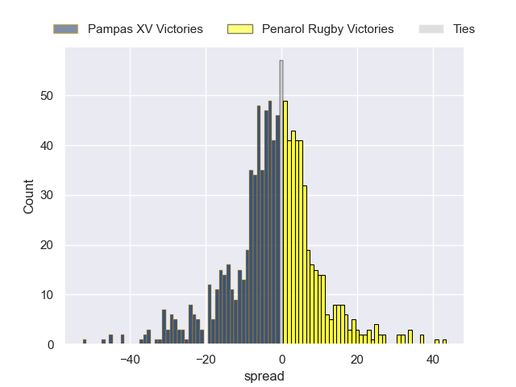
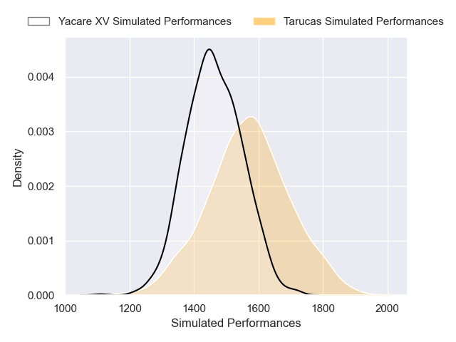
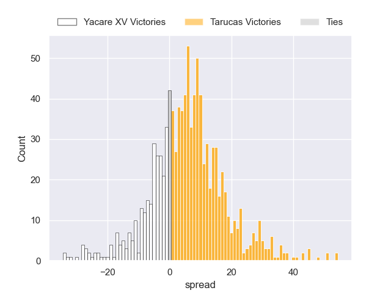

---  
title: "Super Rugby Americas 2025 Status"  
date: 2025-05-30 6:00:00 -0500  
categories: model review projection  
layout: article  
aside:  
    toc: true  
---
# Current Team Rankings

# Standings

## Current Standings

| Club          |   Played |   Wins |   Point Differential |   Losing Bonus Points |   Try Bonus Points |   Competition Points |
|:--------------|---------:|-------:|---------------------:|----------------------:|-------------------:|---------------------:|
| Pampas XV     |       11 |      7 |                  145 |                     2 |                nan |                   35 |
| Dogos XV      |       10 |      6 |                  145 |                     3 |                nan |                   33 |
| Penarol Rugby |       10 |      7 |                   67 |                     1 |                nan |                   32 |
| Selknam       |       11 |      6 |                   25 |                     4 |                nan |                   32 |
| Yacare XV     |       11 |      6 |                   -3 |                     2 |                nan |                   28 |
| Tarucas       |       11 |      5 |                   24 |                     3 |                nan |                   26 |
| Cobras        |       12 |      0 |                 -403 |                     2 |                nan |                    4 |

## Projected Remaining Table

| Club          |   Matches Remaining |   Wins |   Point Differential |   Losing Bonus Points |   Try Bonus Points |   Competition Points |
|:--------------|--------------------:|-------:|---------------------:|----------------------:|-------------------:|---------------------:|
| Dogos XV      |                   1 |    0.9 |             13.2776  |                   0.1 |                0.6 |                  4.2 |
| Tarucas       |                   1 |    0.7 |              6.15981 |                   0.2 |                0.3 |                  3.4 |
| Pampas XV     |                   1 |    0.6 |              2.21929 |                   0.3 |                0.5 |                  3.1 |
| Penarol Rugby |                   1 |    0.4 |             -2.21929 |                   0.4 |                0.2 |                  2.1 |
| Yacare XV     |                   1 |    0.3 |             -6.15981 |                   0.3 |                0.3 |                  1.7 |
| Selknam       |                   1 |    0.1 |            -13.2776  |                   0.2 |                0.2 |                  0.8 |

## Projected Total Table

| Club          |   Total Matches |   Wins |   Point Differential |   Losing Bonus Points |   Try Bonus Points |   Competition Points |
|:--------------|----------------:|-------:|---------------------:|----------------------:|-------------------:|---------------------:|
| Pampas XV     |              12 |    7.6 |            147.219   |                   2.3 |                0.5 |                 38.1 |
| Dogos XV      |              11 |    6.9 |            158.278   |                   3.1 |                0.6 |                 37.2 |
| Penarol Rugby |              11 |    7.4 |             64.7807  |                   1.4 |                0.2 |                 34.1 |
| Selknam       |              12 |    6.1 |             11.7224  |                   4.2 |                0.2 |                 32.8 |
| Yacare XV     |              12 |    6.3 |             -9.15981 |                   2.3 |                0.3 |                 29.7 |
| Tarucas       |              12 |    5.7 |             30.1598  |                   3.2 |                0.3 |                 29.4 |
| Cobras        |              12 |    0   |           -403       |                   2   |                0   |                  4   |

# Completed Match Review

| Model | Percent Correct Predictions | Spread Error |
| ------ | ------ | ------ |
| Club Level | 63.2% | 11.9 |
| Player Level: Lineup | 53.8% | 14.6 |
| Player Level: Minutes | 53.8% | 14.3 |

# Future Predictions

## Week 13

### Dogos XV V Selknam on 2025/05/30

Average Margin: Dogos XV by 13.3

Average Scoreline: 33-19

### Penarol Rugby V Pampas XV on 2025/05/31

Average Margin: Pampas XV by 2.2

Average Scoreline: 26-24

### Tarucas V Yacare XV on 2025/06/01

Average Margin: Tarucas by 6.2

Average Scoreline: 28-22

