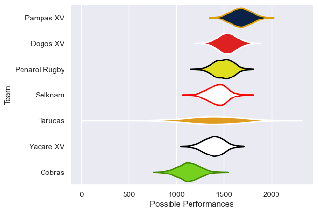

---  
title: "Super Rugby Americas 2025"  
date: 2025-07-29 6:00:00 -0500  
categories: model review projection  
layout: article  
aside:  
    toc: true  
---
# Current Team Rankings

# Standings

## Current Standings

| Club          |   Played |   Wins |   Point Differential |   Losing Bonus Points |   Try Bonus Points |   Competition Points |
|:--------------|---------:|-------:|---------------------:|----------------------:|-------------------:|---------------------:|
| Pampas XV     |       12 |      8 |                  150 |                     2 |                  3 |                   39 |
| Dogos XV      |       10 |      6 |                  145 |                     3 |                  4 |                   33 |
| Penarol Rugby |       11 |      7 |                   62 |                     2 |                  3 |                   33 |
| Selknam       |       11 |      6 |                   25 |                     4 |                  4 |                   32 |
| Tarucas       |       12 |      6 |                   44 |                     3 |                  3 |                   30 |
| Yacare XV     |       12 |      6 |                  -23 |                     2 |                  2 |                   28 |
| Cobras        |       12 |      0 |                 -403 |                     2 |                  2 |                    4 |

## Projected Remaining Table

| Club          |   To Play |   Projected Wins |   Projected Differential |   Projected Losing Bonus Points | Projected Try Bonus Points   |   Projected Competition Points |
|:--------------|----------:|-----------------:|-------------------------:|--------------------------------:|:-----------------------------|-------------------------------:|
| Dogos XV      |         2 |            1.397 |                   14.463 |                           0.307 |                              |                          6.029 |
| Penarol Rugby |         1 |            0.271 |                   -6.897 |                           0.222 |                              |                          1.368 |
| Selknam       |         1 |            0.265 |                   -7.566 |                           0.195 |                              |                          1.327 |

## Projected Total Table

| Club          |   Played |   Wins |   Point Differential |   Losing Bonus Points |   Try Bonus Points |   Competition Points |
|:--------------|---------:|-------:|---------------------:|----------------------:|-------------------:|---------------------:|
| Dogos XV      |       12 |  7.397 |              159.463 |                 3.307 |                  4 |               39.029 |
| Pampas XV     |       12 |  8     |              150     |                 2     |                  3 |               39     |
| Penarol Rugby |       12 |  7.271 |               55.103 |                 2.222 |                  3 |               34.368 |
| Selknam       |       12 |  6.265 |               17.434 |                 4.195 |                  4 |               33.327 |
| Tarucas       |       12 |  6     |               44     |                 3     |                  3 |               30     |
| Yacare XV     |       12 |  6     |              -23     |                 2     |                  2 |               28     |
| Cobras        |       12 |  0     |             -403     |                 2     |                  2 |                4     |

# Completed Match Review

| Model | Percent Correct Predictions | Spread Error |
| ------ | ------ | ------ |
| Club Level | 64.3% | 11.5 |
| Player Level: Lineup | nan% | nan |
| Player Level: Minutes | nan% | nan |

# Future Predictions

## Week 13

### Dogos XV V Penarol Rugby on 2025/05/24

Average Margin: Dogos XV by 6.9

## Week 14

### Dogos XV V Selknam on 2025/05/30

Average Margin: Dogos XV by 7.6

