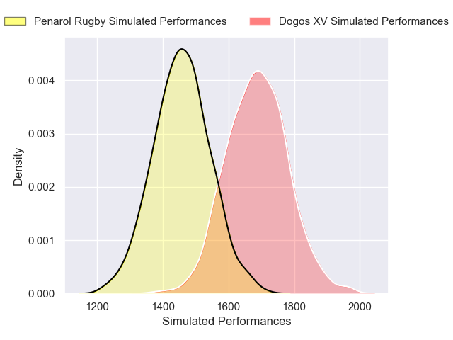
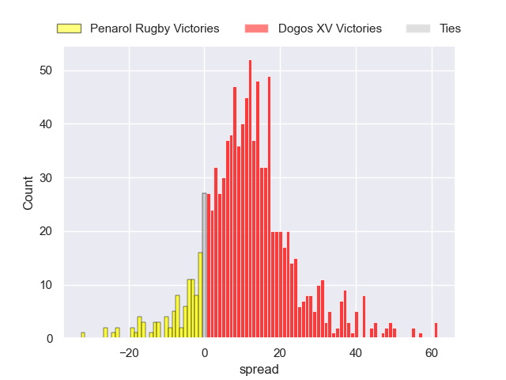

---  
title: "Super Rugby Americas 2025 Status"  
date: 2025-05-22 6:00:00 -0500  
categories: model review projection  
layout: article  
aside:  
    toc: true  
---
# Current Team Rankings

# Standings

## Current Standings

| Club          |   Played |   Wins |   Point Differential |   Losing Bonus Points |   Try Bonus Points |   Competition Points |
|:--------------|---------:|-------:|---------------------:|----------------------:|-------------------:|---------------------:|
| Pampas XV     |       11 |      7 |                  145 |                     2 |                nan |                   35 |
| Dogos XV      |       10 |      6 |                  145 |                     3 |                nan |                   33 |
| Penarol Rugby |       10 |      7 |                   67 |                     1 |                nan |                   32 |
| Selknam       |       10 |      5 |                   22 |                     4 |                nan |                   28 |
| Yacare XV     |       10 |      6 |                    0 |                     1 |                nan |                   27 |
| Tarucas       |       10 |      4 |                    3 |                     3 |                nan |                   22 |
| Cobras        |       11 |      0 |                 -382 |                     2 |                nan |                    4 |

## Projected Remaining Table

| Club          |   Matches Remaining |   Wins |   Point Differential |   Losing Bonus Points |   Try Bonus Points |   Competition Points |
|:--------------|--------------------:|-------:|---------------------:|----------------------:|-------------------:|---------------------:|
| Dogos XV      |                   2 |    1.8 |             24.6861  |                   0.1 |                1.3 |                  8.6 |
| Tarucas       |                   2 |    1.6 |             21.5073  |                   0.3 |                1.1 |                  7.7 |
| Yacare XV     |                   2 |    0.7 |             -7.34416 |                   0.6 |                0.7 |                  4.1 |
| Selknam       |                   2 |    0.7 |             -9.57071 |                   0.4 |                0.6 |                  4   |
| Pampas XV     |                   1 |    0.6 |              2.35072 |                   0.3 |                0.4 |                  3.1 |
| Penarol Rugby |                   2 |    0.5 |            -14.5273  |                   0.5 |                0.5 |                  3.1 |
| Cobras        |                   1 |    0.1 |            -17.1019  |                   0.1 |                0.2 |                  0.7 |

## Projected Total Table

| Club          |   Total Matches |   Wins |   Point Differential |   Losing Bonus Points |   Try Bonus Points |   Competition Points |
|:--------------|----------------:|-------:|---------------------:|----------------------:|-------------------:|---------------------:|
| Dogos XV      |              12 |    7.8 |            169.686   |                   3.1 |                1.3 |                 41.6 |
| Pampas XV     |              12 |    7.6 |            147.351   |                   2.3 |                0.4 |                 38.1 |
| Penarol Rugby |              12 |    7.5 |             52.4727  |                   1.5 |                0.5 |                 35.1 |
| Selknam       |              12 |    5.7 |             12.4293  |                   4.4 |                0.6 |                 32   |
| Yacare XV     |              12 |    6.7 |             -7.34416 |                   1.6 |                0.7 |                 31.1 |
| Tarucas       |              12 |    5.6 |             24.5073  |                   3.3 |                1.1 |                 29.7 |
| Cobras        |              12 |    0.1 |           -399.102   |                   2.1 |                0.2 |                  4.7 |

# Completed Match Review

| Model | Percent Correct Predictions | Spread Error |
| ------ | ------ | ------ |
| Club Level | 61.1% | 12.1 |
| Player Level: Lineup | 53.8% | 14.3 |
| Player Level: Minutes | 53.8% | 14.0 |

# Future Predictions

## Week 12

### Selknam V Yacare XV on 2025/05/24

Average Margin: Selknam by 2.9

Average Scoreline: 35-33

### Dogos XV V Penarol Rugby on 2025/05/24

Average Margin: Dogos XV by 12.2

Average Scoreline: 40-27

### Cobras V Tarucas on 2025/05/25

Average Margin: Tarucas by 17.1

Average Scoreline: 45-28

## Week 13

### Penarol Rugby V Pampas XV on 2025/05/30

Average Margin: Pampas XV by 2.4

Average Scoreline: 31-29

### Dogos XV V Selknam on 2025/05/30

Average Margin: Dogos XV by 12.5

Average Scoreline: 37-24

### Tarucas V Yacare XV on 2025/05/31

Average Margin: Tarucas by 4.4

Average Scoreline: 32-27

