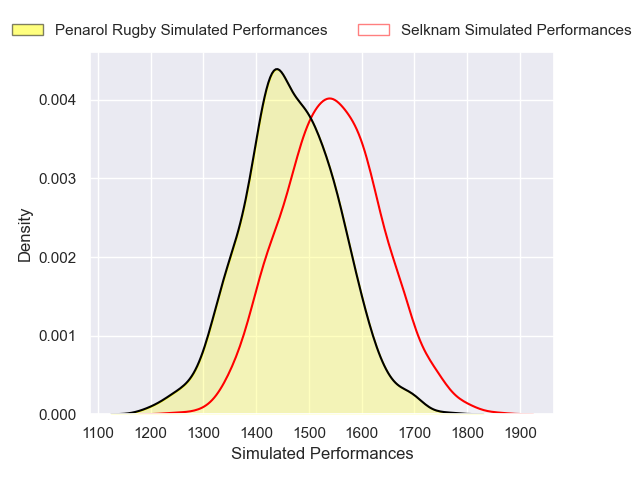
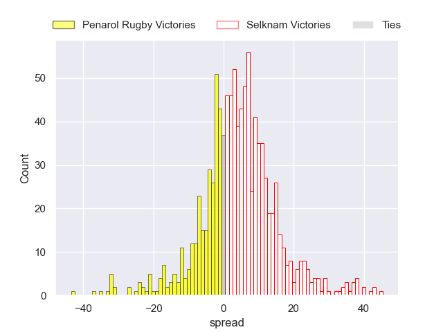
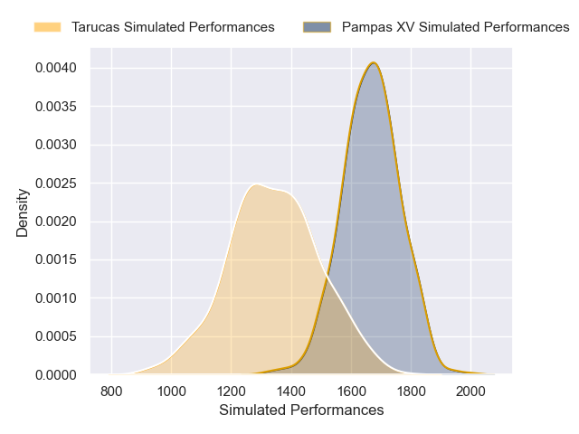
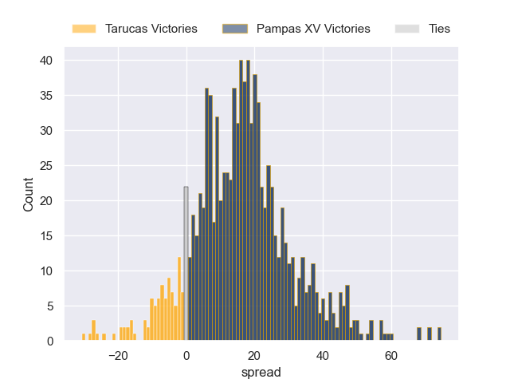

---  
title: "Super Rugby Americas 2025 Status"  
date: 2025-04-21 6:00:00 -0500  
categories: model review projection  
layout: article  
aside:  
    toc: true  
---
# Current Team Rankings

# Standings

## Current Standings

| Club          |   Played |   Wins |   Point Differential |   Losing Bonus Points |   Try Bonus Points |   Competition Points |
|:--------------|---------:|-------:|---------------------:|----------------------:|-------------------:|---------------------:|
| Pampas XV     |        7 |      5 |                   76 |                     0 |                  2 |                   24 |
| Yacare XV     |        8 |      5 |                   -3 |                     1 |                  3 |                   24 |
| Selknam       |        7 |      4 |                   45 |                     3 |                  4 |                   23 |
| Penarol Rugby |        7 |      5 |                   35 |                     0 |                  3 |                   23 |
| Dogos XV      |        7 |      3 |                   62 |                     3 |                  3 |                   20 |
| Tarucas       |        6 |      2 |                    7 |                     3 |                  2 |                   13 |
| Cobras        |        8 |      0 |                 -222 |                     2 |                  3 |                    5 |

## Projected Remaining Table

| Club          |   Matches Remaining |   Wins |   Point Differential |   Losing Bonus Points |   Try Bonus Points |   Competition Points |
|:--------------|--------------------:|-------:|---------------------:|----------------------:|-------------------:|---------------------:|
| Dogos XV      |                   5 |    4.3 |             65.5123  |                   0.4 |                2.7 |                 20.5 |
| Pampas XV     |                   5 |    4   |             57.5834  |                   0.6 |                2.2 |                 18.9 |
| Penarol Rugby |                   5 |    2.6 |             11.6402  |                   1   |                2.1 |                 13.3 |
| Selknam       |                   5 |    2.3 |             -6.64083 |                   1.1 |                1.7 |                 12.1 |
| Yacare XV     |                   5 |    2.1 |             -2.78086 |                   1.1 |                2   |                 11.6 |
| Tarucas       |                   6 |    2.2 |            -27.5488  |                   1.3 |                1.5 |                 11.5 |
| Cobras        |                   5 |    0.5 |            -97.7655  |                   0.5 |                1.1 |                  3.4 |

## Projected Total Table

| Club          |   Total Matches |   Wins |   Point Differential |   Losing Bonus Points |   Try Bonus Points |   Competition Points |
|:--------------|----------------:|-------:|---------------------:|----------------------:|-------------------:|---------------------:|
| Pampas XV     |              12 |    9   |            133.583   |                   0.6 |                4.2 |                 42.9 |
| Dogos XV      |              12 |    7.3 |            127.512   |                   3.4 |                5.7 |                 40.5 |
| Penarol Rugby |              12 |    7.6 |             46.6402  |                   1   |                5.1 |                 36.3 |
| Yacare XV     |              13 |    7.1 |             -5.78086 |                   2.1 |                5   |                 35.6 |
| Selknam       |              12 |    6.3 |             38.3592  |                   4.1 |                5.7 |                 35.1 |
| Tarucas       |              12 |    4.2 |            -20.5488  |                   4.3 |                3.5 |                 24.5 |
| Cobras        |              13 |    0.5 |           -319.765   |                   2.5 |                4.1 |                  8.4 |

# Completed Match Review

| Model | Percent Correct Predictions | Spread Error |
| ------ | ------ | ------ |
| Club Level | 64.0% | 10.3 |
| Player Level: Lineup | 63.6% | 15.8 |
| Player Level: Minutes | 63.6% | 15.4 |

# Future Predictions

## Week 9

### Selknam V Penarol Rugby on 2025/04/26

Average Margin: Selknam by 4.4

Average Scoreline: 27-23

### Cobras V Dogos XV on 2025/04/26

Average Margin: Dogos XV by 23.4

Average Scoreline: 38-14

### Pampas XV V Tarucas on 2025/04/26

Average Margin: Pampas XV by 16.3

Average Scoreline: 28-12

## Week 10

### Penarol Rugby V Tarucas on 2025/05/02

Average Margin: Penarol Rugby by 8.8

Average Scoreline: 26-17

### Cobras V Pampas XV on 2025/05/03

Average Margin: Pampas XV by 22.5

Average Scoreline: 31-8

## Week 11

### Dogos XV V Yacare XV on 2025/05/05

Average Margin: Dogos XV by 12.3

Average Scoreline: 29-17

### Tarucas V Selknam on 2025/05/09

Average Margin: Selknam by 3.0

Average Scoreline: 24-21

### Yacare XV V Pampas XV on 2025/05/10

Average Margin: Pampas XV by 5.5

Average Scoreline: 22-16

## Week 12

### Penarol Rugby V Cobras on 2025/05/12

Average Margin: Penarol Rugby by 21.4

Average Scoreline: 38-16

### Tarucas V Dogos XV on 2025/05/16

Average Margin: Dogos XV by 8.7

Average Scoreline: 31-23

### Yacare XV V Cobras on 2025/05/17

Average Margin: Yacare XV by 20.2

Average Scoreline: 36-16

## Week 13

### Pampas XV V Selknam on 2025/05/19

Average Margin: Pampas XV by 10.1

Average Scoreline: 27-17

### Dogos XV V Penarol Rugby on 2025/05/23

Average Margin: Dogos XV by 10.9

Average Scoreline: 28-17

### Selknam V Yacare XV on 2025/05/24

Average Margin: Selknam by 6.2

Average Scoreline: 26-20

### Cobras V Tarucas on 2025/05/25

Average Margin: Tarucas by 10.3

Average Scoreline: 27-17

## Week 14

### Dogos XV V Selknam on 2025/05/30

Average Margin: Dogos XV by 10.2

Average Scoreline: 28-18

### Penarol Rugby V Pampas XV on 2025/05/30

Average Margin: Pampas XV by 3.2

Average Scoreline: 25-22

### Tarucas V Yacare XV on 2025/05/31

Average Margin: Yacare XV by 1.0

Average Scoreline: 24-23

