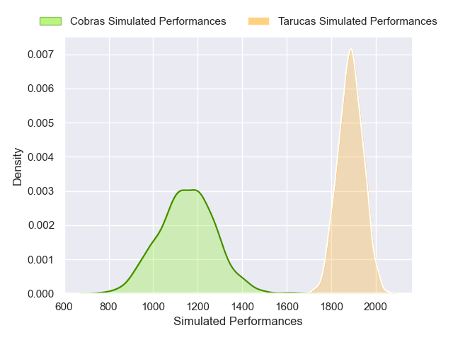
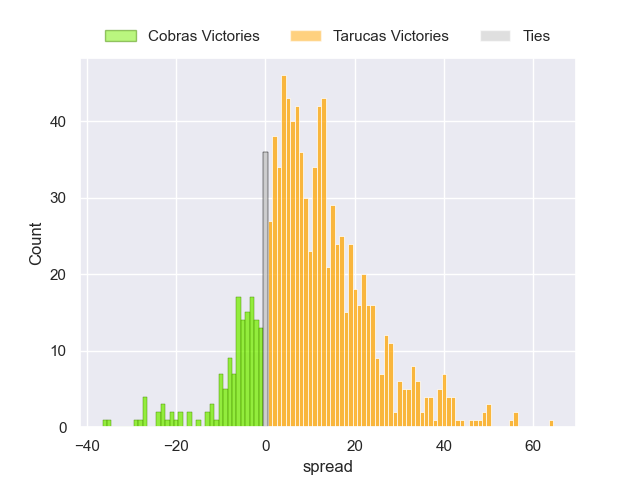

---  
title: "Super Rugby Americas 2025 Status"  
date: 2025-02-07 6:00:00 -0500  
categories: model review projection  
layout: article  
aside:  
    toc: true  
---
# Current Team Rankings

# Standings

## Projected Total Table

| Club          |   Total Matches |   Wins |   Point Differential |   Losing Bonus Points |   Try Bonus Points |   Competition Points |
|:--------------|----------------:|-------:|---------------------:|----------------------:|-------------------:|---------------------:|
| Pampas XV     |              12 |   10.2 |         168.607      |                   1.1 |                6.8 |                 48.5 |
| Dogos XV      |              12 |    8.7 |         101.205      |                   1.6 |                6.3 |                 42.7 |
| Penarol Rugby |              12 |    6.7 |          23.2166     |                   2.2 |                4.8 |                 33.8 |
| Yacare XV     |              12 |    6   |           0.00887695 |                   2.4 |                4.5 |                 30.9 |
| Selknam       |              12 |    5.4 |         -18.4049     |                   2.5 |                4   |                 28.3 |
| Tarucas       |              12 |    3.6 |         -81.2347     |                   2.6 |                2.9 |                 20   |
| Cobras        |              12 |    1.5 |        -193.398      |                   1.9 |                2.4 |                 10.2 |

# Future Predictions

## Week 1

### Penarol Rugby V Dogos XV on 2025/02/14

Average Margin: Dogos XV by 3.1

Average Scoreline: 27-24

### Tarucas V Cobras on 2025/02/15

Average Margin: Tarucas by 13.1

Average Scoreline: 26-13

### Yacare XV V Selknam on 2025/02/15

Average Margin: Yacare XV by 5.3

Average Scoreline: 35-30

## Week 2

### Penarol Rugby V Yacare XV on 2025/02/21

Average Margin: Penarol Rugby by 5.5

Average Scoreline: 29-24

### Cobras V Selknam on 2025/02/22

Average Margin: Selknam by 10.6

Average Scoreline: 29-19

### Dogos XV V Pampas XV on 2025/02/22

Average Margin: Pampas XV by 2.5

Average Scoreline: 35-33

## Week 3

### Pampas XV V Penarol Rugby on 2025/02/28

Average Margin: Pampas XV by 14.3

Average Scoreline: 33-19

### Yacare XV V Tarucas on 2025/03/01

Average Margin: Yacare XV by 9.4

Average Scoreline: 27-18

### Selknam V Dogos XV on 2025/03/01

Average Margin: Dogos XV by 5.8

Average Scoreline: 28-22

## Week 4

### Tarucas V Pampas XV on 2025/03/07

Average Margin: Pampas XV by 14.4

Average Scoreline: 32-18

### Penarol Rugby V Selknam on 2025/03/07

Average Margin: Penarol Rugby by 7.6

Average Scoreline: 28-20

### Dogos XV V Cobras on 2025/03/08

Average Margin: Dogos XV by 24.9

Average Scoreline: 42-17

## Week 5

### Pampas XV V Yacare XV on 2025/03/14

Average Margin: Pampas XV by 15.7

Average Scoreline: 37-21

### Selknam V Tarucas on 2025/03/16

Average Margin: Selknam by 8.8

Average Scoreline: 27-18

### Cobras V Penarol Rugby on 2025/03/16

Average Margin: Penarol Rugby by 12.8

Average Scoreline: 31-19

## Week 6

### Dogos XV V Tarucas on 2025/03/28

Average Margin: Dogos XV by 17.0

Average Scoreline: 37-20

### Selknam V Pampas XV on 2025/03/29

Average Margin: Pampas XV by 11.7

Average Scoreline: 30-19

### Cobras V Yacare XV on 2025/03/29

Average Margin: Yacare XV by 11.7

Average Scoreline: 36-24

## Week 7

### Pampas XV V Cobras on 2025/04/04

Average Margin: Pampas XV by 28.6

Average Scoreline: 48-19

### Yacare XV V Dogos XV on 2025/04/05

Average Margin: Dogos XV by 3.9

Average Scoreline: 28-24

## Week 8

### Tarucas V Penarol Rugby on 2025/04/07

Average Margin: Penarol Rugby by 4.1

Average Scoreline: 22-18

### Pampas XV V Dogos XV on 2025/04/11

Average Margin: Pampas XV by 9.1

Average Scoreline: 32-23

### Yacare XV V Penarol Rugby on 2025/04/12

Average Margin: Yacare XV by 1.9

Average Scoreline: 26-24

### Selknam V Cobras on 2025/04/12

Average Margin: Selknam by 16.2

Average Scoreline: 38-22

## Week 9

### Pampas XV V Tarucas on 2025/04/25

Average Margin: Pampas XV by 21.4

Average Scoreline: 39-18

### Cobras V Dogos XV on 2025/04/26

Average Margin: Dogos XV by 16.8

Average Scoreline: 37-20

### Selknam V Penarol Rugby on 2025/04/27

Average Margin: Selknam by 1.0

Average Scoreline: 24-23

## Week 10

### Penarol Rugby V Tarucas on 2025/05/02

Average Margin: Penarol Rugby by 11.2

Average Scoreline: 26-15

### Cobras V Pampas XV on 2025/05/03

Average Margin: Pampas XV by 20.6

Average Scoreline: 38-17

## Week 11

### Dogos XV V Yacare XV on 2025/05/05

Average Margin: Dogos XV by 10.4

Average Scoreline: 33-22

### Tarucas V Selknam on 2025/05/09

Average Margin: Selknam by 0.3

Average Scoreline: 22-21

### Yacare XV V Pampas XV on 2025/05/10

Average Margin: Pampas XV by 8.2

Average Scoreline: 31-23

## Week 12

### Penarol Rugby V Cobras on 2025/05/12

Average Margin: Penarol Rugby by 17.8

Average Scoreline: 33-15

### Tarucas V Dogos XV on 2025/05/16

Average Margin: Dogos XV by 9.8

Average Scoreline: 28-19

### Yacare XV V Cobras on 2025/05/17

Average Margin: Yacare XV by 16.5

Average Scoreline: 39-22

## Week 13

### Pampas XV V Selknam on 2025/05/19

Average Margin: Pampas XV by 15.9

Average Scoreline: 36-20

### Dogos XV V Penarol Rugby on 2025/05/23

Average Margin: Dogos XV by 9.2

Average Scoreline: 33-24

### Selknam V Yacare XV on 2025/05/24

Average Margin: Selknam by 2.8

Average Scoreline: 27-24

### Cobras V Tarucas on 2025/05/25

Average Margin: Tarucas by 3.9

Average Scoreline: 17-13

## Week 14

### Dogos XV V Selknam on 2025/05/30

Average Margin: Dogos XV by 11.9

Average Scoreline: 34-22

### Penarol Rugby V Pampas XV on 2025/05/30

Average Margin: Pampas XV by 6.4

Average Scoreline: 28-22

### Tarucas V Yacare XV on 2025/05/31

Average Margin: Yacare XV by 1.8

Average Scoreline: 25-23

