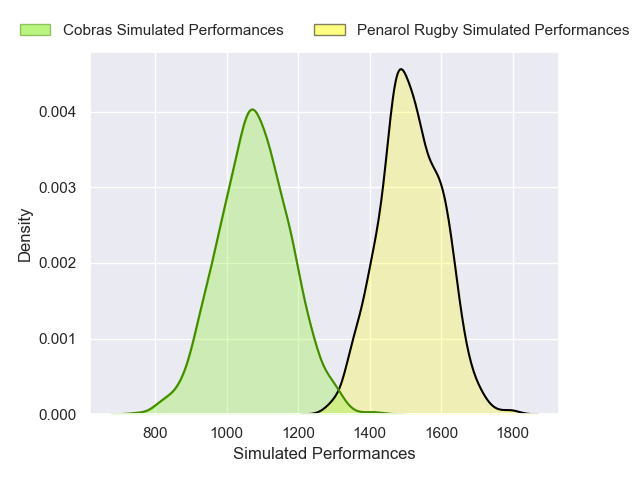
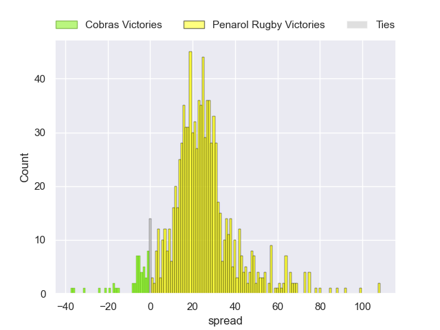

---  
title: "Super Rugby Americas 2025 Status"  
date: 2025-05-12 6:00:00 -0500  
categories: model review projection  
layout: article  
aside:  
    toc: true  
---
# Current Team Rankings

# Standings

## Current Standings

| Club          |   Played |   Wins |   Point Differential |   Losing Bonus Points |   Try Bonus Points |   Competition Points |
|:--------------|---------:|-------:|---------------------:|----------------------:|-------------------:|---------------------:|
| Pampas XV     |       10 |      7 |                  147 |                     1 |                nan |                   34 |
| Dogos XV      |        9 |      5 |                  131 |                     3 |                nan |                   29 |
| Penarol Rugby |        9 |      6 |                   33 |                     1 |                nan |                   28 |
| Selknam       |        9 |      4 |                   20 |                     4 |                  4 |                   24 |
| Yacare XV     |        9 |      5 |                  -15 |                     1 |                nan |                   23 |
| Tarucas       |        9 |      4 |                   17 |                     3 |                nan |                   22 |
| Cobras        |        9 |      0 |                 -333 |                     2 |                nan |                    4 |

## Projected Remaining Table

| Club          |   Matches Remaining |   Wins |   Point Differential |   Losing Bonus Points |   Try Bonus Points |   Competition Points |
|:--------------|--------------------:|-------:|---------------------:|----------------------:|-------------------:|---------------------:|
| Dogos XV      |                   3 |    2.3 |             26.5903  |                   0.4 |                1.6 |                 11.3 |
| Tarucas       |                   3 |    2.2 |             25.2579  |                   0.4 |                1.4 |                 10.5 |
| Yacare XV     |                   3 |    1.6 |             14.5652  |                   0.6 |                1.5 |                  8.5 |
| Penarol Rugby |                   3 |    1.4 |              8.14908 |                   0.6 |                1.2 |                  7.3 |
| Pampas XV     |                   2 |    1.5 |             15.7504  |                   0.3 |                0.7 |                  7.1 |
| Selknam       |                   3 |    0.8 |            -23.9304  |                   0.7 |                0.9 |                  4.7 |
| Cobras        |                   3 |    0.2 |            -66.3825  |                   0.2 |                0.6 |                  1.6 |

## Projected Total Table

| Club          |   Total Matches |   Wins |   Point Differential |   Losing Bonus Points |   Try Bonus Points |   Competition Points |
|:--------------|----------------:|-------:|---------------------:|----------------------:|-------------------:|---------------------:|
| Pampas XV     |              12 |    8.5 |           162.75     |                   1.3 |                0.7 |                 41.1 |
| Dogos XV      |              12 |    7.3 |           157.59     |                   3.4 |                1.6 |                 40.3 |
| Penarol Rugby |              12 |    7.4 |            41.1491   |                   1.6 |                1.2 |                 35.3 |
| Tarucas       |              12 |    6.2 |            42.2579   |                   3.4 |                1.4 |                 32.5 |
| Yacare XV     |              12 |    6.6 |            -0.434767 |                   1.6 |                1.5 |                 31.5 |
| Selknam       |              12 |    4.8 |            -3.93045  |                   4.7 |                4.9 |                 28.7 |
| Cobras        |              12 |    0.2 |          -399.382    |                   2.2 |                0.6 |                  5.6 |

# Completed Match Review

| Model | Percent Correct Predictions | Spread Error |
| ------ | ------ | ------ |
| Club Level | 59.4% | 12.5 |
| Player Level: Lineup | 53.8% | 13.8 |
| Player Level: Minutes | 46.2% | 14.1 |

# Future Predictions

## Week 11

### Penarol Rugby V Cobras on 2025/05/13

Average Margin: Penarol Rugby by 24.3

Average Scoreline: 46-22

### Tarucas V Dogos XV on 2025/05/17

Average Margin: Dogos XV by 0.7

Average Scoreline: 33-32

### Yacare XV V Cobras on 2025/05/18

Average Margin: Yacare XV by 23.6

Average Scoreline: 50-26

## Week 12

### Pampas XV V Selknam on 2025/05/19

Average Margin: Pampas XV by 12.1

Average Scoreline: 28-16

### Dogos XV V Penarol Rugby on 2025/05/23

Average Margin: Dogos XV by 12.6

Average Scoreline: 32-19

### Selknam V Yacare XV on 2025/05/24

Average Margin: Selknam by 1.5

Average Scoreline: 30-29

### Cobras V Tarucas on 2025/05/25

Average Margin: Tarucas by 18.5

Average Scoreline: 53-34

## Week 13

### Dogos XV V Selknam on 2025/05/30

Average Margin: Dogos XV by 13.3

Average Scoreline: 30-16

### Penarol Rugby V Pampas XV on 2025/05/30

Average Margin: Pampas XV by 3.6

Average Scoreline: 31-28

### Tarucas V Yacare XV on 2025/05/31

Average Margin: Tarucas by 7.5

Average Scoreline: 29-22

