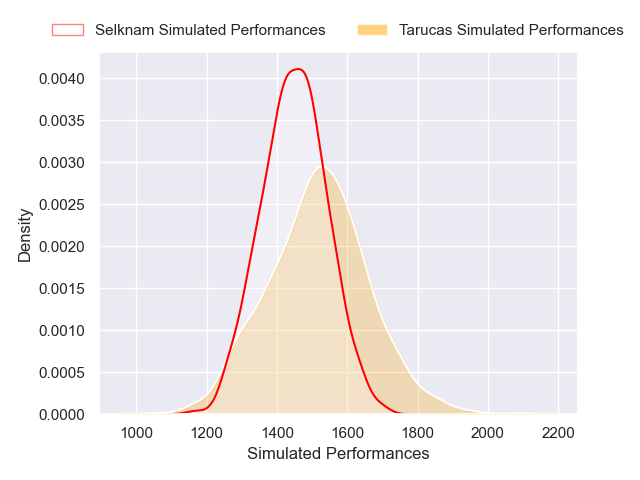
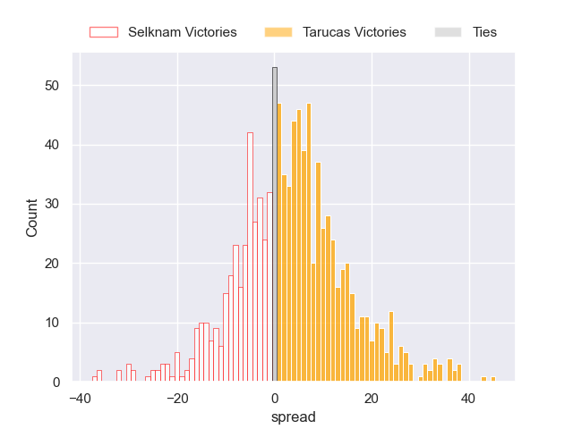

---  
title: "Super Rugby Americas 2025 Status"  
date: 2025-05-09 6:00:00 -0500  
categories: model review projection  
layout: article  
aside:  
    toc: true  
---
# Current Team Rankings

# Standings

## Current Standings

| Club          |   Played |   Wins |   Point Differential |   Losing Bonus Points |   Try Bonus Points |   Competition Points |
|:--------------|---------:|-------:|---------------------:|----------------------:|-------------------:|---------------------:|
| Pampas XV     |        9 |      7 |                  153 |                     0 |                nan |                   33 |
| Dogos XV      |        9 |      5 |                  131 |                     3 |                nan |                   29 |
| Penarol Rugby |        9 |      6 |                   33 |                     1 |                nan |                   28 |
| Selknam       |        8 |      4 |                   40 |                     4 |                  4 |                   24 |
| Yacare XV     |        8 |      4 |                  -21 |                     1 |                nan |                   19 |
| Tarucas       |        8 |      3 |                   -3 |                     3 |                nan |                   17 |
| Cobras        |        9 |      0 |                 -333 |                     2 |                nan |                    4 |

## Projected Remaining Table

| Club          |   Matches Remaining |   Wins |   Point Differential |   Losing Bonus Points |   Try Bonus Points |   Competition Points |
|:--------------|--------------------:|-------:|---------------------:|----------------------:|-------------------:|---------------------:|
| Tarucas       |                   4 |    2.5 |             18.4202  |                   0.7 |                1.6 |                 12.5 |
| Dogos XV      |                   3 |    2.4 |             28.4276  |                   0.3 |                1.7 |                 11.8 |
| Pampas XV     |                   3 |    2.3 |             21.9801  |                   0.4 |                1.2 |                 10.9 |
| Yacare XV     |                   4 |    1.9 |              8.82315 |                   1   |                1.8 |                 10.2 |
| Selknam       |                   4 |    1.3 |            -22.9577  |                   0.9 |                1.3 |                  7.4 |
| Penarol Rugby |                   3 |    1.4 |              7.17971 |                   0.5 |                1.3 |                  7.3 |
| Cobras        |                   3 |    0.2 |            -61.873   |                   0.3 |                0.6 |                  1.8 |

## Projected Total Table

| Club          |   Total Matches |   Wins |   Point Differential |   Losing Bonus Points |   Try Bonus Points |   Competition Points |
|:--------------|----------------:|-------:|---------------------:|----------------------:|-------------------:|---------------------:|
| Pampas XV     |              12 |    9.3 |             174.98   |                   0.4 |                1.2 |                 43.9 |
| Dogos XV      |              12 |    7.4 |             159.428  |                   3.3 |                1.7 |                 40.8 |
| Penarol Rugby |              12 |    7.4 |              40.1797 |                   1.5 |                1.3 |                 35.3 |
| Selknam       |              12 |    5.3 |              17.0423 |                   4.9 |                5.3 |                 31.4 |
| Tarucas       |              12 |    5.5 |              15.4202 |                   3.7 |                1.6 |                 29.5 |
| Yacare XV     |              12 |    5.9 |             -12.1768 |                   2   |                1.8 |                 29.2 |
| Cobras        |              12 |    0.2 |            -394.873  |                   2.3 |                0.6 |                  5.8 |

# Completed Match Review

| Model | Percent Correct Predictions | Spread Error |
| ------ | ------ | ------ |
| Club Level | 63.3% | 12.3 |
| Player Level: Lineup | 50.0% | 14.4 |
| Player Level: Minutes | 50.0% | 13.9 |

# Future Predictions

## Week 10

### Yacare XV V Pampas XV on 2025/05/10

Average Margin: Pampas XV by 5.7

Average Scoreline: 35-29

### Tarucas V Selknam on 2025/05/10

Average Margin: Tarucas by 3.6

Average Scoreline: 29-26

## Week 11

### Penarol Rugby V Cobras on 2025/05/12

Average Margin: Penarol Rugby by 23.5

Average Scoreline: 51-27

### Tarucas V Dogos XV on 2025/05/16

Average Margin: Dogos XV by 5.0

Average Scoreline: 34-29

### Yacare XV V Cobras on 2025/05/17

Average Margin: Yacare XV by 22.6

Average Scoreline: 49-26

## Week 12

### Pampas XV V Selknam on 2025/05/19

Average Margin: Pampas XV by 11.5

Average Scoreline: 24-12

### Dogos XV V Penarol Rugby on 2025/05/23

Average Margin: Dogos XV by 11.6

Average Scoreline: 27-16

### Selknam V Yacare XV on 2025/05/24

Average Margin: Selknam by 4.0

Average Scoreline: 33-29

### Cobras V Tarucas on 2025/05/25

Average Margin: Tarucas by 15.8

Average Scoreline: 39-23

## Week 13

### Dogos XV V Selknam on 2025/05/30

Average Margin: Dogos XV by 11.9

Average Scoreline: 28-16

### Penarol Rugby V Pampas XV on 2025/05/30

Average Margin: Pampas XV by 4.7

Average Scoreline: 34-29

### Tarucas V Yacare XV on 2025/05/31

Average Margin: Tarucas by 4.0

Average Scoreline: 31-27

