---  
title: "Super Rugby Americas 2025 Status"  
date: 2025-05-16 6:00:00 -0500  
categories: model review projection  
layout: article  
aside:  
    toc: true  
---
# Current Team Rankings

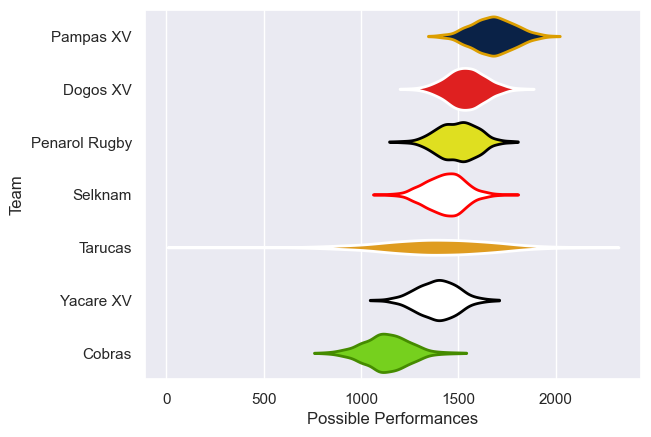
# Standings

## Current Standings

| Club          |   Played |   Wins |   Point Differential |   Losing Bonus Points |   Try Bonus Points |   Competition Points |
|:--------------|---------:|-------:|---------------------:|----------------------:|-------------------:|---------------------:|
| Pampas XV     |       10 |      7 |                  147 |                     1 |                nan |                   34 |
| Penarol Rugby |       10 |      7 |                   67 |                     1 |                nan |                   32 |
| Dogos XV      |        9 |      5 |                  131 |                     3 |                nan |                   29 |
| Selknam       |        9 |      4 |                   20 |                     4 |                  4 |                   24 |
| Yacare XV     |        9 |      5 |                  -15 |                     1 |                nan |                   23 |
| Tarucas       |        9 |      4 |                   17 |                     3 |                nan |                   22 |
| Cobras        |       10 |      0 |                 -367 |                     2 |                nan |                    4 |

## Projected Remaining Table

| Club          |   Matches Remaining |   Wins |   Point Differential |   Losing Bonus Points |   Try Bonus Points |   Competition Points |
|:--------------|--------------------:|-------:|---------------------:|----------------------:|-------------------:|---------------------:|
| Dogos XV      |                   3 |    2.3 |              26.0024 |                   0.4 |                1.6 |                 11.3 |
| Tarucas       |                   3 |    2.1 |              26.0241 |                   0.5 |                1.4 |                 10.4 |
| Yacare XV     |                   3 |    1.6 |              16.4743 |                   0.7 |                1.5 |                  8.6 |
| Pampas XV     |                   2 |    1.6 |              16.0728 |                   0.3 |                0.7 |                  7.2 |
| Selknam       |                   3 |    0.8 |             -23.8951 |                   0.6 |                0.9 |                  4.7 |
| Penarol Rugby |                   2 |    0.5 |             -15.4561 |                   0.5 |                0.4 |                  2.8 |
| Cobras        |                   2 |    0.1 |             -45.2223 |                   0.1 |                0.3 |                  1   |

## Projected Total Table

| Club          |   Total Matches |   Wins |   Point Differential |   Losing Bonus Points |   Try Bonus Points |   Competition Points |
|:--------------|----------------:|-------:|---------------------:|----------------------:|-------------------:|---------------------:|
| Pampas XV     |              12 |    8.6 |            163.073   |                   1.3 |                0.7 |                 41.2 |
| Dogos XV      |              12 |    7.3 |            157.002   |                   3.4 |                1.6 |                 40.3 |
| Penarol Rugby |              12 |    7.5 |             51.5439  |                   1.5 |                0.4 |                 34.8 |
| Tarucas       |              12 |    6.1 |             43.0241  |                   3.5 |                1.4 |                 32.4 |
| Yacare XV     |              12 |    6.6 |              1.47431 |                   1.7 |                1.5 |                 31.6 |
| Selknam       |              12 |    4.8 |             -3.89513 |                   4.6 |                4.9 |                 28.7 |
| Cobras        |              12 |    0.1 |           -412.222   |                   2.1 |                0.3 |                  5   |

# Completed Match Review

| Model | Percent Correct Predictions | Spread Error |
| ------ | ------ | ------ |
| Club Level | 60.6% | 12.4 |
| Player Level: Lineup | 53.8% | 17.3 |
| Player Level: Minutes | 53.8% | 17.6 |

# Future Predictions

## Week 11

### Tarucas V Dogos XV on 2025/05/17

Average Margin: Dogos XV by 1.0

Average Scoreline: 33-32

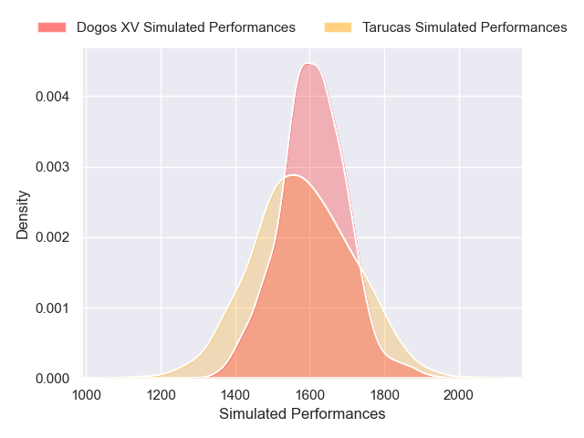

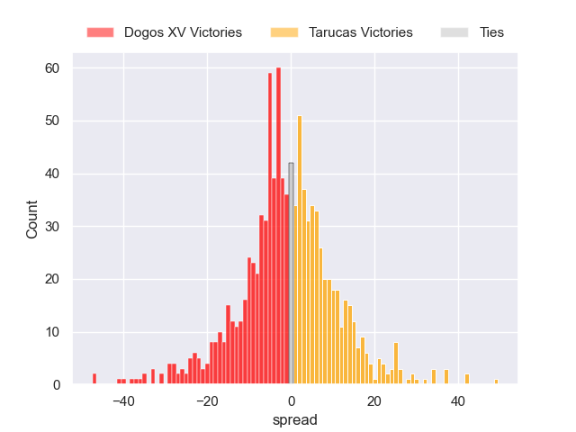

### Yacare XV V Cobras on 2025/05/18

Average Margin: Yacare XV by 25.0

Average Scoreline: 50-25

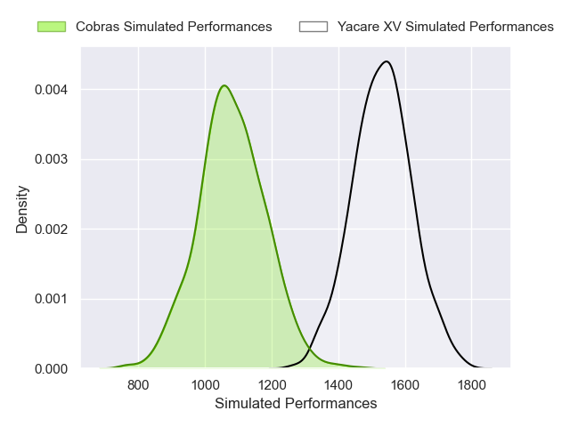

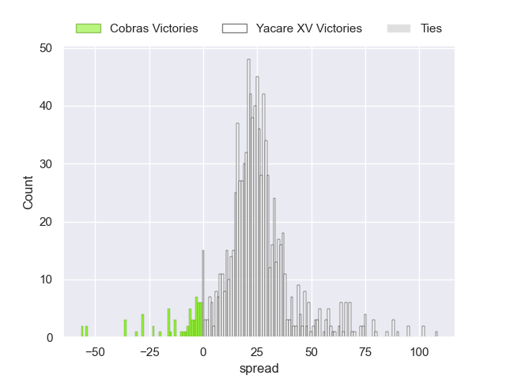

## Week 12

### Pampas XV V Selknam on 2025/05/19

Average Margin: Pampas XV by 12.5

Average Scoreline: 28-16

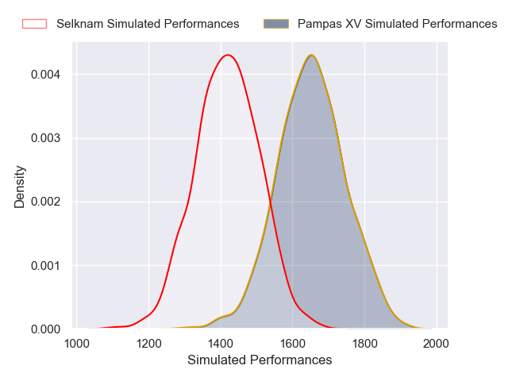

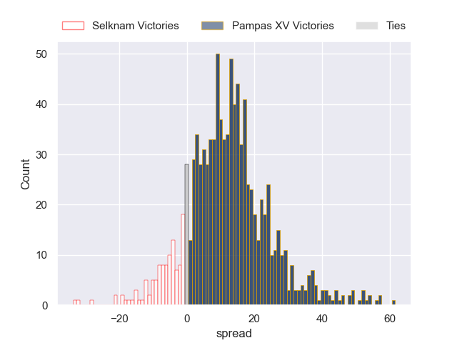

### Dogos XV V Penarol Rugby on 2025/05/23

Average Margin: Dogos XV by 11.9

Average Scoreline: 32-20

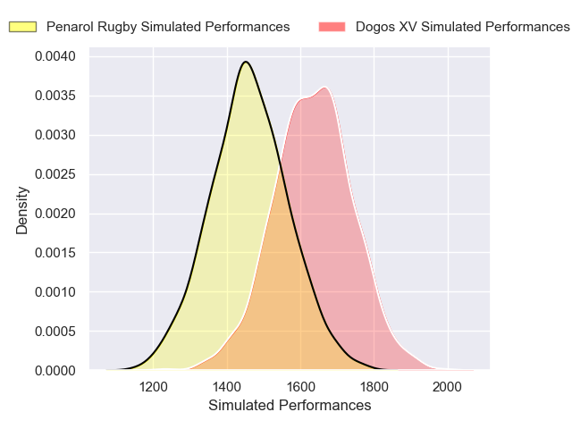

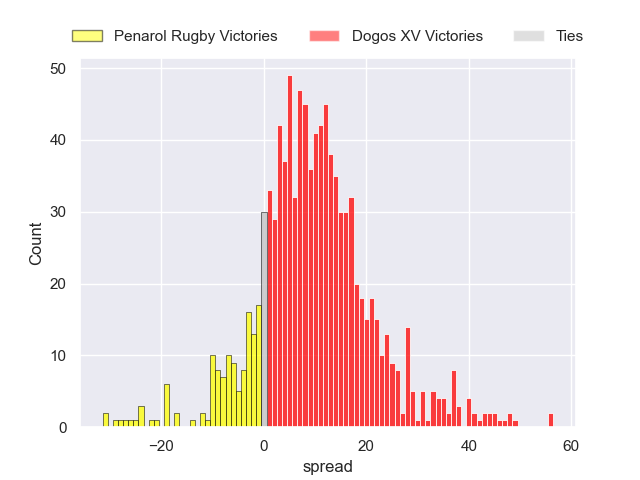

### Selknam V Yacare XV on 2025/05/24

Average Margin: Selknam by 1.7

Average Scoreline: 30-29

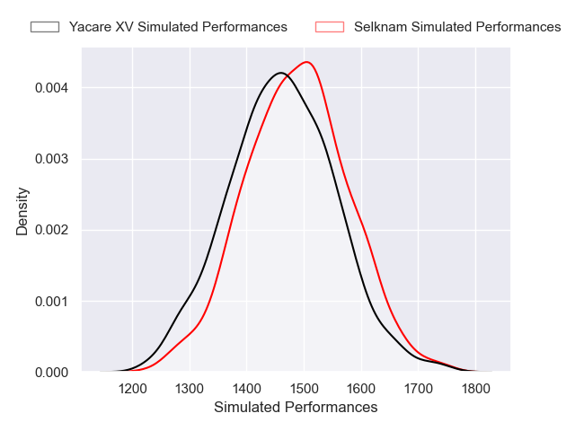
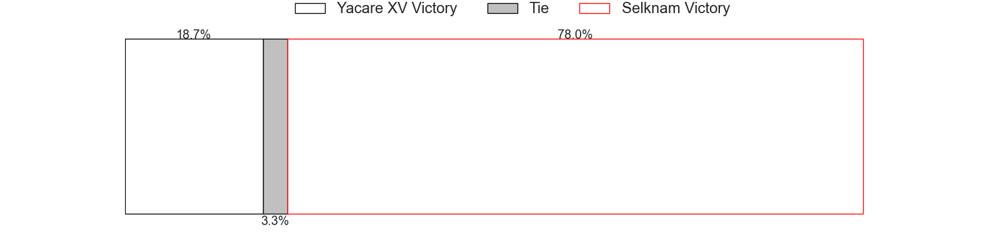
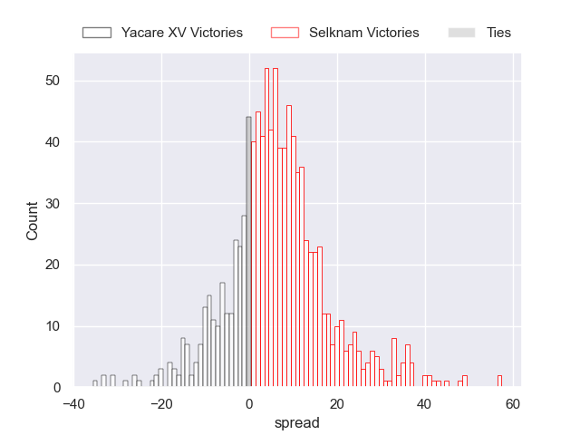

### Cobras V Tarucas on 2025/05/25

Average Margin: Tarucas by 20.2

Average Scoreline: 53-33

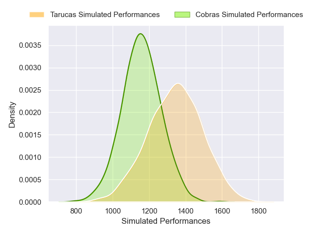

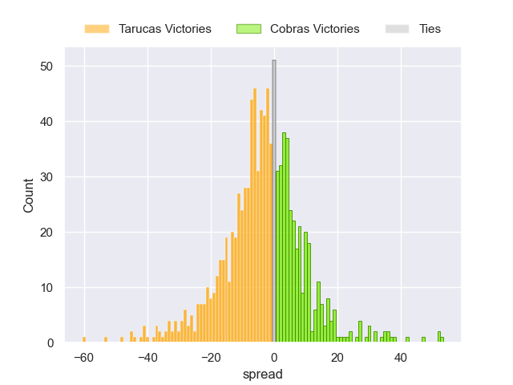

## Week 13

### Dogos XV V Selknam on 2025/05/30

Average Margin: Dogos XV by 13.1

Average Scoreline: 30-17

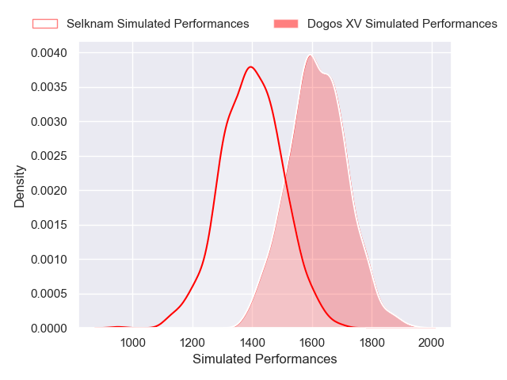

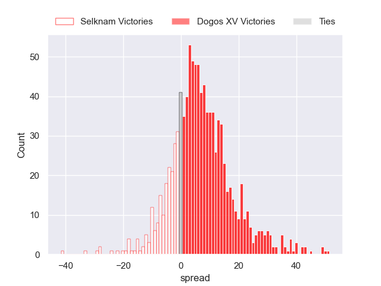

### Penarol Rugby V Pampas XV on 2025/05/30

Average Margin: Pampas XV by 3.5

Average Scoreline: 31-28

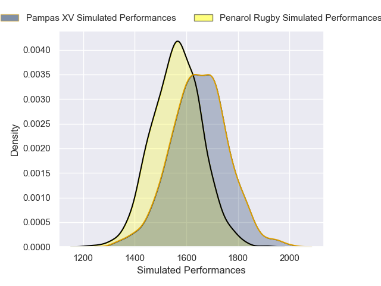

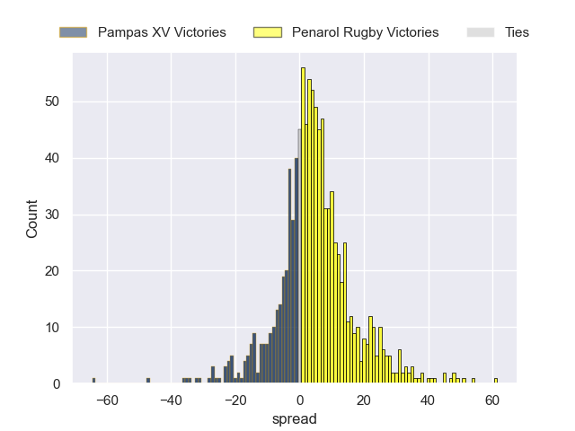

### Tarucas V Yacare XV on 2025/05/31

Average Margin: Tarucas by 6.9

Average Scoreline: 29-22

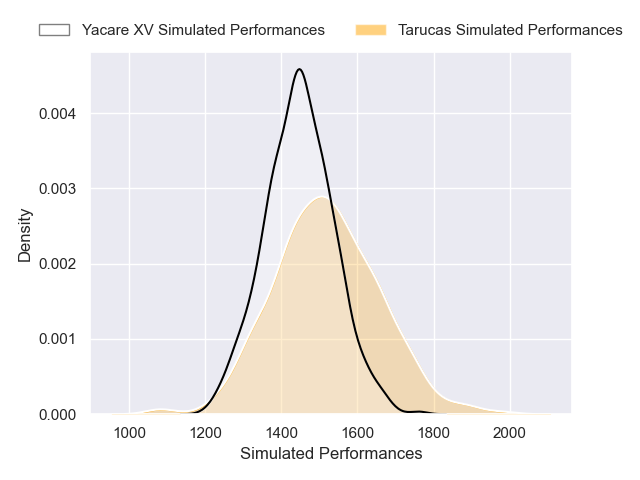

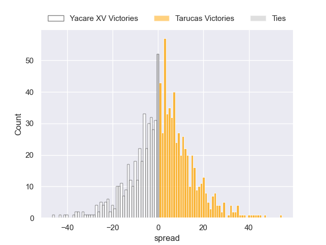

