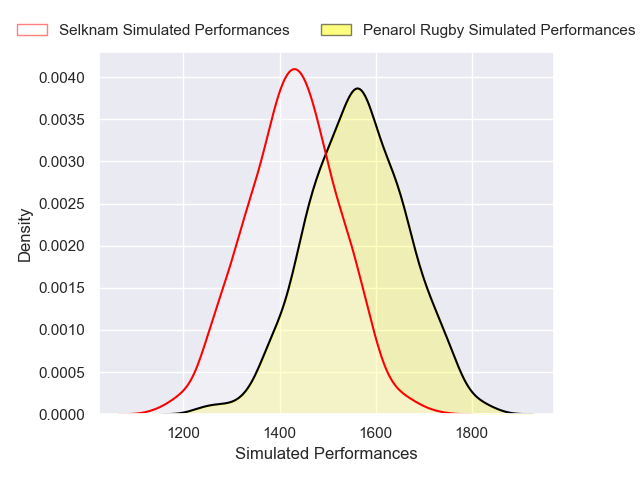
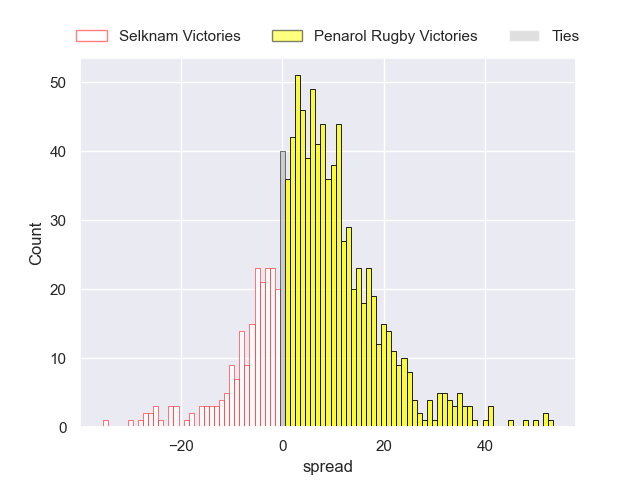

---  
title: "Super Rugby Americas 2025 Status"  
date: 2025-03-06 6:00:00 -0500  
categories: model review projection  
layout: article  
aside:  
    toc: true  
---
# Current Team Rankings

# Standings

## Current Standings

| Club          |   Played |   Wins |   Point Differential |   Losing Bonus Points |   Try Bonus Points |   Competition Points |
|:--------------|---------:|-------:|---------------------:|----------------------:|-------------------:|---------------------:|
| Penarol Rugby |        3 |      2 |                   22 |                     0 |                  2 |                   10 |
| Selknam       |        3 |      2 |                    9 |                     1 |                  1 |                   10 |
| Yacare XV     |        3 |      2 |                  -29 |                     0 |                  0 |                    8 |
| Tarucas       |        2 |      1 |                   36 |                     1 |                  1 |                    6 |
| Pampas XV     |        2 |      1 |                   14 |                     0 |                  0 |                    6 |
| Dogos XV      |        3 |      0 |                   -6 |                     2 |                  2 |                    6 |
| Cobras        |        2 |      0 |                  -46 |                     1 |                  0 |                    1 |

## Projected Remaining Table

| Club          |   Matches Remaining |   Wins |   Point Differential |   Losing Bonus Points |   Try Bonus Points |   Competition Points |
|:--------------|--------------------:|-------:|---------------------:|----------------------:|-------------------:|---------------------:|
| Pampas XV     |                  10 |    8.5 |             146.569  |                   0.8 |                5.8 |                 40.8 |
| Dogos XV      |                   9 |    6.4 |              73.9226 |                   1.2 |                5.4 |                 32   |
| Penarol Rugby |                   9 |    5.3 |              36.2444 |                   1.7 |                4.1 |                 27.1 |
| Tarucas       |                  10 |    4.3 |             -28.445  |                   1.8 |                2.1 |                 21.1 |
| Selknam       |                   9 |    3.9 |             -15.0212 |                   1.8 |                2.9 |                 20.3 |
| Yacare XV     |                   9 |    3.5 |             -31.047  |                   1.8 |                2.8 |                 18.8 |
| Cobras        |                  10 |    1.1 |            -182.223  |                   1.2 |                2   |                  7.4 |

## Projected Total Table

| Club          |   Total Matches |   Wins |   Point Differential |   Losing Bonus Points |   Try Bonus Points |   Competition Points |
|:--------------|----------------:|-------:|---------------------:|----------------------:|-------------------:|---------------------:|
| Pampas XV     |              12 |    9.5 |            160.569   |                   0.8 |                5.8 |                 46.8 |
| Dogos XV      |              12 |    6.4 |             67.9226  |                   3.2 |                7.4 |                 38   |
| Penarol Rugby |              12 |    7.3 |             58.2444  |                   1.7 |                6.1 |                 37.1 |
| Selknam       |              12 |    5.9 |             -6.02122 |                   2.8 |                3.9 |                 30.3 |
| Tarucas       |              12 |    5.3 |              7.55497 |                   2.8 |                3.1 |                 27.1 |
| Yacare XV     |              12 |    5.5 |            -60.047   |                   1.8 |                2.8 |                 26.8 |
| Cobras        |              12 |    1.1 |           -228.223   |                   2.2 |                2   |                  8.4 |

# Completed Match Review

| Model | Percent Correct Predictions | Spread Error |
| ------ | ------ | ------ |
| Club Level | 55.6% | 8.1 |
| Player Level: Lineup | 33.3% | 10.4 |
| Player Level: Minutes | 33.3% | 10.0 |

# Future Predictions

## Week 4

### Tarucas V Pampas XV on 2025/03/07

Average Margin: Pampas XV by 11.9

Average Scoreline: 38-26

### Dogos XV V Cobras on 2025/03/08

Average Margin: Dogos XV by 24.3

Average Scoreline: 40-16

### Penarol Rugby V Selknam on 2025/03/08

Average Margin: Penarol Rugby by 6.8

Average Scoreline: 28-21

## Week 5

### Pampas XV V Yacare XV on 2025/03/14

Average Margin: Pampas XV by 18.4

Average Scoreline: 34-16

### Cobras V Penarol Rugby on 2025/03/16

Average Margin: Penarol Rugby by 16.2

Average Scoreline: 36-20

### Selknam V Tarucas on 2025/03/16

Average Margin: Selknam by 6.4

Average Scoreline: 20-13

## Week 6

### Dogos XV V Tarucas on 2025/03/28

Average Margin: Dogos XV by 11.1

Average Scoreline: 26-15

### Selknam V Pampas XV on 2025/03/29

Average Margin: Pampas XV by 10.1

Average Scoreline: 39-28

### Cobras V Yacare XV on 2025/03/29

Average Margin: Yacare XV by 10.6

Average Scoreline: 35-24

## Week 7

### Pampas XV V Cobras on 2025/04/04

Average Margin: Pampas XV by 29.7

Average Scoreline: 43-13

### Yacare XV V Dogos XV on 2025/04/05

Average Margin: Dogos XV by 4.0

Average Scoreline: 31-27

## Week 8

### Tarucas V Penarol Rugby on 2025/04/07

Average Margin: Tarucas by 0.6

Average Scoreline: 28-28

### Pampas XV V Dogos XV on 2025/04/11

Average Margin: Pampas XV by 10.8

Average Scoreline: 29-18

### Yacare XV V Penarol Rugby on 2025/04/12

Average Margin: Penarol Rugby by 1.0

Average Scoreline: 29-28

### Selknam V Cobras on 2025/04/12

Average Margin: Selknam by 17.7

Average Scoreline: 33-15

## Week 9

### Pampas XV V Tarucas on 2025/04/25

Average Margin: Pampas XV by 15.0

Average Scoreline: 30-15

### Cobras V Dogos XV on 2025/04/26

Average Margin: Dogos XV by 17.3

Average Scoreline: 40-23

### Selknam V Penarol Rugby on 2025/04/27

Average Margin: Selknam by 0.8

Average Scoreline: 26-25

## Week 10

### Penarol Rugby V Tarucas on 2025/05/02

Average Margin: Penarol Rugby by 5.2

Average Scoreline: 22-16

### Cobras V Pampas XV on 2025/05/03

Average Margin: Pampas XV by 20.5

Average Scoreline: 43-23

## Week 11

### Dogos XV V Yacare XV on 2025/05/05

Average Margin: Dogos XV by 10.7

Average Scoreline: 33-22

### Tarucas V Selknam on 2025/05/09

Average Margin: Tarucas by 4.6

Average Scoreline: 30-25

### Yacare XV V Pampas XV on 2025/05/10

Average Margin: Pampas XV by 10.5

Average Scoreline: 36-25

## Week 12

### Penarol Rugby V Cobras on 2025/05/12

Average Margin: Penarol Rugby by 20.5

Average Scoreline: 34-13

### Tarucas V Dogos XV on 2025/05/16

Average Margin: Dogos XV by 0.5

Average Scoreline: 30-29

### Yacare XV V Cobras on 2025/05/17

Average Margin: Yacare XV by 14.8

Average Scoreline: 30-15

## Week 13

### Pampas XV V Selknam on 2025/05/19

Average Margin: Pampas XV by 14.0

Average Scoreline: 32-18

### Dogos XV V Penarol Rugby on 2025/05/23

Average Margin: Dogos XV by 6.5

Average Scoreline: 29-23

### Selknam V Yacare XV on 2025/05/24

Average Margin: Selknam by 5.9

Average Scoreline: 28-23

### Cobras V Tarucas on 2025/05/25

Average Margin: Tarucas by 10.5

Average Scoreline: 38-28

## Week 14

### Dogos XV V Selknam on 2025/05/30

Average Margin: Dogos XV by 10.3

Average Scoreline: 32-22

### Penarol Rugby V Pampas XV on 2025/05/30

Average Margin: Pampas XV by 5.7

Average Scoreline: 28-23

### Tarucas V Yacare XV on 2025/05/31

Average Margin: Tarucas by 5.9

Average Scoreline: 31-25

