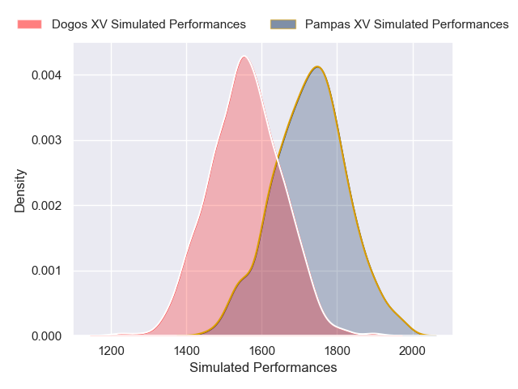
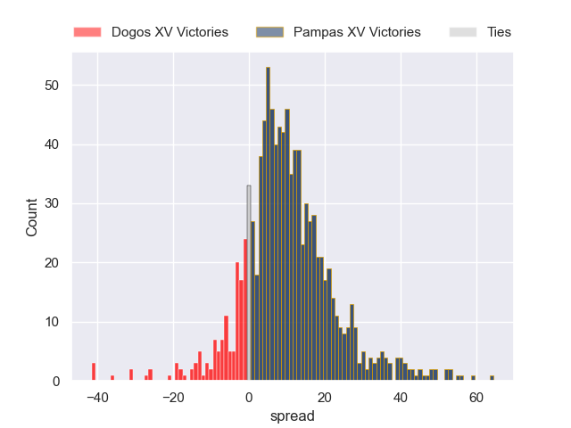
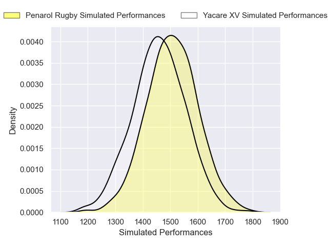
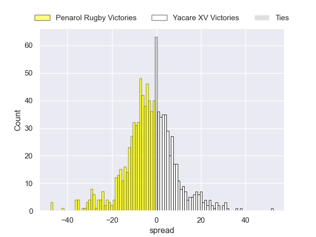

---  
title: "Super Rugby Americas 2025 Status"  
date: 2025-04-10 6:00:00 -0500  
categories: model review projection  
layout: article  
aside:  
    toc: true  
---
# Current Team Rankings

# Standings

## Current Standings

| Club          |   Played |   Wins |   Point Differential |   Losing Bonus Points |   Try Bonus Points |   Competition Points |
|:--------------|---------:|-------:|---------------------:|----------------------:|-------------------:|---------------------:|
| Pampas XV     |        6 |      5 |                   90 |                     0 |                  2 |                   24 |
| Penarol Rugby |        6 |      5 |                   63 |                     0 |                  3 |                   23 |
| Yacare XV     |        7 |      4 |                  -31 |                     1 |                  2 |                   19 |
| Selknam       |        6 |      3 |                   25 |                     3 |                  3 |                   18 |
| Dogos XV      |        6 |      2 |                   48 |                     3 |                  3 |                   16 |
| Tarucas       |        6 |      2 |                    7 |                     3 |                  2 |                   13 |
| Cobras        |        7 |      0 |                 -202 |                     2 |                  3 |                    5 |

## Projected Remaining Table

| Club          |   Matches Remaining |   Wins |   Point Differential |   Losing Bonus Points |   Try Bonus Points |   Competition Points |
|:--------------|--------------------:|-------:|---------------------:|----------------------:|-------------------:|---------------------:|
| Pampas XV     |                   6 |    5.2 |              85.3715 |                   0.5 |                2.6 |                 23.9 |
| Dogos XV      |                   6 |    4.2 |              44.0382 |                   0.8 |                3.1 |                 20.9 |
| Penarol Rugby |                   6 |    3.4 |              24.5186 |                   1.3 |                2.6 |                 17.4 |
| Selknam       |                   6 |    3.3 |              14.7501 |                   1.1 |                2.6 |                 16.7 |
| Yacare XV     |                   6 |    2.1 |             -19.2717 |                   1.4 |                2.1 |                 12.1 |
| Tarucas       |                   6 |    2.3 |             -30.8095 |                   1.2 |                1.5 |                 11.8 |
| Cobras        |                   6 |    0.5 |            -118.597  |                   0.6 |                1.3 |                  4   |

## Projected Total Table

| Club          |   Total Matches |   Wins |   Point Differential |   Losing Bonus Points |   Try Bonus Points |   Competition Points |
|:--------------|----------------:|-------:|---------------------:|----------------------:|-------------------:|---------------------:|
| Pampas XV     |              12 |   10.2 |             175.371  |                   0.5 |                4.6 |                 47.9 |
| Penarol Rugby |              12 |    8.4 |              87.5186 |                   1.3 |                5.6 |                 40.4 |
| Dogos XV      |              12 |    6.2 |              92.0382 |                   3.8 |                6.1 |                 36.9 |
| Selknam       |              12 |    6.3 |              39.7501 |                   4.1 |                5.6 |                 34.7 |
| Yacare XV     |              13 |    6.1 |             -50.2717 |                   2.4 |                4.1 |                 31.1 |
| Tarucas       |              12 |    4.3 |             -23.8095 |                   4.2 |                3.5 |                 24.8 |
| Cobras        |              13 |    0.5 |            -320.597  |                   2.6 |                4.3 |                  9   |

# Completed Match Review

| Model | Percent Correct Predictions | Spread Error |
| ------ | ------ | ------ |
| Club Level | 68.2% | 9.2 |
| Player Level: Lineup | 60.0% | 15.0 |
| Player Level: Minutes | 60.0% | 15.2 |

# Future Predictions

## Week 8

### Pampas XV V Dogos XV on 2025/04/12

Average Margin: Pampas XV by 10.3

Average Scoreline: 28-18

### Selknam V Cobras on 2025/04/12

Average Margin: Selknam by 22.8

Average Scoreline: 40-17

### Yacare XV V Penarol Rugby on 2025/04/13

Average Margin: Penarol Rugby by 2.9

Average Scoreline: 33-30

## Week 9

### Pampas XV V Tarucas on 2025/04/25

Average Margin: Pampas XV by 21.0

Average Scoreline: 37-16

### Cobras V Dogos XV on 2025/04/26

Average Margin: Dogos XV by 21.0

Average Scoreline: 47-26

### Selknam V Penarol Rugby on 2025/04/27

Average Margin: Selknam by 2.4

Average Scoreline: 33-30

## Week 10

### Penarol Rugby V Tarucas on 2025/05/02

Average Margin: Penarol Rugby by 11.6

Average Scoreline: 34-22

### Cobras V Pampas XV on 2025/05/03

Average Margin: Pampas XV by 23.9

Average Scoreline: 45-21

## Week 11

### Dogos XV V Yacare XV on 2025/05/05

Average Margin: Dogos XV by 12.4

Average Scoreline: 34-22

### Tarucas V Selknam on 2025/05/09

Average Margin: Selknam by 3.2

Average Scoreline: 31-27

### Yacare XV V Pampas XV on 2025/05/10

Average Margin: Pampas XV by 10.7

Average Scoreline: 34-24

## Week 12

### Penarol Rugby V Cobras on 2025/05/12

Average Margin: Penarol Rugby by 24.0

Average Scoreline: 41-17

### Tarucas V Dogos XV on 2025/05/16

Average Margin: Dogos XV by 6.6

Average Scoreline: 31-25

### Yacare XV V Cobras on 2025/05/17

Average Margin: Yacare XV by 17.5

Average Scoreline: 34-17

## Week 13

### Pampas XV V Selknam on 2025/05/19

Average Margin: Pampas XV by 14.2

Average Scoreline: 31-17

### Dogos XV V Penarol Rugby on 2025/05/23

Average Margin: Dogos XV by 6.3

Average Scoreline: 28-22

### Selknam V Yacare XV on 2025/05/24

Average Margin: Selknam by 8.5

Average Scoreline: 32-24

### Cobras V Tarucas on 2025/05/25

Average Margin: Tarucas by 9.3

Average Scoreline: 33-24

## Week 14

### Dogos XV V Selknam on 2025/05/30

Average Margin: Dogos XV by 8.0

Average Scoreline: 31-23

### Penarol Rugby V Pampas XV on 2025/05/30

Average Margin: Pampas XV by 5.2

Average Scoreline: 36-31

### Tarucas V Yacare XV on 2025/05/31

Average Margin: Tarucas by 2.2

Average Scoreline: 30-27

