---  
title: "Super Rugby Americas 2025 Status"  
date: 2025-02-17 6:00:00 -0500  
categories: model review projection  
layout: article  
aside:  
    toc: true  
---
# Current Team Rankings

# Standings

## Current Standings

| Club          |   Played |   Wins |   Point Differential |   Losing Bonus Points |   Try Bonus Points |   Competition Points |
|:--------------|---------:|-------:|---------------------:|----------------------:|-------------------:|---------------------:|
| Penarol Rugby |        1 |      1 |                    1 |                     0 |                  1 |                    5 |
| Tarucas       |        1 |      1 |                   39 |                     0 |                nan |                    4 |
| Yacare XV     |        1 |      1 |                    3 |                     0 |                nan |                    4 |
| Dogos XV      |        1 |      0 |                   -1 |                     1 |                  1 |                    2 |
| Selknam       |        1 |      0 |                   -3 |                     1 |                nan |                    1 |
| Cobras        |        1 |      0 |                  -39 |                     0 |                nan |                    0 |

## Projected Remaining Table

| Club          |   Matches Remaining |   Wins |   Point Differential |   Losing Bonus Points |   Try Bonus Points |   Competition Points |
|:--------------|--------------------:|-------:|---------------------:|----------------------:|-------------------:|---------------------:|
| Pampas XV     |                  12 |    9.5 |            143.192   |                   1.2 |                6.6 |                 46   |
| Dogos XV      |                  11 |    7.2 |             70.2556  |                   1.7 |                5.9 |                 36.6 |
| Tarucas       |                  11 |    6.9 |             62.5333  |                   1.7 |                3.2 |                 32.5 |
| Penarol Rugby |                  11 |    5.5 |              3.08536 |                   2   |                4.4 |                 28.6 |
| Selknam       |                  11 |    4.4 |            -37.1446  |                   2.2 |                4   |                 23.8 |
| Yacare XV     |                  11 |    4.3 |            -39.6165  |                   2.3 |                4   |                 23.6 |
| Cobras        |                  11 |    1   |           -202.305   |                   1.4 |                2.2 |                  7.8 |

## Projected Total Table

| Club          |   Total Matches |   Wins |   Point Differential |   Losing Bonus Points |   Try Bonus Points |   Competition Points |
|:--------------|----------------:|-------:|---------------------:|----------------------:|-------------------:|---------------------:|
| Pampas XV     |              12 |    9.5 |            143.192   |                   1.2 |                6.6 |                 46   |
| Dogos XV      |              12 |    7.2 |             69.2556  |                   2.7 |                6.9 |                 38.6 |
| Tarucas       |              12 |    7.9 |            101.533   |                   1.7 |                3.2 |                 36.5 |
| Penarol Rugby |              12 |    6.5 |              4.08536 |                   2   |                5.4 |                 33.6 |
| Yacare XV     |              12 |    5.3 |            -36.6165  |                   2.3 |                4   |                 27.6 |
| Selknam       |              12 |    4.4 |            -40.1446  |                   3.2 |                4   |                 24.8 |
| Cobras        |              12 |    1   |           -241.305   |                   1.4 |                2.2 |                  7.8 |

# Completed Match Review

| Model | Percent Correct Predictions | Spread Error |
| ------ | ------ | ------ |
| Club Level | 66.7% | 7.3 |
| Player Level: Lineup | 0.0% | 6.9 |
| Player Level: Minutes | 0.0% | 3.1 |

# Future Predictions

## Week 2

### Penarol Rugby V Yacare XV on 2025/02/21

Average Margin: Penarol Rugby by 6.9

Average Scoreline: 33-26

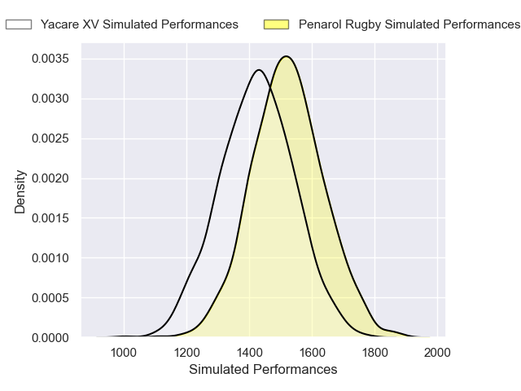

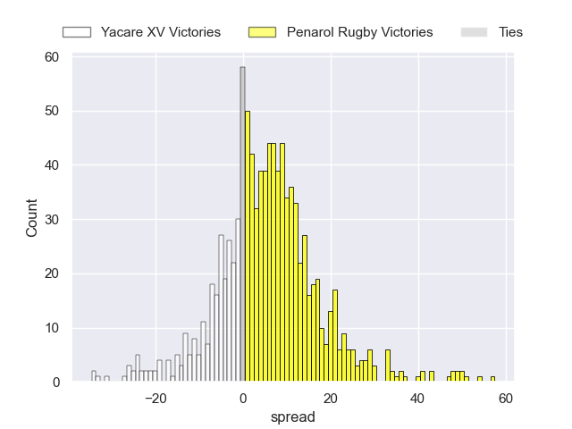

### Dogos XV V Pampas XV on 2025/02/22

Average Margin: Pampas XV by 2.5

Average Scoreline: 31-29

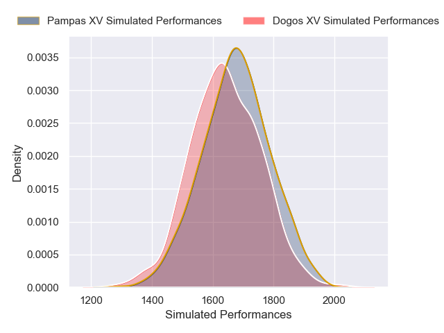

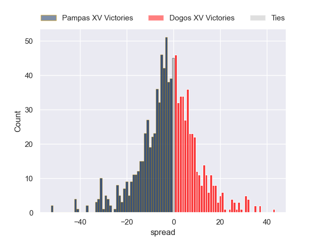

### Cobras V Selknam on 2025/02/22

Average Margin: Selknam by 11.6

Average Scoreline: 35-23

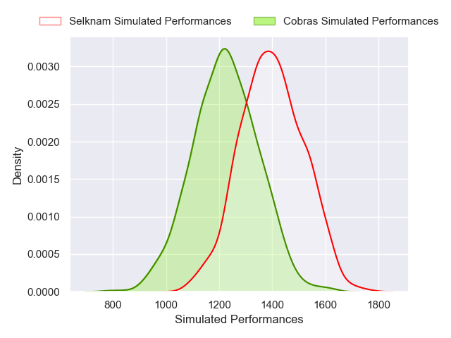
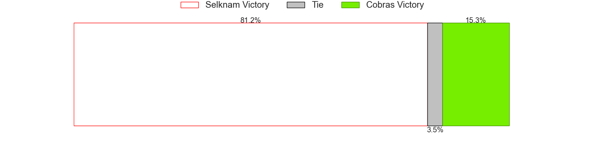
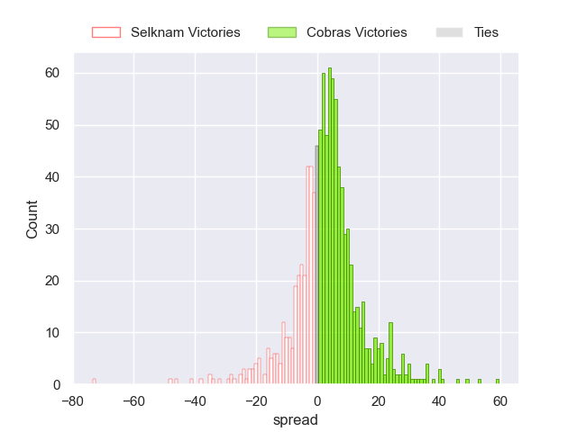

## Week 3

### Pampas XV V Penarol Rugby on 2025/02/28

Average Margin: Pampas XV by 15.0

Average Scoreline: 34-19

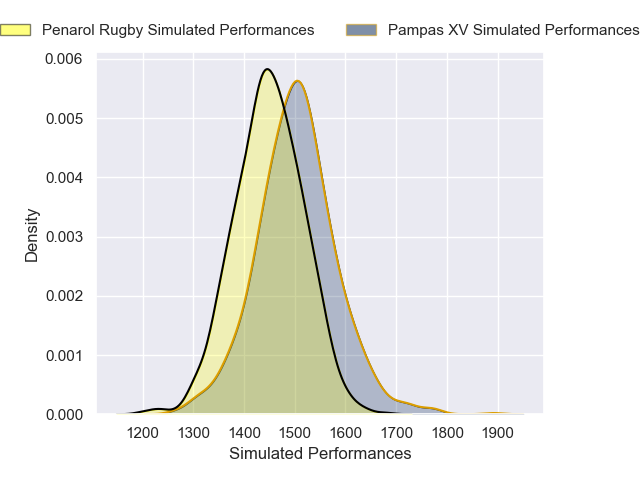
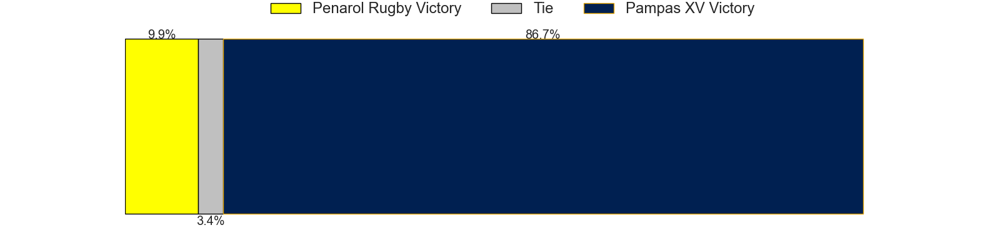
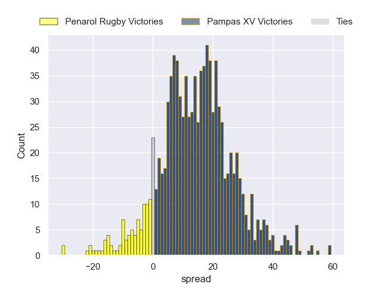

### Yacare XV V Tarucas on 2025/03/01

Average Margin: Tarucas by 7.4

Average Scoreline: 34-26

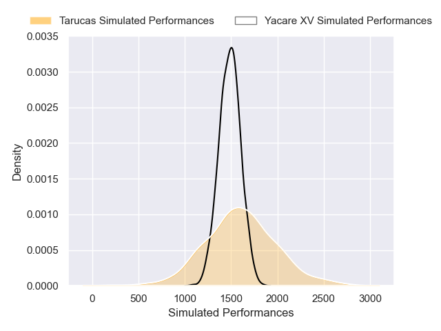

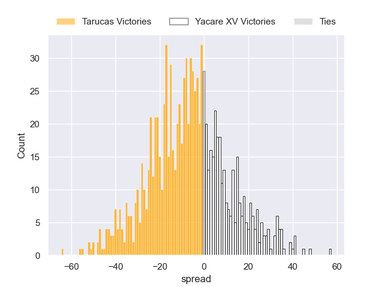

### Selknam V Dogos XV on 2025/03/01

Average Margin: Dogos XV by 5.4

Average Scoreline: 34-29

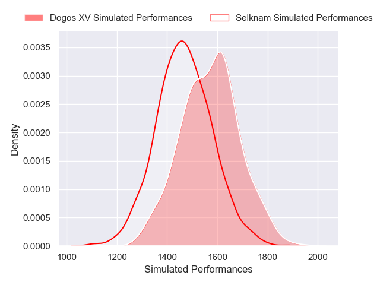

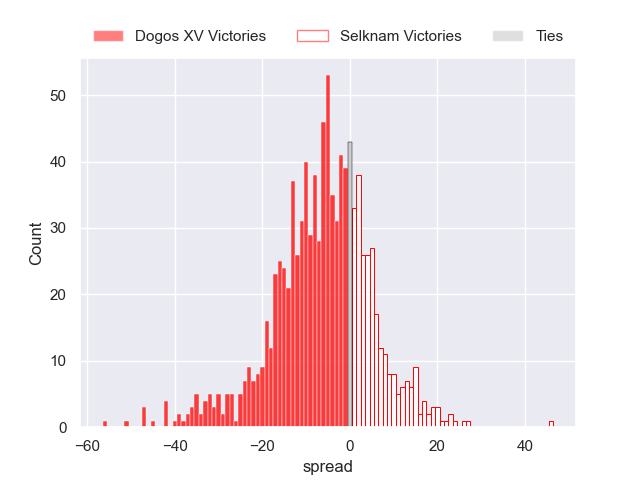

## Week 4

### Penarol Rugby V Selknam on 2025/03/07

Average Margin: Penarol Rugby by 8.1

Average Scoreline: 33-25

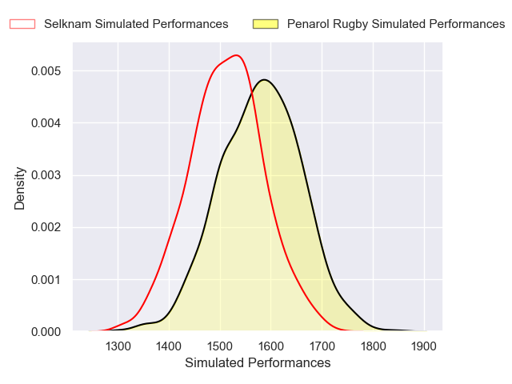

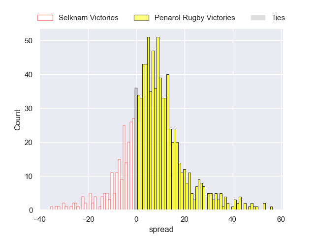

### Tarucas V Pampas XV on 2025/03/07

Average Margin: Tarucas by 0.1

Average Scoreline: 32-32

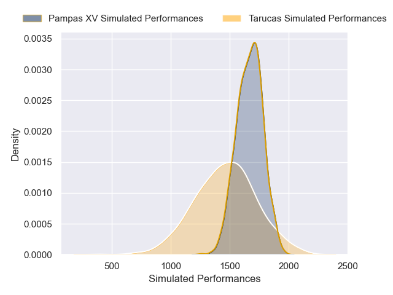

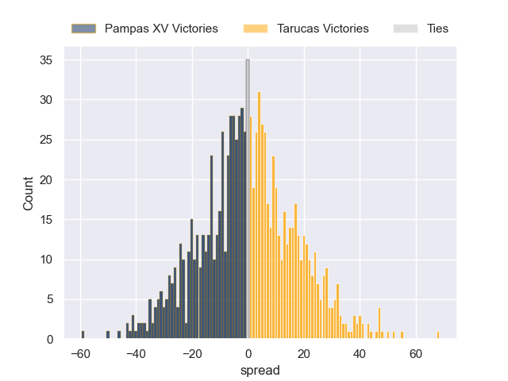

### Dogos XV V Cobras on 2025/03/08

Average Margin: Dogos XV by 25.7

Average Scoreline: 45-19

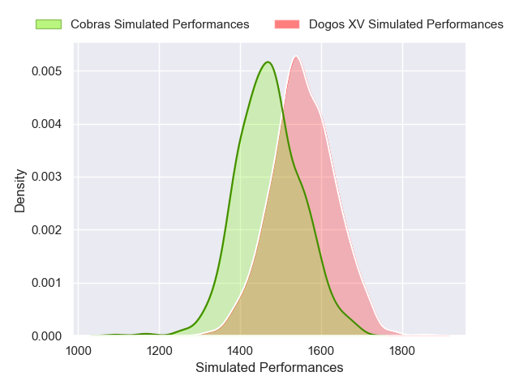

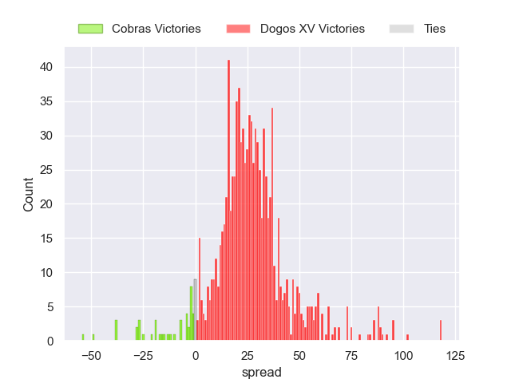

## Week 5

### Pampas XV V Yacare XV on 2025/03/14

Average Margin: Pampas XV by 16.4

Average Scoreline: 37-21

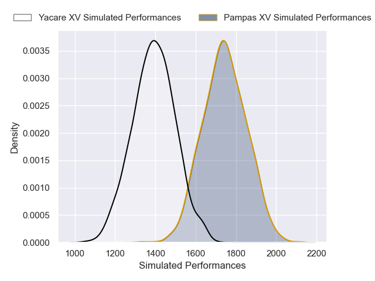

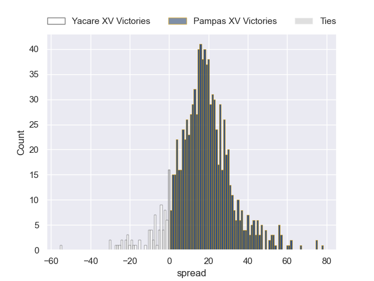

### Selknam V Tarucas on 2025/03/16

Average Margin: Tarucas by 7.6

Average Scoreline: 33-26

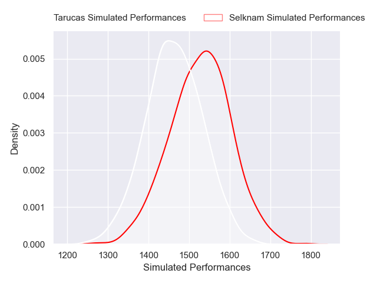

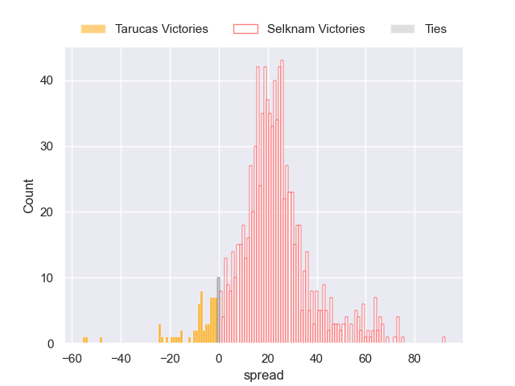

### Cobras V Penarol Rugby on 2025/03/16

Average Margin: Penarol Rugby by 14.0

Average Scoreline: 38-24

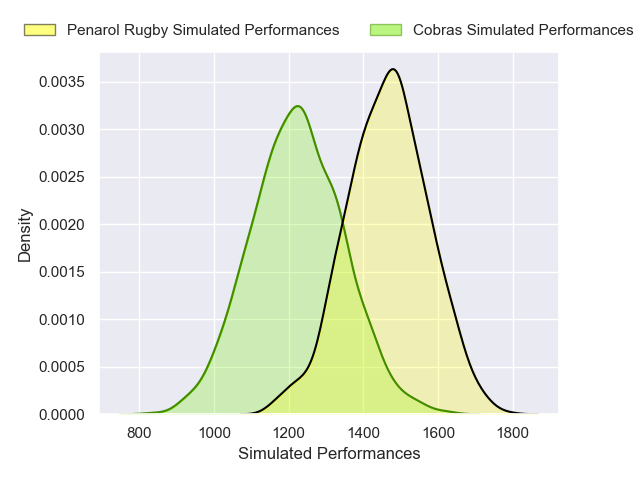

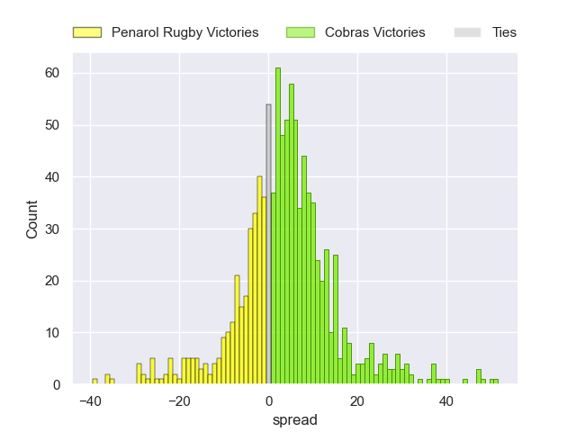

## Week 6

### Dogos XV V Tarucas on 2025/03/28

Average Margin: Dogos XV by 2.4

Average Scoreline: 29-26

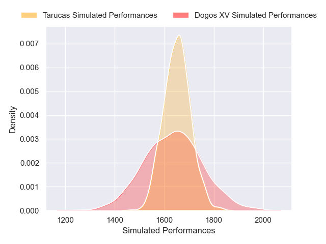

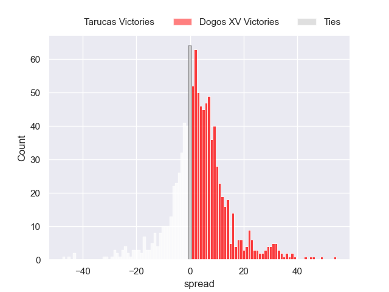

### Cobras V Yacare XV on 2025/03/29

Average Margin: Yacare XV by 11.9

Average Scoreline: 37-26

### Selknam V Pampas XV on 2025/03/29

Average Margin: Pampas XV by 10.7

Average Scoreline: 33-22

## Week 7

### Pampas XV V Cobras on 2025/04/04

Average Margin: Pampas XV by 28.6

Average Scoreline: 49-21

### Yacare XV V Dogos XV on 2025/04/05

Average Margin: Dogos XV by 4.2

Average Scoreline: 29-25

## Week 8

### Tarucas V Penarol Rugby on 2025/04/07

Average Margin: Tarucas by 10.0

Average Scoreline: 33-23

### Pampas XV V Dogos XV on 2025/04/11

Average Margin: Pampas XV by 9.3

Average Scoreline: 30-21

### Yacare XV V Penarol Rugby on 2025/04/12

Average Margin: Yacare XV by 1.8

Average Scoreline: 30-29

### Selknam V Cobras on 2025/04/12

Average Margin: Selknam by 17.6

Average Scoreline: 40-23

## Week 9

### Pampas XV V Tarucas on 2025/04/25

Average Margin: Pampas XV by 8.1

Average Scoreline: 25-17

### Cobras V Dogos XV on 2025/04/26

Average Margin: Dogos XV by 17.7

Average Scoreline: 35-17

### Selknam V Penarol Rugby on 2025/04/27

Average Margin: Selknam by 1.2

Average Scoreline: 30-29

## Week 10

### Penarol Rugby V Tarucas on 2025/05/02

Average Margin: Tarucas by 2.1

Average Scoreline: 23-21

### Cobras V Pampas XV on 2025/05/03

Average Margin: Pampas XV by 22.0

Average Scoreline: 41-18

## Week 11

### Dogos XV V Yacare XV on 2025/05/05

Average Margin: Dogos XV by 11.5

Average Scoreline: 34-23

### Tarucas V Selknam on 2025/05/09

Average Margin: Tarucas by 11.6

Average Scoreline: 34-22

### Yacare XV V Pampas XV on 2025/05/10

Average Margin: Pampas XV by 8.3

Average Scoreline: 34-25

## Week 12

### Penarol Rugby V Cobras on 2025/05/12

Average Margin: Penarol Rugby by 19.1

Average Scoreline: 39-20

### Tarucas V Dogos XV on 2025/05/16

Average Margin: Tarucas by 4.6

Average Scoreline: 31-26

### Yacare XV V Cobras on 2025/05/17

Average Margin: Yacare XV by 16.5

Average Scoreline: 42-26

## Week 13

### Pampas XV V Selknam on 2025/05/19

Average Margin: Pampas XV by 15.6

Average Scoreline: 35-20

### Dogos XV V Penarol Rugby on 2025/05/23

Average Margin: Dogos XV by 8.2

Average Scoreline: 32-24

### Selknam V Yacare XV on 2025/05/24

Average Margin: Selknam by 3.1

Average Scoreline: 31-28

### Cobras V Tarucas on 2025/05/25

Average Margin: Tarucas by 17.7

Average Scoreline: 36-19

## Week 14

### Dogos XV V Selknam on 2025/05/30

Average Margin: Dogos XV by 11.7

Average Scoreline: 34-22

### Penarol Rugby V Pampas XV on 2025/05/30

Average Margin: Pampas XV by 6.7

Average Scoreline: 33-26

### Tarucas V Yacare XV on 2025/05/31

Average Margin: Tarucas by 12.0

Average Scoreline: 34-22

