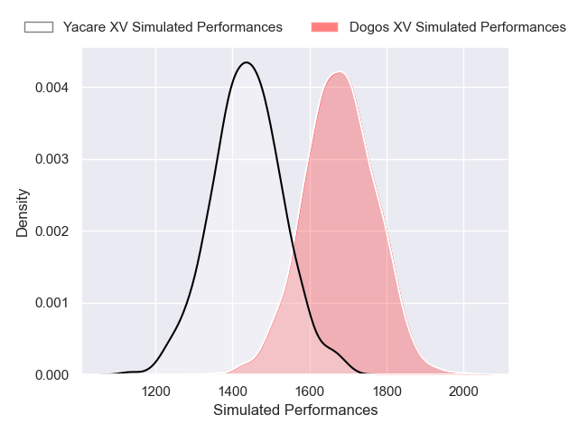
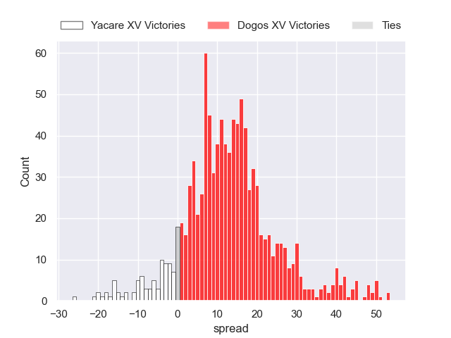
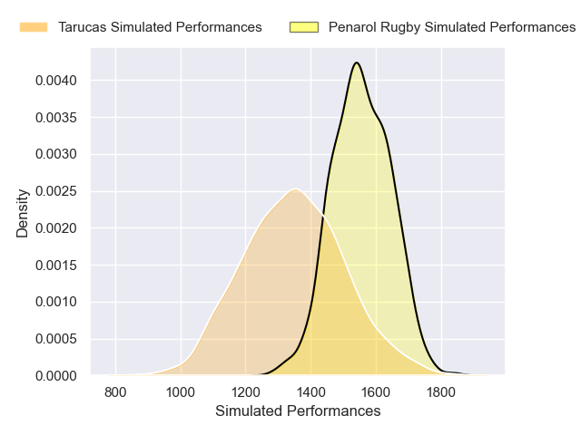
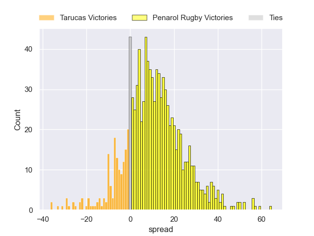

---  
title: "Super Rugby Americas 2025 Status"  
date: 2025-05-02 6:00:00 -0500  
categories: model review projection  
layout: article  
aside:  
    toc: true  
---
# Current Team Rankings

# Standings

## Current Standings

| Club          |   Played |   Wins |   Point Differential |   Losing Bonus Points |   Try Bonus Points |   Competition Points |
|:--------------|---------:|-------:|---------------------:|----------------------:|-------------------:|---------------------:|
| Pampas XV     |        8 |      6 |                   93 |                     0 |                  3 |                   29 |
| Penarol Rugby |        8 |      6 |                   40 |                     0 |                  3 |                   27 |
| Dogos XV      |        8 |      4 |                  121 |                     3 |                  4 |                   25 |
| Selknam       |        8 |      4 |                   40 |                     4 |                  4 |                   24 |
| Yacare XV     |        7 |      4 |                  -11 |                     1 |                  2 |                   19 |
| Tarucas       |        7 |      2 |                  -10 |                     3 |                  2 |                   13 |
| Cobras        |        8 |      0 |                 -273 |                     2 |                  2 |                    4 |

## Projected Remaining Table

| Club          |   Matches Remaining |   Wins |   Point Differential |   Losing Bonus Points |   Try Bonus Points |   Competition Points |
|:--------------|--------------------:|-------:|---------------------:|----------------------:|-------------------:|---------------------:|
| Dogos XV      |                   4 |    3.5 |             45.9077  |                   0.3 |                2.6 |                 16.8 |
| Pampas XV     |                   4 |    3.1 |             42.4147  |                   0.5 |                2   |                 15.1 |
| Yacare XV     |                   5 |    2.2 |             -2.75655 |                   1.1 |                2.3 |                 12   |
| Penarol Rugby |                   4 |    2.3 |             20.0378  |                   0.7 |                1.8 |                 11.6 |
| Tarucas       |                   5 |    2   |            -15.797   |                   1.1 |                1.6 |                 10.6 |
| Selknam       |                   4 |    1.5 |            -14.2736  |                   0.9 |                1.7 |                  8.7 |
| Cobras        |                   4 |    0.4 |            -75.533   |                   0.4 |                0.7 |                  2.8 |

## Projected Total Table

| Club          |   Total Matches |   Wins |   Point Differential |   Losing Bonus Points |   Try Bonus Points |   Competition Points |
|:--------------|----------------:|-------:|---------------------:|----------------------:|-------------------:|---------------------:|
| Pampas XV     |              12 |    9.1 |             135.415  |                   0.5 |                5   |                 44.1 |
| Dogos XV      |              12 |    7.5 |             166.908  |                   3.3 |                6.6 |                 41.8 |
| Penarol Rugby |              12 |    8.3 |              60.0378 |                   0.7 |                4.8 |                 38.6 |
| Selknam       |              12 |    5.5 |              25.7264 |                   4.9 |                5.7 |                 32.7 |
| Yacare XV     |              12 |    6.2 |             -13.7565 |                   2.1 |                4.3 |                 31   |
| Tarucas       |              12 |    4   |             -25.797  |                   4.1 |                3.6 |                 23.6 |
| Cobras        |              12 |    0.4 |            -348.533  |                   2.4 |                2.7 |                  6.8 |

# Completed Match Review

| Model | Percent Correct Predictions | Spread Error |
| ------ | ------ | ------ |
| Club Level | 63.0% | 11.5 |
| Player Level: Lineup | 53.8% | 14.2 |
| Player Level: Minutes | 53.8% | 14.3 |

# Future Predictions

## Week 9

### Dogos XV V Yacare XV on 2025/05/02

Average Margin: Dogos XV by 13.3

Average Scoreline: 34-20

### Penarol Rugby V Tarucas on 2025/05/03

Average Margin: Penarol Rugby by 10.9

Average Scoreline: 26-15

### Cobras V Pampas XV on 2025/05/03

Average Margin: Pampas XV by 22.4

Average Scoreline: 36-13

## Week 10

### Tarucas V Selknam on 2025/05/09

Average Margin: Selknam by 2.7

Average Scoreline: 32-29

### Yacare XV V Pampas XV on 2025/05/10

Average Margin: Pampas XV by 6.4

Average Scoreline: 35-29

## Week 11

### Penarol Rugby V Cobras on 2025/05/12

Average Margin: Penarol Rugby by 23.1

Average Scoreline: 35-12

### Tarucas V Dogos XV on 2025/05/16

Average Margin: Dogos XV by 10.6

Average Scoreline: 34-24

### Yacare XV V Cobras on 2025/05/17

Average Margin: Yacare XV by 19.7

Average Scoreline: 30-10

## Week 12

### Pampas XV V Selknam on 2025/05/19

Average Margin: Pampas XV by 10.5

Average Scoreline: 28-18

### Dogos XV V Penarol Rugby on 2025/05/23

Average Margin: Dogos XV by 10.8

Average Scoreline: 33-22

### Selknam V Yacare XV on 2025/05/24

Average Margin: Selknam by 4.7

Average Scoreline: 27-23

### Cobras V Tarucas on 2025/05/25

Average Margin: Tarucas by 10.3

Average Scoreline: 35-25

## Week 13

### Dogos XV V Selknam on 2025/05/30

Average Margin: Dogos XV by 11.2

Average Scoreline: 34-22

### Penarol Rugby V Pampas XV on 2025/05/30

Average Margin: Pampas XV by 3.2

Average Scoreline: 28-25

### Tarucas V Yacare XV on 2025/05/31

Average Margin: Yacare XV by 1.9

Average Scoreline: 32-30

