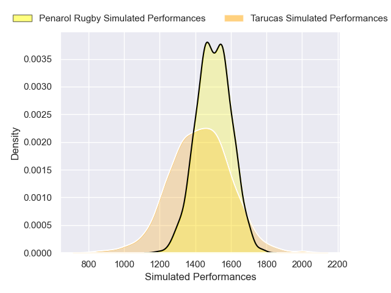
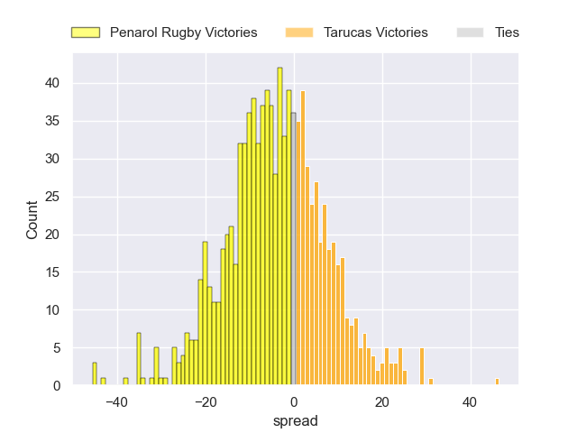

---  
title: "Super Rugby Americas 2025 Status"  
date: 2025-04-07 6:00:00 -0500  
categories: model review projection  
layout: article  
aside:  
    toc: true  
---
# Current Team Rankings

# Standings

## Current Standings

| Club          |   Played |   Wins |   Point Differential |   Losing Bonus Points |   Try Bonus Points |   Competition Points |
|:--------------|---------:|-------:|---------------------:|----------------------:|-------------------:|---------------------:|
| Pampas XV     |        6 |      5 |                   90 |                     0 |                nan |                   22 |
| Penarol Rugby |        5 |      4 |                   58 |                     0 |                  3 |                   19 |
| Selknam       |        6 |      3 |                   25 |                     3 |                nan |                   17 |
| Dogos XV      |        6 |      2 |                   48 |                     3 |                nan |                   16 |
| Yacare XV     |        6 |      3 |                  -38 |                     1 |                nan |                   13 |
| Tarucas       |        5 |      2 |                   12 |                     2 |                  2 |                   12 |
| Cobras        |        6 |      0 |                 -195 |                     1 |                nan |                    2 |

## Projected Remaining Table

| Club          |   Matches Remaining |   Wins |   Point Differential |   Losing Bonus Points |   Try Bonus Points |   Competition Points |
|:--------------|--------------------:|-------:|---------------------:|----------------------:|-------------------:|---------------------:|
| Pampas XV     |                   6 |    5.1 |              83.1916 |                   0.5 |                2.5 |                 23.6 |
| Dogos XV      |                   6 |    4.2 |              41.9868 |                   0.9 |                3.2 |                 20.8 |
| Penarol Rugby |                   7 |    3.9 |              26.4857 |                   1.5 |                3.3 |                 20.3 |
| Selknam       |                   6 |    3.3 |              15.7909 |                   1.1 |                2.6 |                 16.7 |
| Tarucas       |                   7 |    2.8 |             -26.1752 |                   1.4 |                1.7 |                 14.5 |
| Yacare XV     |                   6 |    2.2 |             -19.7788 |                   1.3 |                2.4 |                 12.3 |
| Cobras        |                   6 |    0.5 |            -121.501  |                   0.5 |                1.2 |                  3.8 |

## Projected Total Table

| Club          |   Total Matches |   Wins |   Point Differential |   Losing Bonus Points |   Try Bonus Points |   Competition Points |
|:--------------|----------------:|-------:|---------------------:|----------------------:|-------------------:|---------------------:|
| Pampas XV     |              12 |   10.1 |             173.192  |                   0.5 |                2.5 |                 45.6 |
| Penarol Rugby |              12 |    7.9 |              84.4857 |                   1.5 |                6.3 |                 39.3 |
| Dogos XV      |              12 |    6.2 |              89.9868 |                   3.9 |                3.2 |                 36.8 |
| Selknam       |              12 |    6.3 |              40.7909 |                   4.1 |                2.6 |                 33.7 |
| Tarucas       |              12 |    4.8 |             -14.1752 |                   3.4 |                3.7 |                 26.5 |
| Yacare XV     |              12 |    5.2 |             -57.7788 |                   2.3 |                2.4 |                 25.3 |
| Cobras        |              12 |    0.5 |            -316.501  |                   1.5 |                1.2 |                  5.8 |

# Completed Match Review

| Model | Percent Correct Predictions | Spread Error |
| ------ | ------ | ------ |
| Club Level | 65.0% | 9.9 |
| Player Level: Lineup | 50.0% | 12.5 |
| Player Level: Minutes | 50.0% | 12.6 |

# Future Predictions

## Week 7

### Tarucas V Penarol Rugby on 2025/04/08

Average Margin: Penarol Rugby by 3.8

Average Scoreline: 30-26

### Pampas XV V Dogos XV on 2025/04/12

Average Margin: Pampas XV by 9.9

Average Scoreline: 28-18

### Selknam V Cobras on 2025/04/12

Average Margin: Selknam by 23.4

Average Scoreline: 41-18

### Yacare XV V Penarol Rugby on 2025/04/13

Average Margin: Penarol Rugby by 2.7

Average Scoreline: 32-29

## Week 8

### Pampas XV V Tarucas on 2025/04/25

Average Margin: Pampas XV by 18.9

Average Scoreline: 35-16

### Cobras V Dogos XV on 2025/04/26

Average Margin: Dogos XV by 20.1

Average Scoreline: 43-22

### Selknam V Penarol Rugby on 2025/04/27

Average Margin: Selknam by 2.7

Average Scoreline: 33-30

## Week 9

### Penarol Rugby V Tarucas on 2025/05/02

Average Margin: Penarol Rugby by 10.2

Average Scoreline: 31-20

### Cobras V Pampas XV on 2025/05/03

Average Margin: Pampas XV by 25.2

Average Scoreline: 48-22

## Week 10

### Dogos XV V Yacare XV on 2025/05/05

Average Margin: Dogos XV by 11.7

Average Scoreline: 34-22

### Tarucas V Selknam on 2025/05/09

Average Margin: Selknam by 1.6

Average Scoreline: 30-28

### Yacare XV V Pampas XV on 2025/05/10

Average Margin: Pampas XV by 10.7

Average Scoreline: 34-24

## Week 11

### Penarol Rugby V Cobras on 2025/05/12

Average Margin: Penarol Rugby by 24.1

Average Scoreline: 40-16

### Tarucas V Dogos XV on 2025/05/16

Average Margin: Dogos XV by 5.8

Average Scoreline: 31-25

### Yacare XV V Cobras on 2025/05/17

Average Margin: Yacare XV by 17.5

Average Scoreline: 35-18

## Week 12

### Pampas XV V Selknam on 2025/05/19

Average Margin: Pampas XV by 13.4

Average Scoreline: 31-17

### Dogos XV V Penarol Rugby on 2025/05/23

Average Margin: Dogos XV by 6.5

Average Scoreline: 29-23

### Selknam V Yacare XV on 2025/05/24

Average Margin: Selknam by 9.3

Average Scoreline: 33-23

### Cobras V Tarucas on 2025/05/25

Average Margin: Tarucas by 11.3

Average Scoreline: 37-25

## Week 13

### Dogos XV V Selknam on 2025/05/30

Average Margin: Dogos XV by 7.7

Average Scoreline: 31-23

### Penarol Rugby V Pampas XV on 2025/05/30

Average Margin: Pampas XV by 5.1

Average Scoreline: 33-28

### Tarucas V Yacare XV on 2025/05/31

Average Margin: Tarucas by 2.8

Average Scoreline: 30-27

