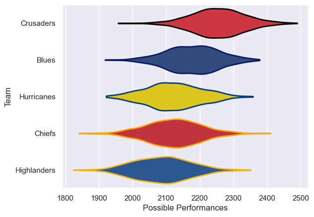

---  
title: "Super Rugby Aotearoa 2021 Status"  
date: 2025-07-28 6:00:00 -0500  
categories: model review projection  
layout: article  
aside:  
    toc: true  
---
# Current Team Rankings

# Standings

## Current Standings

| Club        |   Played |   Wins |   Point Differential |   Losing Bonus Points |   Try Bonus Points |   Competition Points |
|:------------|---------:|-------:|---------------------:|----------------------:|-------------------:|---------------------:|
| Crusaders   |        9 |      7 |                   83 |                     1 |                  5 |                   34 |
| Blues       |        8 |      4 |                   19 |                     2 |                  5 |                   23 |
| Chiefs      |        9 |      5 |                  -54 |                     0 |                  1 |                   21 |
| Highlanders |        8 |      3 |                  -25 |                     1 |                  2 |                   15 |
| Hurricanes  |        8 |      2 |                  -23 |                     3 |                  2 |                   13 |

# Completed Match Review

| Model | Percent Correct Predictions | Spread Error |
| ------ | ------ | ------ |
| Club Level | 52.4% | 10.7 |
| Player Level: Lineup | nan% | nan |
| Player Level: Minutes | nan% | nan |

