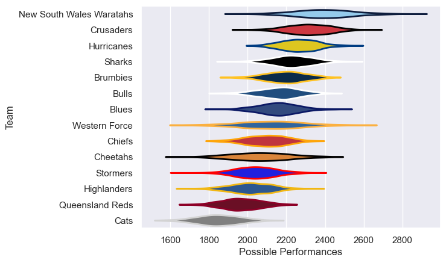

---  
title: "Super Rugby Pacific 2006 Status"  
date: 2025-07-28 6:00:00 -0500  
categories: model review projection  
layout: article  
aside:  
    toc: true  
---
# Current Team Rankings

# Standings

## Current Standings

| Club                     |   Played |   Wins |   Point Differential |   Losing Bonus Points | Try Bonus Points   |   Competition Points |
|:-------------------------|---------:|-------:|---------------------:|----------------------:|:-------------------|---------------------:|
| Crusaders                |       15 |     13 |                  229 |                     0 |                    |                   54 |
| Hurricanes               |       15 |     11 |                   97 |                     3 |                    |                   47 |
| New South Wales Waratahs |       14 |      9 |                  168 |                     4 |                    |                   40 |
| Brumbies                 |       13 |      8 |                   57 |                     1 |                    |                   35 |
| Sharks                   |       13 |      7 |                   64 |                     5 |                    |                   33 |
| Bulls                    |       14 |      7 |                   45 |                     3 |                    |                   33 |
| Chiefs                   |       13 |      7 |                   27 |                     3 |                    |                   33 |
| Highlanders              |       13 |      6 |                  -48 |                     3 |                    |                   27 |
| Blues                    |       13 |      6 |                  -58 |                     1 |                    |                   25 |
| Cheetahs                 |       13 |      5 |                  -95 |                     4 |                    |                   24 |
| Stormers                 |       13 |      4 |                  -71 |                     4 |                    |                   22 |
| Queensland Reds          |       13 |      4 |                  -80 |                     5 |                    |                   21 |
| Cats                     |       13 |      2 |                 -185 |                     3 |                    |                   13 |
| Western Force            |       13 |      1 |                 -150 |                     2 |                    |                   10 |

# Completed Match Review

| Model | Percent Correct Predictions | Spread Error |
| ------ | ------ | ------ |
| Club Level | 66.0% | 12.4 |
| Player Level: Lineup | nan% | nan |
| Player Level: Minutes | nan% | nan |

