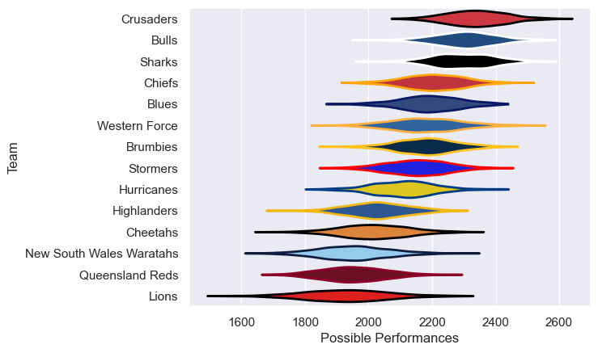

---  
title: "Super Rugby Pacific 2007 Status"  
date: 2025-07-28 6:00:00 -0500  
categories: model review projection  
layout: article  
aside:  
    toc: true  
---
# Current Team Rankings

# Standings

## Current Standings

| Club                     |   Played |   Wins |   Point Differential |   Losing Bonus Points | Try Bonus Points   |   Competition Points |
|:-------------------------|---------:|-------:|---------------------:|----------------------:|:-------------------|---------------------:|
| Bulls                    |       15 |     11 |                  181 |                     1 |                    |                   45 |
| Sharks                   |       15 |     11 |                  156 |                     1 |                    |                   45 |
| Blues                    |       14 |      9 |                  104 |                     2 |                    |                   38 |
| Brumbies                 |       13 |      9 |                   61 |                     2 |                    |                   38 |
| Crusaders                |       14 |      8 |                  132 |                     3 |                    |                   35 |
| Chiefs                   |       13 |      7 |                   52 |                     5 |                    |                   35 |
| Western Force            |       13 |      6 |                  -16 |                     3 |                    |                   29 |
| Hurricanes               |       13 |      6 |                  -53 |                     1 |                    |                   25 |
| Highlanders              |       13 |      5 |                  -66 |                     4 |                    |                   24 |
| Stormers                 |       13 |      6 |                  -77 |                     0 |                    |                   24 |
| Lions                    |       13 |      5 |                 -109 |                     2 |                    |                   22 |
| Cheetahs                 |       13 |      4 |                  -77 |                     2 |                    |                   20 |
| New South Wales Waratahs |       13 |      3 |                  -51 |                     5 |                    |                   19 |
| Queensland Reds          |       13 |      2 |                 -237 |                     3 |                    |                   11 |

# Completed Match Review

| Model | Percent Correct Predictions | Spread Error |
| ------ | ------ | ------ |
| Club Level | 61.7% | 13.3 |
| Player Level: Lineup | nan% | nan |
| Player Level: Minutes | nan% | nan |

