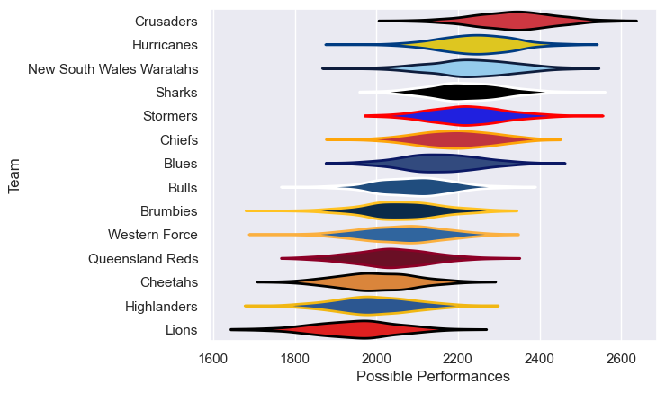

---  
title: "Super Rugby Pacific 2008"  
date: 2025-07-29 6:00:00 -0500  
categories: model review projection  
layout: article  
aside:  
    toc: true  
---
# Current Team Rankings

# Standings

## Current Standings

| Club                     |   Played |   Wins |   Point Differential |   Losing Bonus Points | Try Bonus Points   |   Competition Points |
|:-------------------------|---------:|-------:|---------------------:|----------------------:|:-------------------|---------------------:|
| Crusaders                |       15 |     13 |                  212 |                     0 |                    |                   52 |
| New South Wales Waratahs |       15 |     10 |                   76 |                     2 |                    |                   44 |
| Sharks                   |       14 |      9 |                   47 |                     1 |                    |                   39 |
| Stormers                 |       13 |      8 |                   58 |                     3 |                    |                   37 |
| Hurricanes               |       14 |      8 |                   95 |                     2 |                    |                   36 |
| Blues                    |       13 |      8 |                   87 |                     3 |                    |                   35 |
| Western Force            |       13 |      7 |                  -31 |                     3 |                    |                   31 |
| Chiefs                   |       13 |      7 |                   -1 |                     2 |                    |                   30 |
| Bulls                    |       13 |      6 |                  -23 |                     2 |                    |                   26 |
| Brumbies                 |       13 |      6 |                  -40 |                     2 |                    |                   26 |
| Queensland Reds          |       13 |      3 |                  -65 |                     3 |                    |                   17 |
| Highlanders              |       13 |      3 |                  -81 |                     5 |                    |                   17 |
| Lions                    |       13 |      2 |                 -161 |                     2 |                    |                   12 |
| Cheetahs                 |       13 |      1 |                 -173 |                     6 |                    |                   10 |

# Completed Match Review

| Model | Percent Correct Predictions | Spread Error |
| ------ | ------ | ------ |
| Club Level | 68.1% | 11.6 |
| Player Level: Lineup | nan% | nan |
| Player Level: Minutes | nan% | nan |

