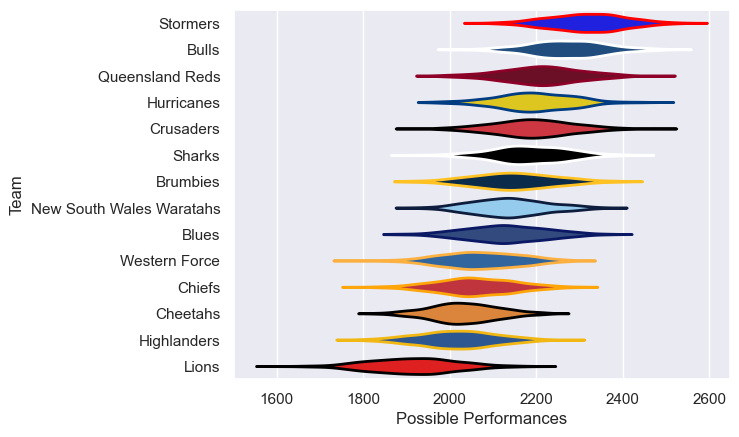

---  
title: "Super Rugby Pacific 2010 Status"  
date: 2025-07-28 6:00:00 -0500  
categories: model review projection  
layout: article  
aside:  
    toc: true  
---
# Current Team Rankings

# Standings

## Current Standings

| Club                     |   Played |   Wins |   Point Differential |   Losing Bonus Points |   Try Bonus Points |   Competition Points |
|:-------------------------|---------:|-------:|---------------------:|----------------------:|-------------------:|---------------------:|
| Bulls                    |       15 |     12 |                  114 |                     1 |                  6 |                   55 |
| Stormers                 |       15 |     10 |                  205 |                     4 |                  4 |                   48 |
| New South Wales Waratahs |       14 |      9 |                   78 |                     1 |                  6 |                   43 |
| Crusaders                |       14 |      8 |                   78 |                     1 |                  6 |                   41 |
| Queensland Reds          |       13 |      8 |                   58 |                     2 |                  5 |                   39 |
| Brumbies                 |       13 |      8 |                   67 |                     2 |                  3 |                   37 |
| Blues                    |       13 |      7 |                   43 |                     2 |                  7 |                   37 |
| Hurricanes               |       13 |      7 |                   35 |                     2 |                  5 |                   37 |
| Sharks                   |       13 |      7 |                   -2 |                     4 |                  1 |                   33 |
| Cheetahs                 |       13 |      5 |                  -77 |                     1 |                  3 |                   26 |
| Chiefs                   |       13 |      4 |                  -78 |                     4 |                  4 |                   26 |
| Highlanders              |       13 |      3 |                 -100 |                     4 |                  3 |                   19 |
| Western Force            |       13 |      4 |                 -106 |                     2 |                  1 |                   19 |
| Lions                    |       13 |      0 |                 -315 |                     2 |                  3 |                    5 |

# Completed Match Review

| Model | Percent Correct Predictions | Spread Error |
| ------ | ------ | ------ |
| Club Level | 70.2% | 12.5 |
| Player Level: Lineup | nan% | nan |
| Player Level: Minutes | nan% | nan |

