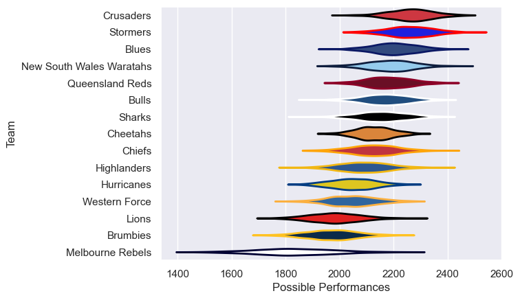

---  
title: "Super Rugby Pacific 2011 Status"  
date: 2025-07-28 6:00:00 -0500  
categories: model review projection  
layout: article  
aside:  
    toc: true  
---
# Current Team Rankings

# Standings

## Current Standings

| Club                     |   Played |   Wins |   Point Differential |   Losing Bonus Points |   Try Bonus Points |   Competition Points |
|:-------------------------|---------:|-------:|---------------------:|----------------------:|-------------------:|---------------------:|
| Queensland Reds          |       18 |     15 |                  142 |                     1 |                  6 |                   67 |
| Crusaders                |       19 |     13 |                  205 |                     3 |                  5 |                   62 |
| Blues                    |       18 |     11 |                   66 |                     4 |                  6 |                   56 |
| Stormers                 |       17 |     12 |                  124 |                     3 |                  4 |                   55 |
| New South Wales Waratahs |       17 |     10 |                  133 |                     3 |                  6 |                   49 |
| Sharks                   |       17 |     10 |                   40 |                     1 |                  6 |                   49 |
| Bulls                    |       16 |     10 |                   46 |                     3 |                  3 |                   46 |
| Highlanders              |       16 |      8 |                  -47 |                     3 |                  2 |                   37 |
| Hurricanes               |       16 |      5 |                  -70 |                     5 |                  5 |                   34 |
| Cheetahs                 |       16 |      5 |                   -2 |                     7 |                  5 |                   32 |
| Chiefs                   |       16 |      6 |                  -16 |                     4 |                  2 |                   32 |
| Western Force            |       16 |      5 |                  -83 |                     5 |                    |                   29 |
| Brumbies                 |       16 |      4 |                 -123 |                     4 |                  3 |                   25 |
| Lions                    |       16 |      3 |                 -126 |                     5 |                  2 |                   21 |
| Melbourne Rebels         |       16 |      3 |                 -289 |                     2 |                  2 |                   16 |

# Completed Match Review

| Model | Percent Correct Predictions | Spread Error |
| ------ | ------ | ------ |
| Club Level | 68.0% | 11.0 |
| Player Level: Lineup | nan% | nan |
| Player Level: Minutes | nan% | nan |

