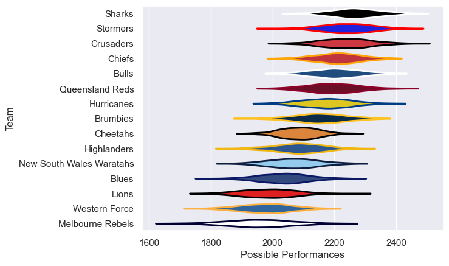

---  
title: "Super Rugby Pacific 2012"  
date: 2025-07-29 6:00:00 -0500  
categories: model review projection  
layout: article  
aside:  
    toc: true  
---
# Current Team Rankings

# Standings

## Current Standings

| Club                     |   Played |   Wins |   Point Differential |   Losing Bonus Points |   Try Bonus Points |   Competition Points |
|:-------------------------|---------:|-------:|---------------------:|----------------------:|-------------------:|---------------------:|
| Chiefs                   |       18 |     14 |                  120 |                     3 |                  6 |                   65 |
| Stormers                 |       17 |     14 |                   89 |                     3 |                    |                   59 |
| Sharks                   |       19 |     12 |                   77 |                     4 |                  7 |                   59 |
| Crusaders                |       18 |     12 |                  154 |                     5 |                  5 |                   58 |
| Bulls                    |       17 |     10 |                   88 |                     5 |                  6 |                   51 |
| Brumbies                 |       16 |     10 |                   73 |                     5 |                  5 |                   50 |
| Queensland Reds          |       17 |     11 |                   -1 |                     2 |                  4 |                   50 |
| Hurricanes               |       16 |     10 |                   60 |                     1 |                  8 |                   49 |
| Highlanders              |       16 |      9 |                  -26 |                     4 |                  2 |                   42 |
| Cheetahs                 |       16 |      5 |                  -67 |                     7 |                  3 |                   30 |
| New South Wales Waratahs |       16 |      4 |                  -61 |                     8 |                  3 |                   27 |
| Blues                    |       16 |      4 |                  -71 |                     6 |                  2 |                   24 |
| Melbourne Rebels         |       16 |      4 |                 -158 |                     5 |                  3 |                   24 |
| Western Force            |       16 |      3 |                 -134 |                     5 |                  2 |                   19 |
| Lions                    |       16 |      3 |                 -143 |                     3 |                  2 |                   17 |

# Completed Match Review

| Model | Percent Correct Predictions | Spread Error |
| ------ | ------ | ------ |
| Club Level | 60.0% | 10.3 |
| Player Level: Lineup | nan% | nan |
| Player Level: Minutes | nan% | nan |

