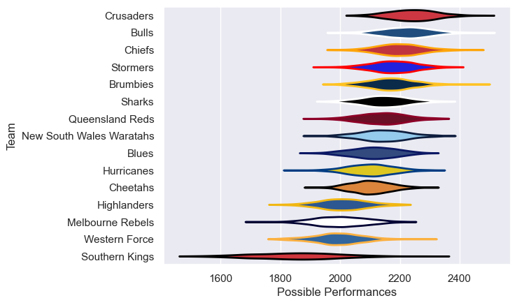

---  
title: "Super Rugby Pacific 2013"  
date: 2025-07-29 6:00:00 -0500  
categories: model review projection  
layout: article  
aside:  
    toc: true  
---
# Current Team Rankings

# Standings

## Current Standings

| Club                     |   Played |   Wins |   Point Differential |   Losing Bonus Points |   Try Bonus Points |   Competition Points |
|:-------------------------|---------:|-------:|---------------------:|----------------------:|-------------------:|---------------------:|
| Chiefs                   |       18 |     14 |                  100 |                     2 |                  8 |                   66 |
| Brumbies                 |       19 |     12 |                  135 |                     4 |                  5 |                   61 |
| Crusaders                |       18 |     12 |                  167 |                     4 |                  6 |                   58 |
| Bulls                    |       17 |     12 |                  115 |                     3 |                  5 |                   56 |
| Queensland Reds          |       17 |     10 |                   -4 |                     2 |                  4 |                   50 |
| Cheetahs                 |       17 |     10 |                   22 |                     5 |                  2 |                   47 |
| Stormers                 |       16 |      9 |                   54 |                     5 |                  1 |                   42 |
| Sharks                   |       16 |      8 |                   79 |                     5 |                  3 |                   40 |
| New South Wales Waratahs |       16 |      8 |                   40 |                     4 |                  1 |                   37 |
| Blues                    |       16 |      6 |                  -17 |                     6 |                  6 |                   36 |
| Hurricanes               |       16 |      6 |                  -71 |                     5 |                  4 |                   33 |
| Melbourne Rebels         |       16 |      5 |                 -133 |                     5 |                  4 |                   29 |
| Western Force            |       16 |      4 |                  -99 |                     5 |                    |                   23 |
| Highlanders              |       16 |      3 |                 -122 |                     5 |                  4 |                   21 |
| Southern Kings           |       16 |      3 |                 -266 |                     0 |                  2 |                   16 |

# Completed Match Review

| Model | Percent Correct Predictions | Spread Error |
| ------ | ------ | ------ |
| Club Level | 67.2% | 9.9 |
| Player Level: Lineup | nan% | nan |
| Player Level: Minutes | nan% | nan |

