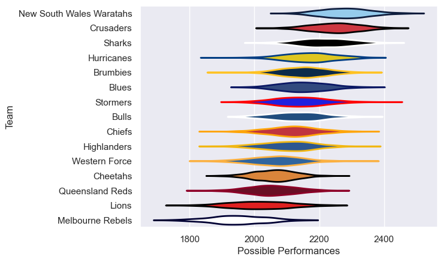

---  
title: "Super Rugby Pacific 2014"  
date: 2025-07-29 6:00:00 -0500  
categories: model review projection  
layout: article  
aside:  
    toc: true  
---
# Current Team Rankings

# Standings

## Current Standings

| Club                     |   Played |   Wins |   Point Differential |   Losing Bonus Points |   Try Bonus Points |   Competition Points |
|:-------------------------|---------:|-------:|---------------------:|----------------------:|-------------------:|---------------------:|
| New South Wales Waratahs |       18 |     14 |                  228 |                     1 |                  9 |                   66 |
| Crusaders                |       18 |     12 |                  154 |                     4 |                  5 |                   57 |
| Sharks                   |       18 |     12 |                   85 |                     4 |                  2 |                   54 |
| Brumbies                 |       18 |     11 |                   18 |                     1 |                  5 |                   50 |
| Chiefs                   |       17 |      8 |                    4 |                     4 |                  6 |                   46 |
| Highlanders              |       17 |      8 |                  -45 |                     6 |                  5 |                   43 |
| Hurricanes               |       16 |      8 |                   65 |                     3 |                  6 |                   41 |
| Western Force            |       16 |      9 |                  -52 |                     1 |                  3 |                   40 |
| Bulls                    |       16 |      7 |                   30 |                     5 |                  3 |                   38 |
| Blues                    |       16 |      7 |                   26 |                     3 |                  6 |                   37 |
| Stormers                 |       16 |      7 |                  -36 |                     2 |                  2 |                   32 |
| Lions                    |       16 |      7 |                  -46 |                     1 |                  2 |                   31 |
| Queensland Reds          |       16 |      5 |                 -119 |                     4 |                  4 |                   28 |
| Cheetahs                 |       16 |      4 |                 -155 |                     3 |                  3 |                   24 |
| Melbourne Rebels         |       16 |      4 |                 -157 |                     4 |                  1 |                   21 |

# Completed Match Review

| Model | Percent Correct Predictions | Spread Error |
| ------ | ------ | ------ |
| Club Level | 71.2% | 11.1 |
| Player Level: Lineup | nan% | nan |
| Player Level: Minutes | nan% | nan |

